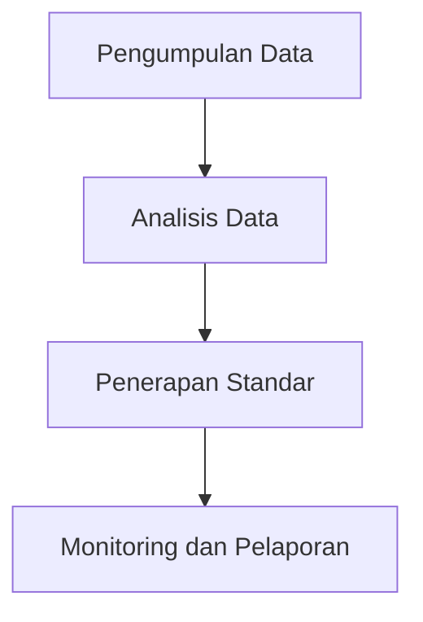

# 832 — Arsitektur Data EU Battery Passport dan Ketertelusuran Rantai Pasok: Deklarasi State-of-Health (SoH), Jejak Karbon, Sourcing Kobalt yang Bertanggung Jawab, dan Interoperabilitas ISO/IEC 19941

**Domain:** Teknik Industri & Rekayasa Sistem Industri  
**Topik Spesialis:** EU Battery Passport Data Architecture & Supply Chain Traceability: State-of-Health (SoH), Carbon Footprint Declaration, Responsible Cobalt Sourcing, and ISO/IEC 19941 Interoperability  
**Standar & Referensi Utama:** EU Battery Regulation 2023/1542; Global Battery Alliance (GBA 2023); ISO 14067  

---

## 1. Pendahuluan dan Konteks Industri

Industri baterai global sedang mengalami transformasi signifikan seiring dengan meningkatnya permintaan untuk kendaraan listrik (EV) dan penyimpanan energi terbarukan. Regulasi Uni Eropa, khususnya EU Battery Regulation 2023/1542, menetapkan kerangka kerja untuk meningkatkan keberlanjutan dan transparansi dalam rantai pasok baterai. Dalam konteks ini, arsitektur data EU Battery Passport menjadi krusial untuk memastikan ketertelusuran dan akuntabilitas dari bahan baku hingga produk akhir. Tantangan utama yang dihadapi adalah integrasi data yang kompleks dari berbagai sumber, termasuk informasi tentang State-of-Health (SoH), jejak karbon, dan praktik sourcing kobalt yang bertanggung jawab.

Ketidakpastian dalam rantai pasok, seperti fluktuasi harga bahan baku dan kepatuhan terhadap standar lingkungan, memerlukan pendekatan yang lebih sistematis untuk pengelolaan risiko. Selain itu, industri harus beradaptasi dengan tuntutan konsumen yang semakin sadar akan isu keberlanjutan, yang menuntut transparansi dalam jejak karbon produk. Oleh karena itu, penerapan ISO 14067 untuk deklarasi jejak karbon menjadi penting dalam mendukung strategi keberlanjutan perusahaan. 

Literatur menunjukkan bahwa perusahaan yang mengadopsi praktik keberlanjutan yang baik tidak hanya memenuhi regulasi tetapi juga meningkatkan daya saing mereka di pasar global (Global Battery Alliance, 2023). Dengan demikian, pemahaman yang mendalam tentang arsitektur data dan ketertelusuran rantai pasok menjadi sangat penting untuk menghadapi tantangan ini.

## 2. Landasan Teori & Formulasi Matematis

### 2.1. Definisi Variabel dan Parameter

- **SoH (State-of-Health)**: Mengukur kondisi baterai dibandingkan dengan kondisi baru. Dinyatakan dalam persentase (%).
- **CF (Carbon Footprint)**: Total emisi gas rumah kaca yang dihasilkan selama siklus hidup produk, dinyatakan dalam CO₂ ekuivalen (kg CO₂e).
- **RC (Responsible Cobalt)**: Persentase kobalt yang diperoleh dari sumber yang memenuhi standar keberlanjutan.

### 2.2. Rumus-Rumus Kuantitatif

1. **Perhitungan SoH**:
   $$ 
   SoH = \left( \frac{C_{current}}{C_{nominal}} \right) \times 100 
   $$
   di mana:
   - \( C_{current} \) = Kapasitas baterai saat ini (Ah)
   - \( C_{nominal} \) = Kapasitas nominal baterai (Ah)

2. **Perhitungan Jejak Karbon**:
   $$ 
   CF = \sum_{i=1}^{n} (E_i \times GHG_i) 
   $$
   di mana:
   - \( E_i \) = Energi yang digunakan dalam proses \( i \) (kWh)
   - \( GHG_i \) = Faktor emisi gas rumah kaca untuk energi \( i \) (kg CO₂e/kWh)

3. **Persentase Kobalt Bertanggung Jawab**:
   $$ 
   RC = \left( \frac{C_{responsible}}{C_{total}} \right) \times 100 
   $$
   di mana:
   - \( C_{responsible} \) = Kobalt yang diperoleh dari sumber bertanggung jawab (kg)
   - \( C_{total} \) = Total kobalt yang digunakan (kg)

### 2.3. Pembuktian Matematis

Untuk membuktikan hubungan antara SoH dan kapasitas, kita dapat menggunakan rumus di atas. Misalkan kapasitas nominal baterai adalah 100 Ah dan kapasitas saat ini adalah 80 Ah, maka:

$$ 
SoH = \left( \frac{80}{100} \right) \times 100 = 80\% 
$$

Ini menunjukkan bahwa baterai memiliki 80% dari kapasitas nominalnya, yang mengindikasikan bahwa baterai tersebut masih dalam kondisi baik.

## 3. Metodologi Rekayasa & Standar Prosedur Operasional (SOP)

### 3.1. Langkah-Langkah Implementasi

1. **Pengumpulan Data**: Mengumpulkan data dari seluruh rantai pasok, termasuk data bahan baku, proses produksi, dan distribusi.
2. **Analisis Data**: Menggunakan alat analisis untuk mengevaluasi SoH, jejak karbon, dan sourcing kobalt.
3. **Penerapan Standar**: Mengintegrasikan ISO 14067 untuk deklarasi jejak karbon dan memastikan kepatuhan terhadap EU Battery Regulation.
4. **Monitoring dan Pelaporan**: Mengembangkan sistem untuk memantau dan melaporkan data secara berkala.

### 3.2. Diagram Alir Proses

## 4. Studi Kasus Kuantitatif Industri & Perhitungan Numerik

### 4.1. Contoh Perhitungan

Misalkan sebuah pabrik baterai menggunakan 500 kg kobalt, di mana 300 kg berasal dari sumber yang bertanggung jawab. Kita dapat menghitung persentase kobalt yang diperoleh secara bertanggung jawab sebagai berikut:

$$ 
RC = \left( \frac{300}{500} \right) \times 100 = 60\% 
$$

### 4.2. Interpretasi Hasil

Hasil menunjukkan bahwa 60% dari kobalt yang digunakan dalam produksi baterai berasal dari sumber yang bertanggung jawab. Ini adalah indikator positif bagi perusahaan dalam memenuhi standar keberlanjutan dan dapat meningkatkan reputasi perusahaan di pasar.

## 5. Evaluasi Kritis, Aplikasi Lintas Sektor & Standar Masa Depan

### 5.1. Hubungan dengan Disiplin Lain

Penerapan arsitektur data dan ketertelusuran rantai pasok tidak hanya relevan dalam industri baterai, tetapi juga dapat diterapkan dalam sektor lain seperti otomotif, elektronik, dan energi terbarukan. Integrasi teknologi otomasi dan manajemen biaya yang efisien dapat meningkatkan produktivitas dan mengurangi biaya operasional.

### 5.2. Batasan Metodologi

Salah satu batasan dari metodologi ini adalah ketergantungan pada kualitas data yang dikumpulkan. Data yang tidak akurat atau tidak lengkap dapat mempengaruhi hasil analisis dan keputusan yang diambil.

### 5.3. Arah Riset Masa Depan

Riset masa depan harus fokus pada pengembangan teknologi baru untuk meningkatkan akurasi pengukuran SoH dan jejak karbon, serta penerapan sistem berbasis blockchain untuk meningkatkan transparansi dan keamanan data dalam rantai pasok. Selain itu, kolaborasi antara industri dan lembaga penelitian akan menjadi kunci untuk mencapai inovasi yang berkelanjutan.

Dengan demikian, pemahaman yang mendalam tentang arsitektur data dan ketertelusuran rantai pasok dalam konteks regulasi baterai EU sangat penting untuk keberlanjutan industri baterai dan pencapaian target keberlanjutan global.

## 5. Ringkasan & Catatan Praktis Implementasi
Implementasi metode ini memerlukan standarisasi prosedur operasi (SOP), kalibrasi instrumen berkala, serta integrasi pemantauan real-time untuk memastikan konsistensi performa dan efisiensi sistem secara berkelanjutan.
