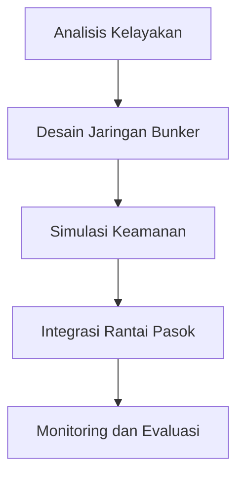

# 834 — Optimasi Rantai Pasok Koridor Hijau Maritim: Desain Jaringan Bunker Amonia Hijau & Metanol, Keamanan Gas Boil-Off, dan Pemodelan Trajektori Karbon Nol IMO

**Domain:** Teknik Industri & Rekayasa Sistem Industri  
**Topik Spesialis:** Maritime Green Corridor Supply Chain Optimization: Green Ammonia & Methanol Bunkering Network Design, Boil-Off Gas Safety, and IMO Net-Zero Carbon Trajectory Modeling  
**Standar & Referensi Utama:** IMO MEPC.377(80); Stopford (Maritime Economics, 3rd Ed.); DNV Maritime Forecast to 2050 (2024)

---

## 1. Pendahuluan dan Konteks Industri

Industri maritim menghadapi tantangan signifikan dalam upaya untuk mengurangi emisi karbon dan memenuhi regulasi lingkungan yang semakin ketat. Dengan meningkatnya kesadaran akan perubahan iklim, International Maritime Organization (IMO) telah menetapkan target ambisius untuk mencapai emisi nol karbon pada tahun 2050. Dalam konteks ini, pengembangan koridor hijau maritim menjadi sangat penting. Koridor hijau ini mencakup penggunaan bahan bakar alternatif seperti amonia hijau dan metanol, yang diharapkan dapat mengurangi jejak karbon dari operasi pelayaran.

Amonia hijau, yang diproduksi melalui proses elektrolisis air menggunakan energi terbarukan, dan metanol, yang dapat dihasilkan dari sumber biomassa atau CO2 yang terperangkap, menawarkan solusi yang menjanjikan untuk menggantikan bahan bakar fosil. Namun, tantangan dalam desain jaringan bunker untuk kedua bahan bakar ini, termasuk keamanan gas boil-off dan integrasi dengan sistem rantai pasok yang ada, memerlukan pendekatan rekayasa yang cermat dan inovatif.

Krisis energi global dan fluktuasi harga bahan bakar juga menambah urgensi untuk mengadopsi solusi yang lebih berkelanjutan. Oleh karena itu, optimasi rantai pasok koridor hijau maritim tidak hanya menjadi kebutuhan lingkungan, tetapi juga merupakan strategi bisnis yang cerdas untuk meningkatkan efisiensi operasional dan mengurangi biaya. Penelitian ini bertujuan untuk mengeksplorasi dan mengembangkan metodologi untuk merancang jaringan bunker amonia hijau dan metanol, serta memodelkan trajektori karbon nol sesuai dengan standar IMO MEPC.377(80).

## 2. Landasan Teori & Formulasi Matematis

### 2.1. Model Rantai Pasok

Model rantai pasok dapat dinyatakan dengan fungsi biaya total yang mencakup biaya produksi, transportasi, dan penyimpanan. Fungsi biaya total $C$ dapat dinyatakan sebagai:

$$
C = C_p + C_t + C_s
$$

di mana:
- $C_p$: Biaya produksi
- $C_t$: Biaya transportasi
- $C_s$: Biaya penyimpanan

### 2.2. Biaya Produksi

Biaya produksi untuk amonia hijau ($C_p^{NH3}$) dan metanol ($C_p^{MeOH}$) dapat dinyatakan sebagai:

$$
C_p^{NH3} = c_{NH3} \cdot Q_{NH3}
$$

$$
C_p^{MeOH} = c_{MeOH} \cdot Q_{MeOH}
$$

di mana:
- $c_{NH3}$ dan $c_{MeOH}$ adalah biaya per unit untuk masing-masing bahan bakar.
- $Q_{NH3}$ dan $Q_{MeOH}$ adalah kuantitas yang diproduksi.

### 2.3. Biaya Transportasi

Biaya transportasi ($C_t$) dapat dihitung dengan rumus:

$$
C_t = \sum_{i=1}^{n} (d_i \cdot r_i \cdot Q_i)
$$

di mana:
- $d_i$: Jarak dari fasilitas produksi ke titik bunker.
- $r_i$: Biaya transportasi per unit jarak.
- $Q_i$: Kuantitas yang diangkut.

### 2.4. Biaya Penyimpanan

Biaya penyimpanan ($C_s$) untuk gas boil-off dapat dinyatakan sebagai:

$$
C_s = h \cdot V
$$

di mana:
- $h$: Biaya penyimpanan per unit volume.
- $V$: Volume gas yang disimpan.

### 2.5. Keamanan Gas Boil-Off

Gas boil-off (BOG) adalah gas yang terbentuk akibat penguapan bahan bakar cair. Keamanan dalam penanganan BOG sangat penting dan dapat dimodelkan dengan persamaan keseimbangan massa:

$$
\frac{dM}{dt} = -\alpha \cdot M
$$

di mana:
- $M$: Massa gas.
- $\alpha$: Koefisien penguapan.

Solusi dari persamaan ini memberikan waktu yang diperlukan untuk mencapai batas aman dalam penyimpanan BOG.

## 3. Metodologi Rekayasa & Standar Prosedur Operasional (SOP)

### 3.1. Langkah-langkah Implementasi

1. **Analisis Kelayakan**: Evaluasi potensi penggunaan amonia hijau dan metanol dalam konteks lokal.
2. **Desain Jaringan Bunker**: Menggunakan model matematis untuk merancang lokasi bunker yang optimal.
3. **Simulasi Keamanan**: Melakukan simulasi untuk menilai risiko terkait BOG.
4. **Integrasi Rantai Pasok**: Mengembangkan strategi untuk mengintegrasikan jaringan bunker dengan rantai pasok yang ada.
5. **Monitoring dan Evaluasi**: Mengimplementasikan sistem monitoring untuk mengevaluasi kinerja jaringan.

### 3.2. Diagram Alir Proses

## 4. Studi Kasus Kuantitatif Industri & Perhitungan Numerik

### 4.1. Input Parameter

Misalkan kita memiliki data berikut untuk perhitungan:

- Biaya produksi amonia hijau ($c_{NH3} = 300 \, \text{USD/ton}$) dan metanol ($c_{MeOH} = 250 \, \text{USD/ton}$).
- Kuantitas yang diproduksi: $Q_{NH3} = 1000 \, \text{ton}$ dan $Q_{MeOH} = 800 \, \text{ton}$.
- Jarak transportasi: $d_1 = 50 \, \text{km}$, $d_2 = 30 \, \text{km}$.
- Biaya transportasi per unit jarak: $r_1 = 0.5 \, \text{USD/km}$ dan $r_2 = 0.4 \, \text{USD/km}$.
- Biaya penyimpanan: $h = 10 \, \text{USD/m}^3$ dan volume penyimpanan $V = 100 \, \text{m}^3$.

### 4.2. Langkah Kalkulasi

1. **Biaya Produksi**:
   - $C_p^{NH3} = 300 \cdot 1000 = 300000 \, \text{USD}$
   - $C_p^{MeOH} = 250 \cdot 800 = 200000 \, \text{USD}$

2. **Biaya Transportasi**:
   - $C_t = (50 \cdot 0.5 \cdot 1000) + (30 \cdot 0.4 \cdot 800) = 25000 + 9600 = 34500 \, \text{USD}$

3. **Biaya Penyimpanan**:
   - $C_s = 10 \cdot 100 = 1000 \, \text{USD}$

4. **Total Biaya**:
   - $C = C_p^{NH3} + C_p^{MeOH} + C_t + C_s = 300000 + 200000 + 34500 + 1000 = 534500 \, \text{USD}$

### 4.3. Interpretasi Hasil

Total biaya untuk mengoperasikan jaringan bunker amonia hijau dan metanol adalah $534500 \, \text{USD}$. Hasil ini menunjukkan bahwa investasi dalam infrastruktur hijau dapat memberikan penghematan biaya jangka panjang melalui efisiensi operasional dan pengurangan emisi.

## 5. Evaluasi Kritis, Aplikasi Lintas Sektor & Standar Masa Depan

Optimasi rantai pasok koridor hijau maritim memiliki implikasi luas tidak hanya dalam sektor maritim tetapi juga dalam disiplin lain seperti manajemen rantai pasok, otomasi, dan teknik keselamatan. Integrasi teknologi informasi dan komunikasi (TIK) dalam desain jaringan bunker dapat meningkatkan efisiensi dan transparansi. Selain itu, penerapan prinsip-prinsip K3 dan ESG (Environmental, Social, and Governance) dalam pengembangan infrastruktur hijau harus menjadi prioritas.

Batasan metodologi ini termasuk ketidakpastian dalam harga bahan baku dan perubahan regulasi yang cepat. Oleh karena itu, penelitian lebih lanjut diperlukan untuk mengeksplorasi model dinamis yang dapat beradaptasi dengan perubahan kondisi pasar dan kebijakan.

Arah riset masa depan harus fokus pada pengembangan teknologi penyimpanan yang lebih aman dan efisien, serta pemodelan yang lebih akurat untuk memprediksi dampak lingkungan dari operasi maritim. Dengan demikian, optimasi rantai pasok koridor hijau maritim tidak hanya akan memenuhi standar IMO tetapi juga berkontribusi pada keberlanjutan industri maritim secara keseluruhan.