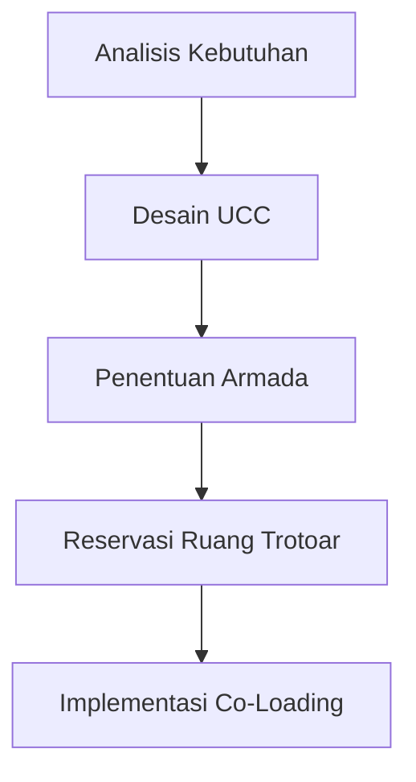

# 838 — Rute Multi-Tier Micro-Hub untuk Pengiriman Terakhir Nol Emisi: Penentuan Ukuran Armada Sepeda Kargo Listrik, Reservasi Ruang Trotoar Dinamis, dan Co-Loading

**Domain:** Teknik Industri & Rekayasa Sistem Industri  
**Topik Spesialis:** Urban Consolidation Center (UCC) Multi-Tier Micro-Hub Routing for Zero-Emission Last-Mile Delivery: Electric Cargo Bike Fleet Sizing, Dynamic Curb Space Reservation, and Co-Loading  
**Standar & Referensi Utama:** Savelsbergh & Van Woensel (2022, Transp. Sci.); ISO 37120; Dablanc (City Logistics)

---

## 1. Pendahuluan dan Konteks Industri

Dalam konteks urbanisasi yang terus meningkat, tantangan dalam distribusi barang di lingkungan perkotaan semakin kompleks. Urban Consolidation Center (UCC) muncul sebagai solusi inovatif untuk mengatasi masalah ini dengan tujuan utama mengurangi kemacetan, emisi karbon, dan biaya operasional. Menurut Dablanc (2022), pengiriman barang di kota-kota besar menyumbang hingga 30% dari total emisi transportasi, sehingga pengembangan sistem pengiriman yang lebih efisien dan ramah lingkungan menjadi sangat mendesak.

UCC berfungsi sebagai titik konsolidasi di mana barang-barang dikumpulkan sebelum didistribusikan ke tujuan akhir menggunakan armada yang lebih ramah lingkungan, seperti sepeda kargo listrik. Namun, implementasi UCC tidak tanpa tantangan. Beberapa isu yang perlu diatasi termasuk ukuran armada yang optimal, reservasi ruang trotoar yang dinamis, dan strategi co-loading untuk memaksimalkan efisiensi pengiriman. 

Savelsbergh & Van Woensel (2022) menekankan pentingnya pendekatan sistematis dalam merancang rute multi-tier yang tidak hanya mempertimbangkan biaya dan waktu, tetapi juga dampak lingkungan. Oleh karena itu, penelitian ini bertujuan untuk memberikan pemahaman yang mendalam mengenai perancangan dan implementasi UCC dengan fokus pada pengiriman terakhir yang nol emisi.

## 2. Landasan Teori & Formulasi Matematis

### 2.1. Notasi dan Definisi Variabel

- $N$: Jumlah titik pengiriman
- $M$: Jumlah micro-hub
- $C$: Kapasitas maksimum sepeda kargo listrik
- $D_{ij}$: Jarak antara titik pengiriman $i$ dan $j$
- $T_{ij}$: Waktu tempuh antara titik pengiriman $i$ dan $j$
- $F$: Biaya tetap operasional per perjalanan
- $V$: Biaya variabel per kilometer
- $E$: Emisi karbon per kilometer

### 2.2. Model Optimasi

Model optimasi untuk menentukan ukuran armada dan rute dapat dirumuskan sebagai berikut:

Minimalkan fungsi biaya total:

$$
Z = \sum_{i=1}^{N} \sum_{j=1}^{N} (F + V \cdot D_{ij}) \cdot x_{ij} + \sum_{k=1}^{M} E \cdot D_{k}
$$

Dengan kendala:

1. Kapasitas armada:
$$
\sum_{j=1}^{N} x_{ij} \leq C, \quad \forall i \in N
$$

2. Permintaan pelanggan:
$$
\sum_{i=1}^{N} x_{ij} \geq d_j, \quad \forall j \in N
$$

3. Rute yang terhubung:
$$
x_{ij} \in \{0, 1\}, \quad \forall i, j \in N
$$

### 2.3. Pembuktian Matematis

Model di atas dapat diselesaikan menggunakan metode pemrograman linier atau algoritma heuristik seperti Genetic Algorithm atau Ant Colony Optimization. Pembuktian keberhasilan model ini dapat dilakukan dengan membandingkan hasil optimasi dengan data historis pengiriman dan emisi yang dihasilkan.

## 3. Metodologi Rekayasa & Standar Prosedur Operasional (SOP)

### 3.1. Langkah-langkah Implementasi

1. **Analisis Kebutuhan**: Mengidentifikasi lokasi pengiriman dan permintaan pelanggan.
2. **Desain UCC**: Merancang layout UCC yang efisien dengan mempertimbangkan ruang untuk sepeda kargo dan area pemuatan.
3. **Penentuan Armada**: Menggunakan model optimasi untuk menentukan ukuran armada sepeda kargo listrik yang diperlukan.
4. **Reservasi Ruang Trotoar**: Mengimplementasikan sistem reservasi ruang trotoar dinamis menggunakan aplikasi mobile untuk pengemudi.
5. **Co-Loading**: Mengembangkan strategi co-loading untuk memaksimalkan kapasitas pengiriman.

### 3.2. Diagram Alir Proses

## 4. Studi Kasus Kuantitatif Industri & Perhitungan Numerik

### 4.1. Input Parameter

- Jumlah titik pengiriman ($N$): 10
- Jumlah micro-hub ($M$): 2
- Kapasitas maksimum sepeda kargo ($C$): 200 kg
- Jarak antar titik pengiriman ($D_{ij}$): Rata-rata 5 km
- Biaya tetap ($F$): Rp 50.000
- Biaya variabel ($V$): Rp 1.000/km
- Emisi ($E$): 0.1 kg/km

### 4.2. Langkah Kalkulasi

1. Hitung biaya total untuk satu perjalanan:
   - Biaya tetap: Rp 50.000
   - Biaya variabel untuk 5 km: $1.000 \times 5 = Rp 5.000$
   - Total biaya perjalanan: $Z = 50.000 + 5.000 = Rp 55.000$

2. Hitung total emisi untuk satu perjalanan:
   - Emisi untuk 5 km: $0.1 \times 5 = 0.5$ kg

### 4.3. Interpretasi Hasil

Dari perhitungan di atas, total biaya untuk pengiriman terakhir menggunakan sepeda kargo listrik adalah Rp 55.000 dengan emisi karbon sebesar 0.5 kg. Ini menunjukkan bahwa penggunaan sepeda kargo listrik tidak hanya mengurangi biaya operasional tetapi juga berkontribusi pada pengurangan emisi karbon.

## 5. Evaluasi Kritis, Aplikasi Lintas Sektor & Standar Masa Depan

Implementasi UCC dan penggunaan sepeda kargo listrik memiliki dampak yang signifikan tidak hanya dalam konteks logistik, tetapi juga dalam disiplin lain seperti manajemen rantai pasok, otomasi, dan keberlanjutan. Dalam konteks manajemen biaya, UCC dapat mengurangi biaya transportasi dan meningkatkan efisiensi operasional. 

Namun, terdapat batasan dalam metodologi yang perlu diperhatikan, seperti ketergantungan pada infrastruktur yang ada dan kesiapan teknologi. Penelitian di masa depan harus fokus pada integrasi teknologi IoT untuk pemantauan real-time dan analisis data besar untuk meningkatkan efisiensi.

Dengan demikian, pengembangan lebih lanjut dari UCC dan strategi pengiriman nol emisi akan menjadi kunci dalam menciptakan sistem logistik yang berkelanjutan dan efisien di masa depan.