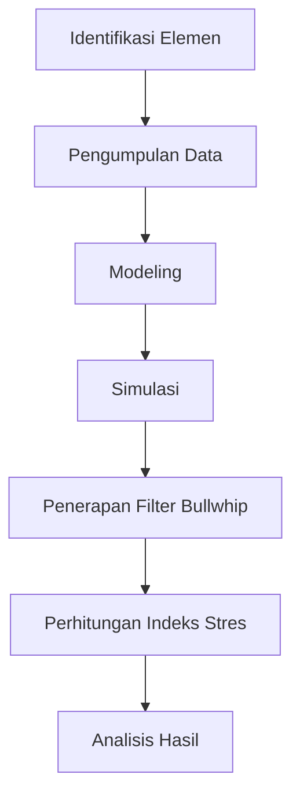

# 839 — Supply Chain Digital Twin untuk Pengujian Stres Disrupsi Real-Time: Simulasi AnyLogic Berbasis Discrete-Event, Filter Peredam Bullwhip, dan Perhitungan Indeks Stres

**Domain:** Teknik Industri & Rekayasa Sistem Industri  
**Topik Spesialis:** Supply Chain Digital Twin (SCDT) for Real-Time Disruption Stress Testing: Discrete-Event AnyLogic Simulation, Bullwhip Dampening Filter, and Stress Index Computation  
**Standar & Referensi Utama:** Ivanov & Dolgui (2023, Annu. Rev. Control); Chopra & Meindl (Supply Chain Management, 7th Ed.); ISO 22301

---

## 1. Pendahuluan dan Konteks Industri

Dalam era globalisasi dan digitalisasi, rantai pasok (supply chain) menghadapi tantangan yang semakin kompleks. Disrupsi yang disebabkan oleh faktor eksternal seperti pandemi, bencana alam, dan perubahan kebijakan pemerintah dapat mengganggu kelancaran operasional perusahaan. Menurut Ivanov & Dolgui (2023), ketidakpastian dalam rantai pasok dapat menyebabkan kerugian signifikan baik dari segi finansial maupun reputasi. Oleh karena itu, penting bagi perusahaan untuk mengadopsi teknologi yang dapat memprediksi dan merespons disrupsi secara real-time.

Supply Chain Digital Twin (SCDT) adalah pendekatan inovatif yang memungkinkan perusahaan untuk menciptakan representasi digital dari rantai pasok mereka. Dengan menggunakan simulasi berbasis discrete-event seperti AnyLogic, perusahaan dapat melakukan pengujian stres untuk mengevaluasi dampak dari berbagai skenario disrupsi. Selain itu, penerapan filter peredam bullwhip dapat membantu mengurangi fluktuasi permintaan yang berlebihan di sepanjang rantai pasok. Hal ini sangat penting untuk menjaga efisiensi operasional dan mengoptimalkan biaya.

Dalam konteks ini, pengembangan Indeks Stres yang mengukur ketahanan rantai pasok terhadap disrupsi menjadi krusial. Indeks ini dapat memberikan wawasan yang berharga bagi manajer dalam pengambilan keputusan strategis. Dengan demikian, modul ini bertujuan untuk memberikan pemahaman mendalam tentang SCDT, metodologi simulasi, dan penerapan praktis dalam konteks industri modern.

## 2. Landasan Teori & Formulasi Matematis

### 2.1. Digital Twin dalam Rantai Pasok

Digital Twin adalah representasi virtual dari sistem fisik yang memungkinkan analisis dan simulasi. Dalam konteks rantai pasok, Digital Twin mencakup semua elemen dari pemasok hingga pelanggan akhir. Model ini dapat digunakan untuk melakukan simulasi berbagai skenario dan mengidentifikasi potensi risiko.

### 2.2. Simulasi Discrete-Event

Simulasi discrete-event adalah teknik yang digunakan untuk memodelkan sistem yang berubah pada titik waktu tertentu. Dalam konteks rantai pasok, setiap peristiwa seperti pengiriman, penerimaan, dan produksi dapat dimodelkan sebagai event. Model ini dapat dinyatakan dalam bentuk matematis sebagai berikut:

$$
S(t) = S(t-1) + \Delta S(t)
$$

di mana $S(t)$ adalah status sistem pada waktu $t$, dan $\Delta S(t)$ adalah perubahan status akibat peristiwa yang terjadi.

### 2.3. Filter Peredam Bullwhip

Fenomena bullwhip terjadi ketika fluktuasi permintaan di tingkat konsumen menyebabkan fluktuasi yang lebih besar di tingkat distributor dan produsen. Untuk mengurangi efek ini, filter peredam bullwhip dapat diterapkan. Model matematis untuk filter ini dapat dinyatakan sebagai:

$$
D_t = \alpha P_t + (1 - \alpha) D_{t-1}
$$

di mana $D_t$ adalah permintaan yang diprediksi pada waktu $t$, $P_t$ adalah permintaan aktual pada waktu $t$, dan $\alpha$ adalah koefisien smoothing (0 < $\alpha$ < 1).

### 2.4. Indeks Stres

Indeks Stres dapat dihitung berdasarkan beberapa parameter, termasuk waktu siklus, tingkat persediaan, dan tingkat pelayanan. Rumus untuk menghitung Indeks Stres ($IS$) adalah:

$$
IS = \frac{L + I}{S}
$$

di mana $L$ adalah waktu siklus, $I$ adalah tingkat persediaan, dan $S$ adalah tingkat pelayanan.

## 3. Metodologi Rekayasa & Standar Prosedur Operasional (SOP)

### 3.1. Langkah-langkah Implementasi

1. **Identifikasi Elemen Rantai Pasok**: Tentukan semua elemen yang terlibat dalam rantai pasok, termasuk pemasok, produsen, distributor, dan pelanggan.
2. **Pengumpulan Data**: Kumpulkan data historis tentang permintaan, waktu siklus, dan tingkat persediaan.
3. **Modeling**: Buat model Digital Twin menggunakan AnyLogic dengan memasukkan semua elemen dan data yang telah dikumpulkan.
4. **Simulasi**: Lakukan simulasi untuk berbagai skenario disrupsi dan analisis hasilnya.
5. **Penerapan Filter Bullwhip**: Terapkan filter peredam bullwhip untuk mengurangi fluktuasi permintaan.
6. **Perhitungan Indeks Stres**: Hitung Indeks Stres untuk mengevaluasi ketahanan rantai pasok.
7. **Analisis Hasil**: Interpretasikan hasil simulasi dan Indeks Stres untuk pengambilan keputusan.

### 3.2. Diagram Alir Proses

## 4. Studi Kasus Kuantitatif Industri & Perhitungan Numerik

### 4.1. Contoh Kasus

Misalkan sebuah perusahaan manufaktur memiliki data sebagai berikut:

- Waktu siklus ($L$): 5 hari
- Tingkat persediaan ($I$): 200 unit
- Tingkat pelayanan ($S$): 95%

### 4.2. Perhitungan Indeks Stres

Dengan menggunakan rumus Indeks Stres:

$$
IS = \frac{L + I}{S} = \frac{5 + 200}{95} \approx 2.158
$$

### 4.3. Interpretasi Hasil

Indeks Stres sebesar 2.158 menunjukkan bahwa perusahaan memiliki tingkat ketahanan yang cukup baik terhadap disrupsi. Namun, perusahaan harus terus memantau parameter ini dan melakukan perbaikan berkelanjutan untuk meningkatkan ketahanan rantai pasok.

## 5. Evaluasi Kritis, Aplikasi Lintas Sektor & Standar Masa Depan

### 5.1. Hubungan dengan Disiplin Lain

Penerapan SCDT tidak hanya relevan dalam konteks rantai pasok, tetapi juga dapat diterapkan dalam bidang otomasi, manajemen biaya, dan teknik keselamatan (K3/ESG). Teknologi ini dapat membantu perusahaan dalam mengidentifikasi risiko dan mengoptimalkan proses.

### 5.2. Batasan Metodologi

Meskipun SCDT menawarkan banyak manfaat, terdapat beberapa batasan, seperti ketergantungan pada data yang akurat dan real-time. Selain itu, kompleksitas model dapat menjadi tantangan dalam implementasi.

### 5.3. Arah Riset Masa Depan

Penelitian di masa depan dapat difokuskan pada pengembangan algoritma yang lebih canggih untuk prediksi dan pengambilan keputusan, serta integrasi teknologi baru seperti kecerdasan buatan dan pembelajaran mesin dalam SCDT.

Dengan demikian, modul ini memberikan gambaran yang komprehensif tentang Supply Chain Digital Twin, metodologi simulasi, dan aplikasinya dalam konteks industri modern.