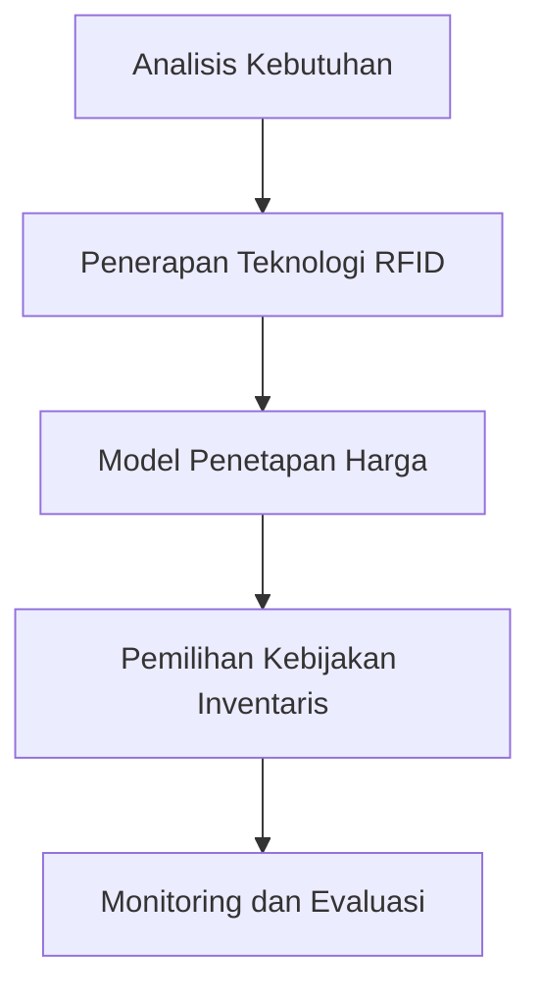

# 840 — Penetapan Harga Dinamis yang Disesuaikan dengan Umur Simpan dan Rute Inventaris untuk Farmasi Perishable: Model Kerusakan Kinetik Arrhenius, Logger Sensor RFID Aktif, dan Kebijakan FIFO vs LSFO

**Domain:** Teknik Industri & Rekayasa Sistem Industri  
**Topik Spesialis:** Dynamic Shelf-Life-Adjusted Pricing and Inventory Routing for Perishable Pharmaceuticals: Arrhenius Kinetic Spoilage Model, Active RFID Sensor Logger, and FIFO vs LSFO Policies  
**Standar & Referensi Utama:** Rong et al. (2022, Int. J. Prod. Econ.); WHO Technical Report Series No. 961; ISO 9001

---

## 1. Pendahuluan dan Konteks Industri

Industri farmasi menghadapi tantangan signifikan dalam pengelolaan produk yang mudah rusak, seperti vaksin dan obat-obatan biologis. Produk-produk ini memiliki umur simpan yang terbatas dan memerlukan penanganan serta distribusi yang sangat hati-hati untuk mempertahankan efektivitasnya. Dalam konteks ini, penetapan harga dinamis yang disesuaikan dengan umur simpan menjadi penting untuk meminimalkan kerugian akibat kerusakan produk dan mengoptimalkan pendapatan. Menurut Rong et al. (2022), penerapan model harga dinamis dapat membantu perusahaan farmasi dalam mengelola inventaris dengan lebih efisien, terutama dalam situasi di mana permintaan dapat berfluktuasi secara signifikan.

Tantangan utama dalam rantai pasok farmasi adalah memastikan bahwa produk sampai ke konsumen dalam kondisi optimal. Hal ini mencakup pengendalian suhu, kelembapan, dan waktu transportasi yang tepat. Penggunaan teknologi seperti Active RFID Sensor Logger memungkinkan pemantauan real-time terhadap kondisi produk selama proses distribusi. Selain itu, pemilihan kebijakan pengelolaan inventaris yang tepat, seperti FIFO (First In First Out) dan LSFO (Last Shelf First Out), juga berperan penting dalam mengurangi kerugian akibat kerusakan.

Dengan meningkatnya regulasi dari WHO dan standar ISO 9001, perusahaan farmasi dituntut untuk meningkatkan efisiensi operasional dan memastikan kualitas produk. Oleh karena itu, penelitian ini berfokus pada pengembangan model yang mengintegrasikan penetapan harga dinamis, pengelolaan inventaris, dan teknologi pemantauan untuk meningkatkan kinerja rantai pasok farmasi.

## 2. Landasan Teori & Formulasi Matematis

### Model Kerusakan Kinetik Arrhenius

Model kerusakan kinetik Arrhenius digunakan untuk menggambarkan laju kerusakan produk farmasi berdasarkan suhu dan waktu. Persamaan Arrhenius dinyatakan sebagai:

$$
k = A e^{-\frac{E_a}{RT}}
$$

di mana:
- \( k \) = laju reaksi (kerusakan)
- \( A \) = faktor frekuensi (konstanta)
- \( E_a \) = energi aktivasi (kJ/mol)
- \( R \) = konstanta gas (8.314 J/(mol·K))
- \( T \) = suhu (K)

### Penetapan Harga Dinamis

Penetapan harga dinamis dapat dinyatakan dengan fungsi harga \( P(t) \) yang bergantung pada waktu dan umur simpan produk:

$$
P(t) = P_0 \cdot e^{-\alpha t}
$$

di mana:
- \( P_0 \) = harga awal
- \( \alpha \) = koefisien penurunan harga per unit waktu

### Kebijakan FIFO dan LSFO

Kebijakan FIFO dan LSFO dapat dianalisis dengan menggunakan model matematis yang mempertimbangkan jumlah produk yang tersisa dan laju kerusakan. Misalkan \( Q_i \) adalah jumlah produk pada periode \( i \), maka untuk kebijakan FIFO:

$$
Q_{i+1} = Q_i - D_i
$$

dengan \( D_i \) adalah permintaan pada periode \( i \).

Untuk kebijakan LSFO, produk yang lebih mendekati tanggal kedaluwarsa akan diprioritaskan untuk dijual terlebih dahulu.

## 3. Metodologi Rekayasa & Standar Prosedur Operasional (SOP)

### Langkah-langkah Implementasi

1. **Analisis Kebutuhan**: Identifikasi jenis produk farmasi yang akan dikelola dan karakteristik umur simpannya.
2. **Penerapan Teknologi RFID**: Instalasi Active RFID Sensor Logger untuk pemantauan kondisi produk.
3. **Model Penetapan Harga**: Pengembangan model penetapan harga dinamis berdasarkan data historis permintaan dan umur simpan produk.
4. **Pemilihan Kebijakan Inventaris**: Penentuan kebijakan FIFO atau LSFO berdasarkan analisis kerusakan dan permintaan.
5. **Monitoring dan Evaluasi**: Implementasi sistem monitoring untuk mengevaluasi efektivitas model yang diterapkan.

### Diagram Alir Proses

## 4. Studi Kasus Kuantitatif Industri & Perhitungan Numerik

### Contoh Kasus

Misalkan sebuah perusahaan farmasi memiliki produk vaksin dengan karakteristik sebagai berikut:
- Harga awal \( P_0 = 100 \) USD
- Koefisien penurunan harga \( \alpha = 0.05 \)
- Energi aktivasi \( E_a = 75 \) kJ/mol
- Faktor frekuensi \( A = 1.2 \times 10^{13} \)

#### Langkah 1: Hitung Laju Kerusakan

Pertama, kita hitung laju kerusakan pada suhu 25°C (298 K):

$$
k = 1.2 \times 10^{13} e^{-\frac{75 \times 10^3}{8.314 \times 298}} \approx 0.0012 \text{ per hari}
$$

#### Langkah 2: Hitung Harga Dinamis

Setelah 10 hari, harga produk dapat dihitung sebagai berikut:

$$
P(10) = 100 \cdot e^{-0.05 \times 10} \approx 60.65 \text{ USD}
$$

#### Langkah 3: Evaluasi Kebijakan FIFO

Jika permintaan harian \( D_i = 5 \) unit, maka jumlah produk yang tersisa setelah 10 hari dengan kebijakan FIFO:

$$
Q_{10} = Q_0 - 10 \cdot D_i
$$

Misalkan \( Q_0 = 100 \):

$$
Q_{10} = 100 - 10 \cdot 5 = 50 \text{ unit}
$$

### Interpretasi Hasil

Dari perhitungan di atas, perusahaan dapat melihat bahwa setelah 10 hari, harga produk turun menjadi 60.65 USD dan jumlah produk yang tersisa adalah 50 unit. Ini menunjukkan pentingnya penetapan harga dinamis dan pengelolaan inventaris yang efisien untuk meminimalkan kerugian.

## 5. Evaluasi Kritis, Aplikasi Lintas Sektor & Standar Masa Depan

Penerapan model ini tidak hanya terbatas pada industri farmasi, tetapi juga dapat diterapkan dalam sektor makanan dan minuman, di mana produk juga memiliki umur simpan yang terbatas. Dalam konteks otomasi, penggunaan teknologi RFID dan sistem pemantauan dapat meningkatkan efisiensi operasional dan mengurangi kesalahan manusia.

Namun, terdapat beberapa batasan dalam metodologi ini, seperti ketidakpastian dalam permintaan pasar dan variabilitas kondisi penyimpanan. Oleh karena itu, penelitian lebih lanjut diperlukan untuk mengembangkan model yang lebih adaptif dan responsif terhadap perubahan kondisi pasar.

Arah riset masa depan dapat mencakup pengembangan algoritma pembelajaran mesin untuk memprediksi permintaan dan mengoptimalkan penetapan harga secara real-time, serta integrasi dengan sistem manajemen rantai pasok yang lebih luas untuk meningkatkan efisiensi dan transparansi.

---

Dokumen ini memberikan panduan komprehensif mengenai penetapan harga dinamis dan pengelolaan inventaris untuk produk farmasi yang mudah rusak, dengan penekanan pada penerapan teknologi modern dan metodologi yang sesuai dengan standar industri.

## 5. Ringkasan & Catatan Praktis Implementasi
Implementasi metode ini memerlukan standarisasi prosedur operasi (SOP), kalibrasi instrumen berkala, serta integrasi pemantauan real-time untuk memastikan konsistensi performa dan efisiensi sistem secara berkelanjutan.
