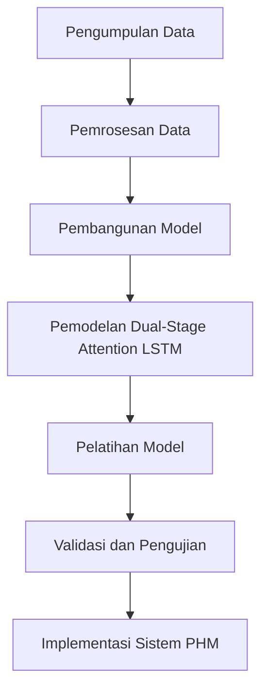

# 852 — Prognostics and Health Management (PHM) untuk Mesin Turbofan Aerospace: Estimasi Remaining Useful Life (RUL) melalui Dual-Stage Attention LSTM, Sensor Degradation Drift, dan Benchmark C-MAPSS

**Domain:** Teknik Industri & Rekayasa Sistem Industri  
**Topik Spesialis:** Prognostics and Health Management (PHM) for Aerospace Turbofan Engines: Remaining Useful Life (RUL) Estimation via Dual-Stage Attention LSTM, Sensor Degradation Drift, and C-MAPSS Benchmark  
**Standar & Referensi Utama:** Saxena et al. (NASA C-MAPSS); ISO 13374; Vachtsevanos et al. (Intelligent Fault Diagnosis and Prognosis for Engineering Systems, Wiley)

---

## 1. Pendahuluan dan Konteks Industri

Prognostics and Health Management (PHM) merupakan pendekatan yang sangat penting dalam industri penerbangan, terutama untuk mesin turbofan. Dengan meningkatnya kompleksitas mesin dan tuntutan untuk efisiensi operasional yang lebih tinggi, estimasi Remaining Useful Life (RUL) menjadi krusial untuk mengurangi biaya pemeliharaan dan meningkatkan keselamatan penerbangan. Menurut Saxena et al. (2008), mesin turbofan adalah salah satu komponen paling mahal dalam pesawat terbang, dan kegagalan mesin dapat menyebabkan kerugian finansial yang signifikan serta risiko keselamatan yang tinggi.

Dalam konteks ini, tantangan utama yang dihadapi adalah akurasi dalam memprediksi RUL, yang dipengaruhi oleh degradasi sensor dan drift data. Degradasi sensor dapat mengakibatkan informasi yang tidak akurat mengenai kondisi mesin, sehingga mempersulit proses diagnosis dan prognostik. Selain itu, perubahan lingkungan operasional dan variasi dalam pola penggunaan mesin juga dapat mempengaruhi akurasi estimasi RUL. Oleh karena itu, pengembangan metode yang lebih baik untuk memprediksi RUL, seperti penggunaan model Dual-Stage Attention LSTM, menjadi sangat penting.

Dalam industri manufaktur dan rantai pasok modern, penerapan PHM tidak hanya meningkatkan efisiensi operasional tetapi juga mengurangi downtime dan biaya pemeliharaan. Dengan mengadopsi standar ISO 13374, perusahaan dapat memastikan bahwa sistem PHM yang diterapkan memenuhi kriteria kualitas dan keandalan yang tinggi. Oleh karena itu, penelitian ini bertujuan untuk memberikan pemahaman yang mendalam tentang metodologi dan aplikasi PHM dalam konteks mesin turbofan, serta tantangan yang dihadapi dalam implementasinya.

## 2. Landasan Teori & Formulasi Matematis

### 2.1. Definisi dan Notasi

Dalam konteks PHM, RUL didefinisikan sebagai waktu yang tersisa sebelum suatu komponen atau sistem mengalami kegagalan. Secara matematis, RUL dapat dinyatakan sebagai:

$$
RUL(t) = T_f - t
$$

di mana:
- $RUL(t)$ = Remaining Useful Life pada waktu $t$,
- $T_f$ = waktu kegagalan yang diprediksi,
- $t$ = waktu saat ini.

### 2.2. Model Dual-Stage Attention LSTM

Model Dual-Stage Attention LSTM menggabungkan dua tahap perhatian untuk meningkatkan akurasi prediksi. Pada tahap pertama, perhatian diterapkan pada fitur input untuk menyoroti informasi yang relevan, sedangkan pada tahap kedua, perhatian diterapkan pada urutan waktu untuk menangkap dinamika temporal. Model ini dapat dinyatakan dengan persamaan berikut:

$$
h_t = LSTM(x_t, h_{t-1}, c_{t-1})
$$

di mana:
- $h_t$ = status tersembunyi pada waktu $t$,
- $x_t$ = input pada waktu $t$,
- $c_{t-1}$ = status sel memori pada waktu $t-1$.

### 2.3. Degradasi Sensor

Degradasi sensor dapat dimodelkan dengan menggunakan fungsi drift yang mengubah nilai pengukuran seiring waktu. Misalkan $S(t)$ adalah nilai sensor pada waktu $t$, maka degradasi dapat dinyatakan sebagai:

$$
S(t) = S_0 + D(t)
$$

di mana:
- $S_0$ = nilai awal sensor,
- $D(t)$ = fungsi degradasi yang dapat dinyatakan sebagai $D(t) = k \cdot t^n$, dengan $k$ dan $n$ adalah parameter yang ditentukan berdasarkan data historis.

## 3. Metodologi Rekayasa & Standar Prosedur Operasional (SOP)

### 3.1. Langkah-Langkah Implementasi

1. **Pengumpulan Data**: Mengumpulkan data operasional dari mesin turbofan, termasuk data sensor dan kondisi lingkungan.
2. **Pra-pemrosesan Data**: Menghilangkan noise dan mengatasi masalah degradasi sensor menggunakan teknik interpolasi dan normalisasi.
3. **Pengembangan Model**: Membangun model Dual-Stage Attention LSTM menggunakan data yang telah diproses.
4. **Pelatihan Model**: Melatih model dengan menggunakan dataset C-MAPSS untuk memastikan generalisasi yang baik.
5. **Validasi dan Pengujian**: Menggunakan data validasi untuk menguji akurasi model dan melakukan tuning parameter jika diperlukan.
6. **Implementasi Sistem PHM**: Mengintegrasikan model ke dalam sistem pemantauan untuk estimasi RUL secara real-time.

### 3.2. Diagram Alir Proses

## 4. Studi Kasus Kuantitatif Industri & Perhitungan Numerik

### 4.1. Contoh Kasus

Misalkan kita memiliki data sensor dari mesin turbofan dengan parameter sebagai berikut:
- $S_0 = 100$ (nilai awal sensor),
- $k = 0.5$, $n = 2$ (parameter degradasi),
- Waktu pengukuran $t = 10$ jam.

### 4.2. Perhitungan Degradasi Sensor

Menggunakan rumus degradasi:

$$
D(t) = k \cdot t^n = 0.5 \cdot 10^2 = 50
$$

Maka nilai sensor pada waktu $t = 10$ jam adalah:

$$
S(10) = S_0 + D(10) = 100 + 50 = 150
$$

### 4.3. Estimasi RUL

Misalkan kita memprediksi waktu kegagalan $T_f = 100$ jam. Maka estimasi RUL pada waktu $t = 10$ jam adalah:

$$
RUL(10) = T_f - t = 100 - 10 = 90 \text{ jam}
$$

### 4.4. Interpretasi Hasil

Hasil perhitungan menunjukkan bahwa mesin turbofan masih memiliki RUL sebesar 90 jam. Namun, dengan degradasi sensor yang signifikan, perlu dilakukan pemantauan yang lebih ketat untuk memastikan bahwa data yang dihasilkan tetap akurat dan dapat diandalkan.

## 5. Evaluasi Kritis, Aplikasi Lintas Sektor & Standar Masa Depan

### 5.1. Hubungan dengan Disiplin Lain

PHM tidak hanya relevan dalam industri penerbangan, tetapi juga dapat diterapkan dalam berbagai sektor lain seperti otomotif, energi, dan manufaktur. Dalam konteks rantai pasok, PHM dapat membantu dalam pengelolaan persediaan dan pemeliharaan prediktif, yang pada gilirannya dapat mengurangi biaya dan meningkatkan efisiensi.

### 5.2. Batasan Metodologi

Salah satu batasan dari metodologi ini adalah ketergantungan pada data historis yang berkualitas tinggi. Jika data yang digunakan untuk pelatihan model tidak representatif, maka akurasi prediksi RUL dapat menurun. Selain itu, kompleksitas model dapat menyebabkan waktu komputasi yang lebih lama, yang mungkin tidak sesuai untuk aplikasi waktu nyata.

### 5.3. Arah Riset Masa Depan

Ke depan, penelitian dapat difokuskan pada pengembangan algoritma yang lebih efisien dan akurat untuk estimasi RUL, serta integrasi teknologi baru seperti Internet of Things (IoT) dan pembelajaran mesin untuk meningkatkan akurasi dan kecepatan pemantauan kondisi. Selain itu, penerapan standar ISO 13374 dalam sistem PHM akan menjadi penting untuk memastikan kualitas dan keandalan sistem yang diterapkan.

---

Dokumen ini memberikan gambaran komprehensif tentang PHM untuk mesin turbofan, dengan fokus pada estimasi RUL menggunakan model Dual-Stage Attention LSTM. Dengan mengikuti metodologi yang sistematis dan mematuhi standar yang relevan, diharapkan dapat meningkatkan efisiensi operasional dan keselamatan dalam industri penerbangan.

## 5. Ringkasan & Catatan Praktis Implementasi
Implementasi metode ini memerlukan standarisasi prosedur operasi (SOP), kalibrasi instrumen berkala, serta integrasi pemantauan real-time untuk memastikan konsistensi performa dan efisiensi sistem secara berkelanjutan.
