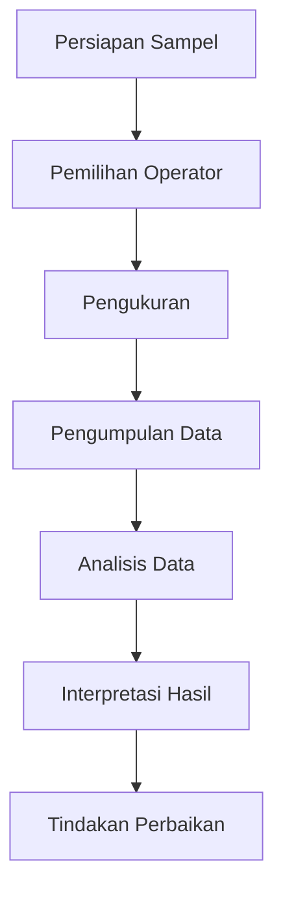

# 856 — Analisis Lanjut Gauge R&R untuk Pengujian Destruktif & Metrologi Semikonduktor Berpresisi Tinggi: Model ANOVA Efek Acak Bersarang, Isolasi Varians Antar Bagian, dan Ambang NDC

**Domain:** Teknik Industri & Rekayasa Sistem Industri  
**Topik Spesialis:** Advanced Gauge R&R for Destructive Testing & High-Precision Semiconductor Metrology: Nested ANOVA Random Effects Model, Part-to-Part Variance Isolation, and NDC Thresholds  
**Standar & Referensi Utama:** AIAG MSA Reference Manual (4th/5th Ed.); Wheeler (Evaluating the Measurement Process); ISO/IEC 17025

---

## 1. Pendahuluan dan Konteks Industri

Dalam konteks industri modern, pengujian dan pengukuran yang akurat menjadi semakin penting, terutama dalam sektor semikonduktor dan manufaktur yang melibatkan pengujian destruktif. Dengan meningkatnya kompleksitas produk dan kebutuhan untuk memenuhi standar kualitas yang ketat, perusahaan menghadapi tantangan signifikan dalam memastikan bahwa proses pengukuran mereka dapat diandalkan dan konsisten. Pengujian destruktif, di mana sampel diuji hingga batas kegagalan, memerlukan metode pengukuran yang mampu memberikan informasi yang akurat tentang variabilitas produk dan proses.

Salah satu pendekatan yang diakui secara luas untuk mengevaluasi sistem pengukuran adalah Gauge Repeatability and Reproducibility (Gauge R&R). Namun, dalam konteks pengujian destruktif dan metrologi semikonduktor berpresisi tinggi, metode tradisional Gauge R&R sering kali tidak cukup. Oleh karena itu, diperlukan pendekatan yang lebih canggih, seperti model ANOVA efek acak bersarang, untuk mengisolasi varians antar bagian dan menentukan ambang nilai tidak dapat dibedakan (NDC).

Dalam industri semikonduktor, di mana toleransi sangat ketat dan kesalahan dapat menyebabkan kerugian finansial yang signifikan, penerapan metodologi ini menjadi sangat penting. Dengan menggunakan model ANOVA dan teknik isolasi varians, perusahaan dapat mengidentifikasi sumber variabilitas dalam proses pengukuran dan meningkatkan kualitas produk akhir. Hal ini tidak hanya meningkatkan efisiensi operasional tetapi juga memberikan keunggulan kompetitif di pasar yang semakin ketat.

## 2. Landasan Teori & Formulasi Matematis

### 2.1. Definisi Variabel dan Parameter

- $Y_{ijk}$: Nilai pengukuran untuk bagian ke-$i$, operator ke-$j$, dan pengulangan ke-$k$.
- $\mu$: Rata-rata keseluruhan pengukuran.
- $\tau_i$: Efek acak dari bagian ke-$i$.
- $\beta_j$: Efek acak dari operator ke-$j$.
- $\epsilon_{ijk}$: Kesalahan acak yang tidak terukur.

### 2.2. Model ANOVA Efek Acak Bersarang

Model ANOVA efek acak bersarang dapat dinyatakan sebagai:

$$
Y_{ijk} = \mu + \tau_i + \beta_j + \epsilon_{ijk}
$$

Di mana:

- $\tau_i \sim N(0, \sigma^2_\tau)$
- $\beta_j \sim N(0, \sigma^2_\beta)$
- $\epsilon_{ijk} \sim N(0, \sigma^2_\epsilon)$

### 2.3. Varians Total

Varians total ($\sigma^2_{total}$) dapat dinyatakan sebagai:

$$
\sigma^2_{total} = \sigma^2_\tau + \sigma^2_\beta + \sigma^2_\epsilon
$$

### 2.4. Isolasi Varians Antar Bagian

Untuk mengisolasi varians antar bagian, kita dapat menggunakan rumus berikut:

$$
NDC = \frac{1}{\sqrt{\frac{\sigma^2_\tau}{\sigma^2_{total}}}} \text{ (Ambang NDC)}
$$

Di mana NDC adalah nilai tidak dapat dibedakan, yang menunjukkan seberapa banyak variasi yang dapat diterima dalam pengukuran.

## 3. Metodologi Rekayasa & Standar Prosedur Operasional (SOP)

### 3.1. Langkah-langkah Implementasi

1. **Persiapan Sampel**: Pilih sampel yang representatif dari bagian yang akan diuji.
2. **Pelatihan Operator**: Pastikan semua operator dilatih untuk menggunakan alat pengukur dengan benar.
3. **Pengukuran**: Lakukan pengukuran pada setiap bagian oleh setiap operator dengan beberapa pengulangan.
4. **Pengumpulan Data**: Catat semua data pengukuran dalam format yang terstruktur.
5. **Analisis Data**: Gunakan model ANOVA efek acak bersarang untuk menganalisis data.
6. **Interpretasi Hasil**: Evaluasi hasil analisis untuk menentukan variabilitas dan ambang NDC.
7. **Tindakan Perbaikan**: Jika diperlukan, lakukan tindakan perbaikan berdasarkan hasil analisis.

### 3.2. Diagram Alir Proses

## 4. Studi Kasus Kuantitatif Industri & Perhitungan Numerik

### 4.1. Contoh Kasus

Misalkan kita memiliki 5 bagian yang diuji oleh 3 operator dengan 2 pengulangan setiap pengukuran. Data pengukuran yang diperoleh adalah sebagai berikut:

| Bagian | Operator 1 | Operator 2 | Operator 3 |
|--------|------------|------------|------------|
| 1      | 10.1      | 10.3      | 10.2      |
| 2      | 10.5      | 10.4      | 10.6      |
| 3      | 10.2      | 10.1      | 10.3      |
| 4      | 10.4      | 10.5      | 10.3      |
| 5      | 10.3      | 10.2      | 10.4      |

### 4.2. Perhitungan Varians

1. **Hitung Rata-rata ($\mu$)**:

$$
\mu = \frac{10.1 + 10.3 + 10.2 + 10.5 + 10.4 + 10.6 + 10.2 + 10.1 + 10.3 + 10.4 + 10.5 + 10.3 + 10.3 + 10.2 + 10.4}{15} = 10.33
$$

2. **Hitung Varians Bagian ($\sigma^2_\tau$)**:

$$
\sigma^2_\tau = \frac{1}{n-1} \sum_{i=1}^{n} (Y_i - \mu)^2
$$

3. **Hitung Varians Operator ($\sigma^2_\beta$)** dan **Kesalahan ($\sigma^2_\epsilon$)** menggunakan metode yang sama.

4. **Hitung NDC**:

Setelah mendapatkan nilai varians, kita dapat menghitung NDC menggunakan rumus yang telah ditentukan sebelumnya.

### 4.3. Interpretasi Hasil

Hasil dari analisis ini akan memberikan wawasan tentang seberapa besar variabilitas yang disebabkan oleh bagian dan operator. Jika NDC lebih besar dari ambang batas yang ditetapkan, maka sistem pengukuran dianggap dapat diterima.

## 5. Evaluasi Kritis, Aplikasi Lintas Sektor & Standar Masa Depan

Penerapan metode Gauge R&R dan model ANOVA efek acak bersarang tidak hanya terbatas pada industri semikonduktor, tetapi juga dapat diterapkan dalam sektor lain seperti otomotif, farmasi, dan produk konsumen. Dalam konteks rantai pasok, pemahaman yang lebih baik tentang variabilitas pengukuran dapat membantu dalam pengelolaan kualitas dan pengurangan biaya.

Namun, terdapat batasan dalam metodologi ini, seperti asumsi normalitas dan independensi data. Penelitian masa depan dapat mengeksplorasi penggunaan teknik pembelajaran mesin untuk meningkatkan analisis data pengukuran dan mengatasi batasan yang ada.

Dengan demikian, penerapan metode ini diharapkan dapat meningkatkan efisiensi dan efektivitas proses pengukuran di berbagai sektor industri, serta mendukung pencapaian standar kualitas yang lebih tinggi.

## 5. Ringkasan & Catatan Praktis Implementasi
Implementasi metode ini memerlukan standarisasi prosedur operasi (SOP), kalibrasi instrumen berkala, serta integrasi pemantauan real-time untuk memastikan konsistensi performa dan efisiensi sistem secara berkelanjutan.
