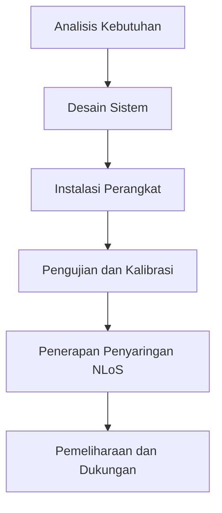

# 876 — Sistem Lokasi Real-Time Ultra-Wideband (UWB) di Hanggar Perakitan Berat: Trilaterasi Time-Difference-of-Arrival (TDoA), Penyaringan Non-Line-of-Sight (NLoS), dan Spasi Pabrik

**Domain:** Teknik Industri & Rekayasa Sistem Industri  
**Topik Spesialis:** Ultra-Wideband (UWB) Real-Time Locating Systems (RTLS) in Heavy Assembly Hangars: Time-Difference-of-Arrival (TDoA) Trilateration, Non-Line-of-Sight (NLoS) Filtering, and Factory Spacing  
**Standar & Referensi Utama:** IEEE 802.15.4z; ISO/IEC 24730; Zafari et al. (IEEE Commun. Surv. Tutorials)

---

## 1. Pendahuluan dan Konteks Industri

Dalam era industri 4.0, efisiensi operasional dan pengurangan biaya menjadi prioritas utama bagi perusahaan manufaktur. Salah satu tantangan signifikan dalam konteks ini adalah pengelolaan aset dan sumber daya di lingkungan yang kompleks seperti hanggar perakitan berat. Ultra-Wideband (UWB) Real-Time Locating Systems (RTLS) menawarkan solusi inovatif untuk masalah ini dengan memberikan kemampuan pelacakan yang akurat dan real-time. Sistem ini memungkinkan identifikasi lokasi alat berat dan komponen dalam hanggar, yang berkontribusi pada pengurangan waktu henti dan peningkatan produktivitas.

Urgensi implementasi UWB RTLS di hanggar perakitan berat tidak dapat diabaikan. Dalam industri yang sangat kompetitif, keterlambatan dalam proses perakitan dapat menyebabkan kerugian finansial yang signifikan. Menurut Zafari et al. (2020), sistem pelacakan yang efisien dapat mengurangi waktu siklus produksi hingga 30%. Namun, tantangan yang dihadapi termasuk interferensi sinyal, terutama dalam kondisi Non-Line-of-Sight (NLoS), yang dapat mempengaruhi akurasi pengukuran. Oleh karena itu, penerapan teknik penyaringan NLoS dan metode trilaterasi Time-Difference-of-Arrival (TDoA) menjadi sangat penting untuk memastikan keandalan sistem.

Dalam konteks ini, pemahaman yang mendalam tentang prinsip-prinsip dasar UWB, teknik pengolahan sinyal, dan pengelolaan ruang pabrik menjadi krusial. Dengan memanfaatkan teknologi ini, perusahaan dapat meningkatkan efisiensi operasional, mengurangi biaya, dan meningkatkan daya saing di pasar global.

## 2. Landasan Teori & Formulasi Matematis

### 2.1. Prinsip Dasar UWB

Ultra-Wideband (UWB) adalah teknologi komunikasi nirkabel yang menggunakan spektrum frekuensi yang sangat lebar, biasanya lebih dari 500 MHz. Teknologi ini memungkinkan transmisi data dengan kecepatan tinggi dan akurasi yang tinggi dalam pengukuran jarak. Dalam konteks RTLS, UWB memanfaatkan prinsip Time-Difference-of-Arrival (TDoA) untuk menentukan lokasi objek.

### 2.2. Trilaterasi TDoA

Trilaterasi TDoA mengandalkan pengukuran waktu kedatangan sinyal dari beberapa pemancar (anchor) ke penerima (tag). Misalkan terdapat tiga pemancar dengan koordinat $(x_1, y_1)$, $(x_2, y_2)$, dan $(x_3, y_3)$, serta waktu kedatangan sinyal $t_1$, $t_2$, dan $t_3$. Jarak antara pemancar dan penerima dapat dihitung dengan rumus:

$$
d_i = c \cdot (t_i - t_0)
$$

di mana $c$ adalah kecepatan cahaya dan $t_0$ adalah waktu referensi yang ditentukan oleh pemancar.

Dengan menggunakan trilaterasi, kita dapat mengekspresikan posisi penerima $(x, y)$ sebagai solusi dari sistem persamaan berikut:

\[
\begin{align*}
(x - x_1)^2 + (y - y_1)^2 &= d_1^2 \\
(x - x_2)^2 + (y - y_2)^2 &= d_2^2 \\
(x - x_3)^2 + (y - y_3)^2 &= d_3^2
\end{align*}
\]

### 2.3. Penyaringan NLoS

Dalam lingkungan hanggar, sinyal dapat terhalang oleh berbagai objek, menyebabkan kesalahan dalam pengukuran jarak. Untuk mengatasi masalah ini, teknik penyaringan NLoS diperlukan. Salah satu metode yang umum digunakan adalah algoritma Kalman, yang dapat dinyatakan sebagai:

$$
\hat{x}_{k|k} = \hat{x}_{k|k-1} + K_k(z_k - H_k \hat{x}_{k|k-1})
$$

di mana:
- $\hat{x}_{k|k}$ adalah estimasi posisi pada langkah waktu $k$.
- $K_k$ adalah gain Kalman.
- $z_k$ adalah pengukuran aktual.
- $H_k$ adalah matriks pengukuran.

## 3. Metodologi Rekayasa & Standar Prosedur Operasional (SOP)

### 3.1. Langkah-langkah Implementasi

1. **Analisis Kebutuhan**: Identifikasi kebutuhan spesifik dari sistem RTLS yang akan diterapkan di hanggar perakitan.
2. **Desain Sistem**: Rancang arsitektur sistem yang mencakup pemilihan pemancar dan penerima, serta penempatan strategis untuk meminimalkan NLoS.
3. **Instalasi Perangkat**: Pasang perangkat keras sesuai dengan desain yang telah dibuat.
4. **Pengujian dan Kalibrasi**: Lakukan pengujian sistem untuk memastikan akurasi dan keandalan. Kalibrasi sistem berdasarkan hasil pengujian.
5. **Implementasi Penyaringan NLoS**: Terapkan algoritma penyaringan untuk meningkatkan akurasi pengukuran.
6. **Pelatihan Pengguna**: Berikan pelatihan kepada operator dan pengguna sistem.
7. **Pemeliharaan dan Dukungan**: Siapkan rencana pemeliharaan untuk memastikan sistem tetap berfungsi dengan baik.

### 3.2. Diagram Alir Proses

## 4. Studi Kasus Kuantitatif Industri & Perhitungan Numerik

### 4.1. Contoh Kasus

Misalkan kita memiliki tiga pemancar dengan koordinat sebagai berikut:
- Pemancar 1: $(0, 0)$
- Pemancar 2: $(10, 0)$
- Pemancar 3: $(5, 10)$

Waktu kedatangan sinyal yang terukur adalah:
- $t_1 = 0.0005$ s
- $t_2 = 0.0007$ s
- $t_3 = 0.0006$ s

### 4.2. Perhitungan Jarak

Menggunakan kecepatan cahaya $c = 3 \times 10^8$ m/s, kita dapat menghitung jarak sebagai berikut:

\[
\begin{align*}
d_1 &= c \cdot t_1 = 3 \times 10^8 \cdot 0.0005 = 150000 \text{ m} \\
d_2 &= c \cdot t_2 = 3 \times 10^8 \cdot 0.0007 = 210000 \text{ m} \\
d_3 &= c \cdot t_3 = 3 \times 10^8 \cdot 0.0006 = 180000 \text{ m}
\end{align*}
\]

### 4.3. Penyelesaian Sistem Persamaan

Dengan menggunakan trilaterasi, kita dapat menyelesaikan sistem persamaan yang telah ditentukan sebelumnya. Namun, untuk kesederhanaan, kita akan menggunakan metode numerik atau perangkat lunak untuk menemukan posisi $(x, y)$.

### 4.4. Interpretasi Hasil

Setelah menghitung posisi, kita dapat menentukan lokasi alat berat di hanggar, yang memungkinkan manajer untuk mengoptimalkan penempatan alat dan meningkatkan efisiensi perakitan.

## 5. Evaluasi Kritis, Aplikasi Lintas Sektor & Standar Masa Depan

Sistem RTLS berbasis UWB tidak hanya relevan dalam konteks perakitan berat, tetapi juga dapat diterapkan dalam berbagai sektor seperti logistik, kesehatan, dan otomasi pabrik. Dalam rantai pasok, teknologi ini dapat meningkatkan visibilitas dan pelacakan barang, yang pada gilirannya mengurangi biaya dan meningkatkan kepuasan pelanggan.

Namun, terdapat beberapa batasan dalam metodologi ini, termasuk biaya implementasi awal dan kebutuhan untuk pemeliharaan sistem yang berkelanjutan. Oleh karena itu, penelitian lebih lanjut diperlukan untuk mengembangkan solusi yang lebih efisien dan terjangkau.

Arah riset masa depan dapat mencakup pengembangan algoritma yang lebih canggih untuk penyaringan NLoS dan integrasi teknologi baru seperti Internet of Things (IoT) untuk meningkatkan interoperabilitas sistem. Dengan demikian, UWB RTLS memiliki potensi untuk menjadi komponen kunci dalam transformasi digital industri.

--- 

Dokumen ini memberikan panduan komprehensif mengenai penerapan UWB RTLS di hanggar perakitan berat, mencakup teori, metodologi, studi kasus, dan evaluasi kritis yang relevan dengan standar industri terkini.

## 5. Ringkasan & Catatan Praktis Implementasi
Implementasi metode ini memerlukan standarisasi prosedur operasi (SOP), kalibrasi instrumen berkala, serta integrasi pemantauan real-time untuk memastikan konsistensi performa dan efisiensi sistem secara berkelanjutan.
