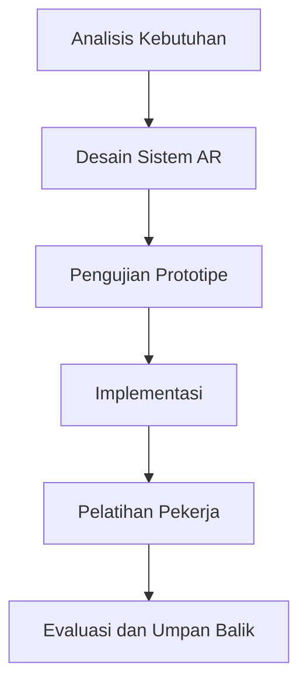

# 877 — Augmented Reality (AR) Spatial Computing for Complex High-Mix Assembly Work Instructions: Head-Mounted Display (HMD) Cognitive Load Reduction, Spatial Anchoring, and Error Proofing

**Domain:** Teknik Industri & Rekayasa Sistem Industri  
**Topik Spesialis:** Augmented Reality (AR) Spatial Computing for Complex High-Mix Assembly Work Instructions: Head-Mounted Display (HMD) Cognitive Load Reduction, Spatial Anchoring, and Error Proofing  
**Standar & Referensi Utama:** Billinghurst et al. (Foundations and Trends in HCI); ISO 9241-920; IEEE Trans. Vis. Comput. Graph.

---

## 1. Pendahuluan dan Konteks Industri

Dalam era industri 4.0, penerapan teknologi canggih seperti Augmented Reality (AR) menjadi semakin penting dalam meningkatkan efisiensi dan efektivitas proses manufaktur. AR memungkinkan pekerja untuk mendapatkan informasi yang relevan secara real-time, yang sangat penting dalam lingkungan produksi dengan variasi tinggi (high-mix) dan kompleksitas tinggi. Tantangan utama yang dihadapi oleh industri saat ini adalah mengurangi beban kognitif pekerja, yang sering kali disebabkan oleh instruksi kerja yang rumit dan beragam. Hal ini berpotensi menyebabkan kesalahan dalam perakitan, yang tidak hanya mempengaruhi kualitas produk tetapi juga meningkatkan biaya operasional.

Menurut Billinghurst et al. (2020), penggunaan Head-Mounted Display (HMD) dalam konteks AR dapat membantu mengurangi beban kognitif dengan menyediakan panduan visual yang terintegrasi dengan lingkungan fisik. Selain itu, ISO 9241-920 menekankan pentingnya desain interaksi yang baik untuk meningkatkan pengalaman pengguna dan mengurangi kesalahan. Dalam konteks ini, spatial anchoring menjadi kunci untuk memastikan bahwa informasi yang ditampilkan di HMD relevan dan mudah diakses oleh pekerja. Dengan demikian, penerapan AR dalam instruksi kerja perakitan tidak hanya meningkatkan efisiensi tetapi juga berkontribusi pada keselamatan kerja dan kepuasan pekerja.

## 2. Landasan Teori & Formulasi Matematis

### 2.1. Beban Kognitif

Beban kognitif dapat didefinisikan sebagai jumlah sumber daya mental yang diperlukan untuk menyelesaikan suatu tugas. Dalam konteks AR, beban kognitif dapat dihitung menggunakan rumus:

$$
Cognitive\ Load = \frac{Mental\ Effort}{Performance}
$$

Di mana:
- \( Mental\ Effort \) adalah jumlah usaha mental yang diperlukan untuk menyelesaikan tugas.
- \( Performance \) adalah tingkat keberhasilan dalam menyelesaikan tugas tersebut.

### 2.2. Spatial Anchoring

Spatial anchoring dalam AR merujuk pada kemampuan untuk mengaitkan informasi digital dengan lokasi fisik tertentu. Ini dapat dinyatakan dengan rumus:

$$
Anchor\ Position = (x, y, z)
$$

Di mana \( (x, y, z) \) adalah koordinat dalam sistem referensi dunia nyata.

### 2.3. Error Proofing

Error proofing adalah pendekatan untuk mengurangi kemungkinan kesalahan dalam proses. Dalam konteks ini, kita dapat menggunakan rumus probabilitas untuk menghitung kemungkinan terjadinya kesalahan:

$$
P(Error) = \frac{N_{errors}}{N_{trials}}
$$

Di mana:
- \( N_{errors} \) adalah jumlah kesalahan yang terjadi.
- \( N_{trials} \) adalah jumlah total percobaan.

## 3. Metodologi Rekayasa & Standar Prosedur Operasional (SOP)

### 3.1. Langkah-langkah Implementasi

1. **Analisis Kebutuhan**: Mengidentifikasi kebutuhan spesifik dari pekerja dan proses perakitan.
2. **Desain Sistem AR**: Mengembangkan prototipe sistem AR yang mencakup HMD dan perangkat lunak yang relevan.
3. **Pengujian Prototipe**: Melakukan pengujian untuk mengevaluasi efektivitas sistem dalam mengurangi beban kognitif dan meningkatkan akurasi.
4. **Implementasi**: Mengintegrasikan sistem AR ke dalam proses perakitan yang ada.
5. **Pelatihan Pekerja**: Memberikan pelatihan kepada pekerja mengenai penggunaan sistem AR.
6. **Evaluasi dan Umpan Balik**: Mengumpulkan umpan balik dari pekerja untuk perbaikan berkelanjutan.

### 3.2. Diagram Alir Proses

## 4. Studi Kasus Kuantitatif Industri & Perhitungan Numerik

### 4.1. Contoh Kasus

Misalkan sebuah perusahaan elektronik memproduksi 1000 unit perangkat dengan variasi tinggi. Dalam proses perakitan, mereka mencatat 50 kesalahan selama 2000 percobaan.

### 4.2. Perhitungan

1. **Hitung Beban Kognitif**:
   - Misalkan \( Mental\ Effort = 200 \) dan \( Performance = 0.9 \).
   - Maka,
   $$
   Cognitive\ Load = \frac{200}{0.9} \approx 222.22
   $$

2. **Hitung Probabilitas Kesalahan**:
   - \( N_{errors} = 50 \) dan \( N_{trials} = 2000 \).
   - Maka,
   $$
   P(Error) = \frac{50}{2000} = 0.025
   $$

### 4.3. Interpretasi Hasil

Hasil menunjukkan bahwa beban kognitif yang tinggi dapat berkontribusi pada tingkat kesalahan yang signifikan. Dengan menerapkan sistem AR, perusahaan dapat mengurangi beban kognitif dan meningkatkan akurasi, yang pada gilirannya dapat menurunkan biaya dan meningkatkan kepuasan pelanggan.

## 5. Evaluasi Kritis, Aplikasi Lintas Sektor & Standar Masa Depan

Penerapan AR dalam instruksi kerja tidak hanya terbatas pada industri manufaktur. Teknologi ini juga dapat diterapkan dalam sektor kesehatan, pendidikan, dan logistik. Misalnya, dalam sektor kesehatan, AR dapat digunakan untuk memberikan panduan visual kepada dokter selama prosedur bedah. Dalam logistik, AR dapat membantu dalam pengambilan keputusan yang lebih cepat dan akurat.

Namun, terdapat beberapa batasan dalam metodologi ini, seperti kebutuhan akan perangkat keras yang mahal dan tantangan dalam integrasi dengan sistem yang ada. Oleh karena itu, penelitian lebih lanjut diperlukan untuk mengatasi tantangan ini dan mengeksplorasi potensi AR dalam konteks yang lebih luas.

Ke depan, standar industri seperti ISO 9241-920 dapat berperan penting dalam mengarahkan pengembangan teknologi AR untuk memastikan bahwa solusi yang dihasilkan tidak hanya efektif tetapi juga aman dan ramah pengguna. Penelitian lebih lanjut juga diharapkan dapat mengidentifikasi cara-cara baru untuk mengurangi beban kognitif dan meningkatkan pengalaman pengguna dalam konteks AR.

Dengan demikian, penerapan AR dalam instruksi kerja perakitan dapat menjadi solusi inovatif untuk tantangan yang dihadapi oleh industri modern, meningkatkan efisiensi, mengurangi kesalahan, dan meningkatkan keselamatan kerja.