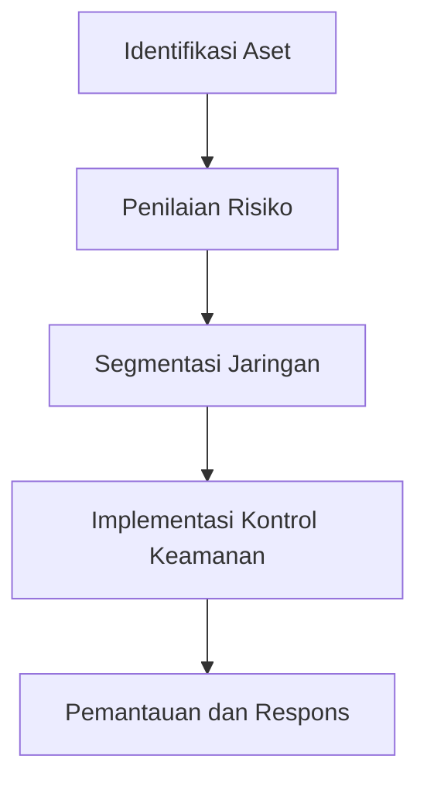

# 880 — Keamanan Siber dalam Sistem Kontrol Industri: Pendekatan IEC 62443

**Domain:** Teknik Industri & Rekayasa Sistem Industri  
**Topik Spesialis:** Industrial Control Systems (ICS) Cybersecurity Engineering: IEC 62443 Security Levels (SL 1-4), Zone and Conduit Segmentation, Deep Packet Inspection (DPI) for Modbus/OPC, and DMZ  
**Standar & Referensi Utama:** IEC 62443-3-3 / IEC 62443-4-2; NIST SP 800-82 Rev 3; Knapp & Langill (Applied Cyber Security and the Smart Grid, Syngress)

---

## 1. Pendahuluan dan Konteks Industri

Dalam era digitalisasi industri, keamanan siber pada sistem kontrol industri (ICS) menjadi sangat penting. ICS mencakup berbagai sistem yang digunakan untuk mengontrol proses industri, seperti SCADA (Supervisory Control and Data Acquisition), DCS (Distributed Control Systems), dan PLC (Programmable Logic Controllers). Dengan meningkatnya konektivitas dan integrasi sistem, ICS semakin rentan terhadap serangan siber yang dapat mengakibatkan kerugian finansial yang signifikan, gangguan operasional, dan bahkan ancaman terhadap keselamatan manusia.

Menurut laporan NIST SP 800-82 Rev 3, serangan terhadap ICS dapat menyebabkan dampak yang luas, termasuk kerusakan infrastruktur kritis, pencemaran lingkungan, dan risiko terhadap keselamatan publik. Oleh karena itu, penerapan standar keamanan siber seperti IEC 62443 menjadi sangat mendesak. Standar ini memberikan kerangka kerja untuk mengidentifikasi dan mengelola risiko keamanan, serta menetapkan tingkat keamanan yang sesuai untuk berbagai jenis sistem dan aplikasi.

Tantangan utama dalam implementasi keamanan siber di ICS meliputi kompleksitas sistem, keterbatasan sumber daya, dan kebutuhan untuk menjaga ketersediaan dan integritas sistem. Selain itu, banyak organisasi yang masih mengandalkan praktik keamanan yang tidak memadai, seperti penggunaan kata sandi yang lemah dan kurangnya segmentasi jaringan. Oleh karena itu, pendekatan yang sistematis dan berbasis standar sangat diperlukan untuk melindungi sistem kontrol industri dari ancaman yang terus berkembang.

## 2. Landasan Teori & Formulasi Matematis

### 2.1. Keamanan Siber dan IEC 62443

IEC 62443 adalah standar internasional yang dirancang untuk meningkatkan keamanan siber dalam sistem otomasi industri. Standar ini dibagi menjadi beberapa bagian, dengan IEC 62443-3-3 dan IEC 62443-4-2 yang menjadi fokus utama dalam konteks ini. 

### 2.2. Tingkat Keamanan (Security Levels)

IEC 62443 mendefinisikan empat tingkat keamanan (SL 1-4) yang mencakup:

- **SL 1:** Perlindungan dasar terhadap ancaman yang tidak disengaja.
- **SL 2:** Perlindungan terhadap ancaman yang disengaja dengan kemampuan deteksi.
- **SL 3:** Perlindungan yang lebih kuat dengan kemampuan respons terhadap insiden.
- **SL 4:** Perlindungan tertinggi dengan kontrol yang ketat dan pengawasan berkelanjutan.

### 2.3. Segmentasi Zona dan Saluran

Segmentasi zona dan saluran adalah teknik yang digunakan untuk membatasi akses dan mengurangi risiko di dalam jaringan ICS. Dengan membagi jaringan menjadi zona yang lebih kecil, organisasi dapat mengontrol aliran data dan mengurangi dampak dari serangan yang berhasil.

### 2.4. Deep Packet Inspection (DPI)

DPI adalah teknik analisis data yang memungkinkan pemantauan dan pengendalian lalu lintas jaringan secara mendalam. Dalam konteks Modbus dan OPC, DPI dapat digunakan untuk mendeteksi dan mencegah serangan yang menargetkan protokol komunikasi ini.

### 2.5. Model Matematis

Model keamanan dapat dinyatakan dalam bentuk fungsi probabilitas. Misalkan $P(A)$ adalah probabilitas terjadinya serangan, dan $P(S)$ adalah probabilitas sistem bertahan terhadap serangan. Maka, kita dapat mendefinisikan efisiensi keamanan sebagai:

$$
E = \frac{P(S)}{P(A)}
$$

Di mana $E$ adalah efisiensi keamanan. Semakin tinggi nilai $E$, semakin efektif sistem dalam mempertahankan diri terhadap serangan.

## 3. Metodologi Rekayasa & Standar Prosedur Operasional (SOP)

### 3.1. Langkah-langkah Implementasi

1. **Identifikasi Aset:** Mengidentifikasi semua aset yang ada dalam sistem kontrol industri.
2. **Penilaian Risiko:** Melakukan penilaian risiko untuk menentukan potensi ancaman dan kerentanan.
3. **Segmentasi Jaringan:** Menerapkan segmentasi zona dan saluran untuk membatasi akses.
4. **Implementasi Kontrol Keamanan:** Mengimplementasikan kontrol keamanan yang sesuai dengan tingkat keamanan yang ditentukan.
5. **Pemantauan dan Respons:** Mengatur sistem pemantauan untuk mendeteksi dan merespons insiden keamanan.

### 3.2. Diagram Alir Proses

## 4. Studi Kasus Kuantitatif Industri & Perhitungan Numerik

### 4.1. Contoh Kasus

Misalkan sebuah pabrik menggunakan sistem SCADA untuk mengontrol proses produksi. Dalam penilaian risiko, ditemukan bahwa kemungkinan terjadinya serangan adalah 0,1 (10%), dan sistem memiliki kemampuan bertahan sebesar 0,8 (80%).

### 4.2. Perhitungan

Menggunakan rumus efisiensi keamanan yang telah didefinisikan:

$$
E = \frac{P(S)}{P(A)} = \frac{0.8}{0.1} = 8
$$

### 4.3. Interpretasi Hasil

Nilai efisiensi keamanan sebesar 8 menunjukkan bahwa sistem memiliki kemampuan yang baik dalam melindungi diri dari serangan. Namun, organisasi harus terus melakukan pemantauan dan memperbarui kontrol keamanan untuk menjaga efisiensi ini.

## 5. Evaluasi Kritis, Aplikasi Lintas Sektor & Standar Masa Depan

Keamanan siber dalam ICS tidak hanya berdampak pada sektor industri, tetapi juga memiliki implikasi yang luas di sektor lain, seperti rantai pasok, otomasi, dan manajemen biaya. Dalam konteks rantai pasok, serangan terhadap ICS dapat mengganggu aliran barang dan informasi, yang pada gilirannya dapat mempengaruhi kinerja keseluruhan organisasi.

Selain itu, dengan meningkatnya perhatian terhadap keberlanjutan dan tanggung jawab sosial perusahaan (K3/ESG), penting bagi organisasi untuk mempertimbangkan aspek keamanan siber dalam strategi keberlanjutan mereka. Hal ini mencakup pengembangan teknologi baru dan praktik terbaik yang dapat membantu mengurangi risiko dan meningkatkan ketahanan sistem.

Arah riset masa depan dalam keamanan siber ICS harus fokus pada pengembangan teknologi baru, seperti kecerdasan buatan dan analitik data, untuk meningkatkan kemampuan deteksi dan respons terhadap ancaman. Selain itu, kolaborasi antara sektor publik dan swasta akan menjadi kunci dalam menciptakan kerangka kerja yang lebih kuat untuk melindungi infrastruktur kritis dari ancaman siber yang terus berkembang.

## 5. Ringkasan & Catatan Praktis Implementasi
Implementasi metode ini memerlukan standarisasi prosedur operasi (SOP), kalibrasi instrumen berkala, serta integrasi pemantauan real-time untuk memastikan konsistensi performa dan efisiensi sistem secara berkelanjutan.
