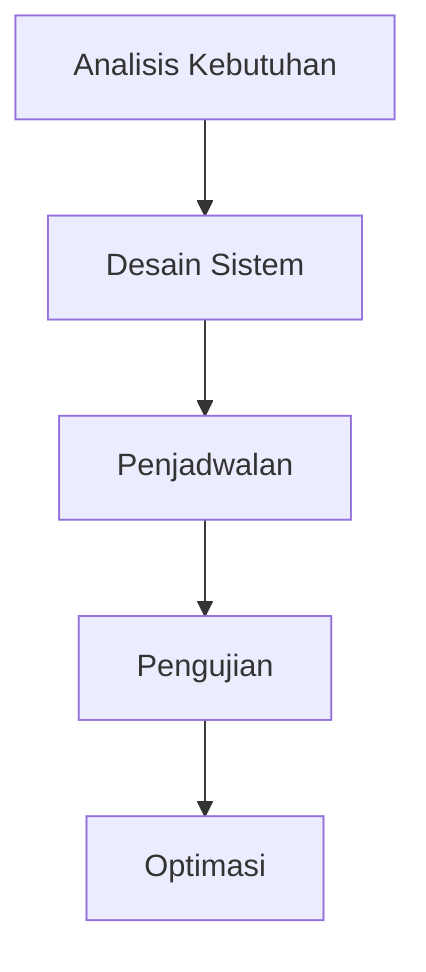

# 882 — Optimasi Throughput Multi-Tier pada Sistem Penyimpanan dan Pengambilan Berbasis Shuttle

**Domain:** Teknik Industri & Rekayasa Sistem Industri  
**Topik Spesialis:** Shuttle-Based Storage and Retrieval Systems (SBS/RS) Multi-Tier Throughput Optimization: Tier-Captive vs Roaming Shuttle Scheduling, Lift Dynamic Sequencing, and Queuing Network M/G/1  
**Standar & Referensi Utama:** Marchet et al. (2022, Comput. Ind. Eng.); Roodbergen & Vis (Eur. J. Oper. Res.); Tompkins et al. (Facilities Planning, 4th Ed., Wiley)

---

## 1. Pendahuluan dan Konteks Industri

Sistem Penyimpanan dan Pengambilan Berbasis Shuttle (SBS/RS) telah menjadi komponen penting dalam otomatisasi gudang modern. Dengan meningkatnya permintaan untuk efisiensi operasional dan pengurangan biaya, perusahaan menghadapi tantangan dalam mengoptimalkan throughput sistem penyimpanan. Dalam konteks industri, tantangan ini mencakup pengelolaan ruang penyimpanan yang terbatas, kebutuhan untuk pengambilan barang yang cepat, dan pengurangan waktu siklus. Menurut Marchet et al. (2022), optimasi throughput pada sistem multi-tier memerlukan pendekatan yang cermat dalam penjadwalan shuttle dan pengaturan lift.

Pentingnya optimasi ini tidak hanya terletak pada peningkatan produktivitas, tetapi juga pada dampaknya terhadap biaya operasional dan kepuasan pelanggan. Dalam rantai pasok yang semakin kompleks, perusahaan harus mampu merespons permintaan pasar yang fluktuatif dengan cepat. Roodbergen & Vis (Eur. J. Oper. Res.) menekankan bahwa sistem yang tidak teroptimasi dapat menyebabkan bottleneck, yang berujung pada keterlambatan pengiriman dan peningkatan biaya. Oleh karena itu, pemahaman yang mendalam tentang penjadwalan shuttle, urutan dinamis lift, dan model antrian M/G/1 menjadi sangat penting untuk mencapai efisiensi yang diinginkan.

## 2. Landasan Teori & Formulasi Matematis

### 2.1. Notasi dan Definisi Variabel

1. **Shuttle**: Unit transportasi yang bergerak di antara rak penyimpanan.
2. **Lift**: Perangkat yang mengangkut shuttle antara tingkat penyimpanan.
3. **Throughput ($T$)**: Jumlah item yang diproses per unit waktu.
4. **Waktu Layanan ($S$)**: Waktu yang dibutuhkan untuk mengambil atau menyimpan item.
5. **Waktu Antara Kedatangan ($A$)**: Waktu antara kedatangan item ke sistem.

### 2.2. Model Antrian M/G/1

Model antrian M/G/1 digunakan untuk menganalisis sistem penyimpanan. Dalam model ini, kita memiliki satu server (shuttle) dan waktu layanan yang mengikuti distribusi umum. Beberapa parameter penting adalah:

- **Rasio Utilisasi ($\rho$)**:
$$
\rho = \frac{\lambda}{\mu}
$$
di mana $\lambda$ adalah laju kedatangan dan $\mu$ adalah laju layanan.

- **Waktu Tunggu dalam Antrian ($W_q$)**:
$$
W_q = \frac{\rho}{\mu(1 - \rho)}
$$

- **Waktu Total dalam Sistem ($W$)**:
$$
W = W_q + \frac{1}{\mu}
$$

### 2.3. Penjadwalan Shuttle

Penjadwalan shuttle dapat dibagi menjadi dua kategori: Tier-Captive dan Roaming. 

- **Tier-Captive Scheduling**: Shuttle hanya beroperasi di tingkat tertentu.
- **Roaming Scheduling**: Shuttle dapat bergerak bebas antara tingkat.

### 2.4. Dinamika Urutan Lift

Urutan dinamis lift dapat dinyatakan sebagai fungsi dari waktu dan posisi shuttle. Misalkan $D(t)$ adalah waktu yang dibutuhkan lift untuk menyelesaikan tugas pada waktu $t$, maka:

$$
D(t) = \sum_{i=1}^{n} d_i(t)
$$

di mana $d_i(t)$ adalah waktu yang dibutuhkan untuk mengangkut shuttle ke tingkat $i$.

## 3. Metodologi Rekayasa & Standar Prosedur Operasional (SOP)

### 3.1. Langkah-langkah Implementasi

1. **Analisis Kebutuhan**: Identifikasi kebutuhan sistem berdasarkan volume dan jenis barang.
2. **Desain Sistem**: Rancang layout sistem SBS/RS dengan mempertimbangkan jumlah tingkat dan shuttle.
3. **Penjadwalan**: Implementasikan algoritma penjadwalan (Tier-Captive atau Roaming) berdasarkan analisis throughput.
4. **Pengujian**: Lakukan simulasi untuk menguji kinerja sistem.
5. **Optimasi**: Sesuaikan parameter berdasarkan hasil pengujian untuk mencapai throughput maksimum.

### 3.2. Diagram Alir Proses

## 4. Studi Kasus Kuantitatif Industri & Perhitungan Numerik

### 4.1. Parameter Input

Misalkan kita memiliki sistem dengan:
- Laju kedatangan ($\lambda$) = 10 item/jam
- Laju layanan ($\mu$) = 15 item/jam

### 4.2. Perhitungan

1. **Rasio Utilisasi**:
$$
\rho = \frac{10}{15} = 0.67
$$

2. **Waktu Tunggu dalam Antrian**:
$$
W_q = \frac{0.67}{15(1 - 0.67)} = \frac{0.67}{15 \times 0.33} \approx 0.135 \text{ jam} \approx 8.1 \text{ menit}
$$

3. **Waktu Total dalam Sistem**:
$$
W = 0.135 + \frac{1}{15} \approx 0.135 + 0.067 = 0.202 \text{ jam} \approx 12.1 \text{ menit}
$$

### 4.3. Interpretasi Hasil

Hasil perhitungan menunjukkan bahwa waktu tunggu dalam antrian adalah sekitar 8.1 menit, sementara waktu total dalam sistem adalah 12.1 menit. Hal ini menunjukkan bahwa sistem masih memiliki kapasitas untuk meningkatkan throughput dengan mengoptimalkan penjadwalan shuttle dan urutan lift.

## 5. Evaluasi Kritis, Aplikasi Lintas Sektor & Standar Masa Depan

Optimasi throughput pada sistem SBS/RS tidak hanya relevan untuk industri manufaktur, tetapi juga untuk sektor logistik, e-commerce, dan distribusi. Dalam konteks ini, penerapan teknologi otomatisasi dan analitik data menjadi krusial untuk meningkatkan efisiensi. 

Batasan dari metodologi ini termasuk ketergantungan pada model matematis yang mungkin tidak sepenuhnya mencerminkan kondisi nyata. Oleh karena itu, penelitian lebih lanjut diperlukan untuk mengembangkan model yang lebih adaptif dan responsif terhadap dinamika pasar.

Arah riset masa depan dapat mencakup integrasi sistem SBS/RS dengan teknologi IoT dan AI untuk menganalisis data secara real-time, serta pengembangan algoritma penjadwalan yang lebih kompleks untuk meningkatkan fleksibilitas dan efisiensi sistem.

---

Dokumen ini memberikan gambaran menyeluruh tentang optimasi throughput pada sistem SBS/RS, dengan penekanan pada aspek teknis dan aplikatif yang relevan dalam konteks industri modern.