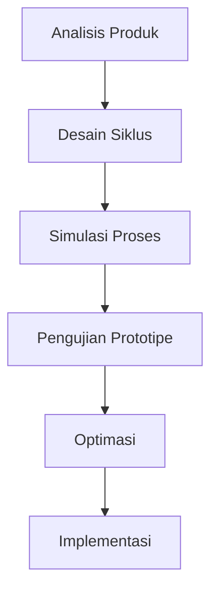

# 903 — Desain Siklus Lyophilization Farmasi: Transfer Panas-Massa pada Sublimasi Pengeringan Primer, Desorpsi Sekunder, dan Suhu Transisi Kritis (Tg')

**Domain:** Teknik Industri & Rekayasa Sistem Industri  
**Topik Spesialis:** Pharmaceutical Lyophilization (Freeze-Drying) Cycle Design: Primary Drying Sublimation Front Heat-Mass Transfer, Secondary Desorption, and Critical Glass Transition Temperature (Tg')  
**Standar & Referensi Utama:** Nail et al. (Pharm. Dev. Technol.); Pikal (Freeze-Drying of Pharmaceuticals); PDA Technical Report No. 39; FDA Guidance for Industry

---

## 1. Pendahuluan dan Konteks Industri

Lyophilization, atau pengeringan beku, adalah proses kritis dalam industri farmasi yang bertujuan untuk meningkatkan stabilitas dan umur simpan produk biopharmaceutical. Proses ini melibatkan penghilangan air dari produk yang telah dibekukan, melalui sublimasi es menjadi uap tanpa melewati fase cair. Dalam konteks industri, pengeringan beku menjadi semakin penting karena meningkatnya permintaan akan produk-produk farmasi yang stabil dan berkualitas tinggi, seperti vaksin, antibodi, dan protein terapeutik. 

Tantangan utama dalam proses lyophilization meliputi pengendalian parameter proses yang tepat, seperti suhu, tekanan, dan waktu, untuk memastikan efisiensi dan kualitas produk akhir. Ketidakakuratan dalam desain siklus dapat menyebabkan kerusakan pada produk, termasuk denaturasi protein dan kehilangan aktivitas biologis. Selain itu, biaya operasional yang tinggi dan kebutuhan untuk memenuhi standar regulasi yang ketat menambah kompleksitas dalam desain dan implementasi siklus lyophilization.

Menurut Nail et al. (2022), pentingnya pemahaman mendalam tentang transfer panas dan massa selama pengeringan primer dan desorpsi sekunder tidak dapat diabaikan. Pengendalian suhu transisi kaca (Tg') juga menjadi faktor penting yang mempengaruhi stabilitas produk. Oleh karena itu, desain siklus yang efektif memerlukan pendekatan multidisiplin yang mengintegrasikan ilmu material, teknik proses, dan manajemen rantai pasok.

## 2. Landasan Teori & Formulasi Matematis

### 2.1. Transfer Panas dan Massa

Proses lyophilization terdiri dari dua tahap utama: pengeringan primer dan pengeringan sekunder. Pada tahap pengeringan primer, sublimasi terjadi, di mana es diubah menjadi uap. Transfer panas ke produk dilakukan melalui konduksi, konveksi, dan radiasi. Persamaan dasar untuk transfer panas dapat dinyatakan sebagai:

$$
Q = U \cdot A \cdot (T_s - T_p)
$$

di mana:
- \( Q \) = laju transfer panas (W)
- \( U \) = koefisien transfer panas total (W/m²·K)
- \( A \) = luas permukaan kontak (m²)
- \( T_s \) = suhu permukaan (K)
- \( T_p \) = suhu produk (K)

### 2.2. Sublimasi dan Desorpsi

Sublimasi dapat dimodelkan dengan persamaan Fick untuk difusi:

$$
J = -D \cdot \frac{dC}{dz}
$$

di mana:
- \( J \) = fluks massa (kg/m²·s)
- \( D \) = koefisien difusi (m²/s)
- \( C \) = konsentrasi (kg/m³)
- \( z \) = jarak (m)

Pada tahap desorpsi sekunder, air yang terikat pada produk harus dihilangkan. Model desorpsi dapat dinyatakan sebagai:

$$
\frac{dC}{dt} = -k_d \cdot C
$$

di mana:
- \( k_d \) = konstanta laju desorpsi (s⁻¹)

### 2.3. Suhu Transisi Kritis (Tg')

Tg' adalah suhu di mana produk mengalami transisi dari keadaan kaku menjadi keadaan fleksibel. Untuk menentukan Tg', kita dapat menggunakan persamaan:

$$
Tg' = T_{m} - \Delta H_f / C_p
$$

di mana:
- \( T_{m} \) = suhu lebur (K)
- \( \Delta H_f \) = entalpi pembekuan (J/kg)
- \( C_p \) = kapasitas panas spesifik (J/kg·K)

## 3. Metodologi Rekayasa & Standar Prosedur Operasional (SOP)

### 3.1. Langkah-Langkah Implementasi

1. **Analisis Produk**: Identifikasi karakteristik fisik dan kimia produk yang akan di-lyophilize.
2. **Desain Siklus**: Tentukan parameter siklus awal berdasarkan literatur dan data eksperimen sebelumnya.
3. **Simulasi Proses**: Gunakan perangkat lunak simulasi untuk memodelkan transfer panas dan massa.
4. **Pengujian Prototipe**: Lakukan pengujian pada skala kecil untuk memvalidasi desain siklus.
5. **Optimasi**: Sesuaikan parameter siklus berdasarkan hasil pengujian untuk mencapai efisiensi maksimum.
6. **Implementasi**: Terapkan siklus yang telah dioptimalkan pada skala produksi.

### 3.2. Diagram Alir Proses

## 4. Studi Kasus Kuantitatif Industri & Perhitungan Numerik

### 4.1. Parameter Input

Misalkan kita memiliki produk farmasi dengan parameter sebagai berikut:
- \( U = 50 \, \text{W/m}^2\cdot\text{K} \)
- \( A = 1.0 \, \text{m}^2 \)
- \( T_s = 253 \, \text{K} \) (suhu permukaan)
- \( T_p = 223 \, \text{K} \) (suhu produk)

### 4.2. Perhitungan Laju Transfer Panas

Menggunakan persamaan transfer panas:

$$
Q = U \cdot A \cdot (T_s - T_p) = 50 \cdot 1.0 \cdot (253 - 223) = 1500 \, \text{W}
$$

### 4.3. Fluks Massa Sublimasi

Misalkan \( D = 1.0 \times 10^{-5} \, \text{m}^2/\text{s} \) dan \( C = 0.1 \, \text{kg/m}^3 \):

$$
J = -D \cdot \frac{dC}{dz} = -1.0 \times 10^{-5} \cdot \frac{0.1 - 0}{0.01} = -1.0 \times 10^{-6} \, \text{kg/m}^2\cdot\text{s}
$$

### 4.4. Interpretasi Hasil

Laju transfer panas sebesar 1500 W menunjukkan bahwa proses pengeringan primer dapat berlangsung dengan efisiensi yang baik. Fluks massa sublimasi yang rendah menunjukkan bahwa ada potensi untuk meningkatkan laju sublimasi dengan mengoptimalkan parameter proses.

## 5. Evaluasi Kritis, Aplikasi Lintas Sektor & Standar Masa Depan

Lyophilization tidak hanya relevan dalam industri farmasi, tetapi juga memiliki aplikasi dalam sektor makanan dan bioteknologi. Dalam konteks rantai pasok, pengeringan beku dapat meningkatkan stabilitas produk selama transportasi dan penyimpanan. Selain itu, integrasi otomatisasi dalam proses lyophilization dapat mengurangi biaya dan meningkatkan konsistensi produk.

Namun, tantangan tetap ada, termasuk kebutuhan untuk mematuhi regulasi yang ketat dan pengembangan teknologi baru yang lebih efisien. Penelitian masa depan harus fokus pada pengembangan model prediktif yang lebih akurat untuk transfer panas dan massa, serta eksplorasi material baru yang dapat meningkatkan stabilitas produk.

Dengan demikian, desain siklus lyophilization yang efektif memerlukan pendekatan interdisipliner yang menggabungkan teknik industri, ilmu material, dan manajemen rantai pasok untuk mencapai hasil yang optimal dan memenuhi tuntutan industri yang semakin kompleks.