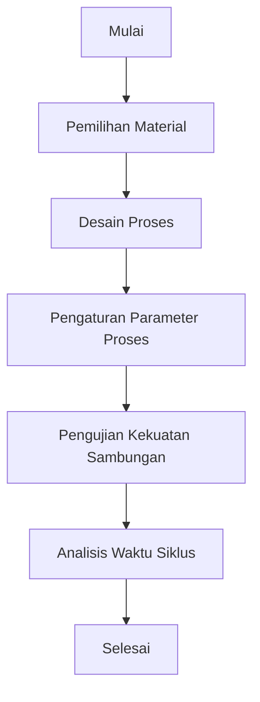

# 907 — High-Speed Continuous Extrusion Blow Molding (EBM) for Rigid Containers: Parison Extrusion Sagging/Swell Viscoelastic Modeling, Pinch-Off Weld Strength, and Cycle Time Reduction

**Domain:** Teknik Industri & Rekayasa Sistem Industri  
**Topik Spesialis:** High-Speed Continuous Extrusion Blow Molding (EBM) for Rigid Containers: Parison Extrusion Sagging/Swell Viscoelastic Modeling, Pinch-Off Weld Strength, and Cycle Time Reduction  
**Standar & Referensi Utama:** Rosato & Rosato (Blow Molding Handbook, Hanser); Osswald (Polymer Processing Fundamentals); ISO 294

---

## 1. Pendahuluan dan Konteks Industri

Industri kemasan plastik mengalami pertumbuhan yang pesat, terutama dalam produksi wadah kaku yang digunakan untuk berbagai aplikasi, mulai dari makanan dan minuman hingga produk farmasi. High-Speed Continuous Extrusion Blow Molding (EBM) menjadi metode yang semakin populer karena efisiensi dan kecepatan produksinya. Namun, tantangan utama dalam proses ini adalah pengendalian kualitas parison, yang dapat mengalami sagging atau swell akibat sifat viskoelastik material. Hal ini berpotensi mengakibatkan cacat produk dan mengurangi kekuatan sambungan pinch-off, yang merupakan titik kritis dalam integritas struktural wadah.

Dalam konteks ini, pemodelan viskoelastik sagging/swell parison sangat penting untuk memahami perilaku material selama proses ekstrusi. Selain itu, kekuatan sambungan pinch-off menjadi faktor kunci dalam menentukan daya tahan dan performa wadah. Dengan meningkatnya permintaan untuk efisiensi waktu siklus, pengurangan waktu siklus produksi juga menjadi fokus utama. Oleh karena itu, penelitian dan pengembangan dalam bidang ini tidak hanya penting untuk meningkatkan kualitas produk, tetapi juga untuk mengoptimalkan biaya dan waktu produksi, yang pada gilirannya dapat meningkatkan daya saing perusahaan di pasar global.

Sumber daya yang terbatas dan kebutuhan untuk mematuhi standar lingkungan yang lebih ketat juga menambah kompleksitas dalam proses produksi. Oleh karena itu, pemahaman mendalam tentang teknik dan metodologi dalam EBM sangat diperlukan untuk menghadapi tantangan ini dan memanfaatkan peluang yang ada di pasar.

## 2. Landasan Teori & Formulasi Matematis

### 2.1. Viskoelastisitas Material

Material polimer menunjukkan perilaku viskoelastik, yang dapat dijelaskan dengan model Maxwell atau Kelvin-Voigt. Model ini menggambarkan hubungan antara stres ($\sigma$) dan regangan ($\epsilon$) sebagai berikut:

$$
\sigma(t) = E \epsilon(t) + \eta \frac{d\epsilon(t)}{dt}
$$

di mana:
- $E$ adalah modulus elastisitas,
- $\eta$ adalah viskositas,
- $t$ adalah waktu.

### 2.2. Model Sagging/Swell

Sagging dan swell dapat dimodelkan dengan menggunakan persamaan diferensial yang menggambarkan perubahan bentuk parison selama proses ekstrusi. Persamaan ini dapat dituliskan sebagai:

$$
\frac{d^2y}{dx^2} = -\frac{1}{E} \left( \sigma - \sigma_{crit} \right)
$$

di mana:
- $y$ adalah defleksi parison,
- $x$ adalah posisi sepanjang parison,
- $\sigma_{crit}$ adalah stres kritis yang menyebabkan deformasi.

### 2.3. Kekuatan Sambungan Pinch-Off

Kekuatan sambungan pinch-off dapat dihitung dengan menggunakan rumus berikut:

$$
S = \frac{F}{A}
$$

di mana:
- $S$ adalah kekuatan sambungan,
- $F$ adalah gaya yang diterapkan pada sambungan,
- $A$ adalah luas penampang sambungan.

### 2.4. Waktu Siklus

Waktu siklus ($T_c$) dalam proses EBM dapat dihitung dengan rumus:

$$
T_c = T_{extrusion} + T_{cooling} + T_{ejection}
$$

di mana:
- $T_{extrusion}$ adalah waktu ekstrusi,
- $T_{cooling}$ adalah waktu pendinginan,
- $T_{ejection}$ adalah waktu pengeluaran produk.

## 3. Metodologi Rekayasa & Standar Prosedur Operasional (SOP)

### 3.1. Langkah-langkah Implementasi

1. **Pemilihan Material**: Pilih polimer yang sesuai berdasarkan sifat viskoelastik dan aplikasi akhir.
2. **Desain Proses**: Rancang sistem ekstrusi dengan mempertimbangkan geometri parison dan parameter proses.
3. **Pengaturan Parameter Proses**: Atur suhu, tekanan, dan kecepatan ekstrusi untuk meminimalkan sagging dan swell.
4. **Pengujian Kekuatan Sambungan**: Lakukan pengujian untuk menentukan kekuatan sambungan pinch-off.
5. **Analisis Waktu Siklus**: Hitung waktu siklus dan identifikasi area untuk pengurangan waktu.

### 3.2. Diagram Alir Proses

## 4. Studi Kasus Kuantitatif Industri & Perhitungan Numerik

### 4.1. Input Parameter

Misalkan kita menggunakan polietilena (PE) dengan parameter berikut:
- Modulus elastisitas ($E$): 500 MPa
- Viskositas ($\eta$): 1000 Pa.s
- Gaya pada sambungan ($F$): 2000 N
- Luas penampang sambungan ($A$): 10 cm²

### 4.2. Langkah Kalkulasi

1. **Hitung Kekuatan Sambungan**:

$$
S = \frac{F}{A} = \frac{2000 \, \text{N}}{10 \, \text{cm}^2} = \frac{2000 \, \text{N}}{0.001 \, \text{m}^2} = 2,000,000 \, \text{Pa} = 2 \, \text{MPa}
$$

2. **Hitung Waktu Siklus**:

Misalkan waktu ekstrusi ($T_{extrusion}$): 5 detik, waktu pendinginan ($T_{cooling}$): 10 detik, waktu pengeluaran ($T_{ejection}$): 2 detik.

$$
T_c = T_{extrusion} + T_{cooling} + T_{ejection} = 5 + 10 + 2 = 17 \, \text{detik}
$$

### 4.3. Interpretasi Hasil

Kekuatan sambungan sebesar 2 MPa menunjukkan bahwa sambungan cukup kuat untuk aplikasi umum, namun perlu diperhatikan bahwa nilai ini harus lebih tinggi untuk aplikasi yang lebih kritis. Waktu siklus 17 detik dapat menjadi target untuk pengurangan lebih lanjut melalui optimasi proses.

## 5. Evaluasi Kritis, Aplikasi Lintas Sektor & Standar Masa Depan

Penerapan teknik EBM tidak hanya terbatas pada industri kemasan, tetapi juga dapat diterapkan dalam sektor otomotif, elektronik, dan medis. Dalam konteks rantai pasok, efisiensi yang dihasilkan dari pengurangan waktu siklus dapat meningkatkan throughput dan mengurangi biaya penyimpanan. 

Dalam hal otomasi, integrasi sistem kontrol cerdas dapat membantu dalam pengaturan parameter proses secara real-time, sehingga meningkatkan kualitas produk dan mengurangi limbah. 

Kesehatan dan keselamatan kerja (K3) serta pertimbangan lingkungan (ESG) juga menjadi aspek penting dalam pengembangan proses EBM. Penggunaan material yang lebih ramah lingkungan dan pengurangan emisi selama proses produksi akan menjadi fokus utama di masa depan.

Arah riset masa depan dapat mencakup pengembangan material baru dengan sifat viskoelastik yang lebih baik, serta penerapan teknologi digital untuk memantau dan mengoptimalkan proses secara berkelanjutan. 

Dengan demikian, pemahaman yang mendalam tentang teknik dan metodologi dalam EBM akan menjadi kunci untuk menghadapi tantangan dan memanfaatkan peluang di industri kemasan dan sektor terkait lainnya.