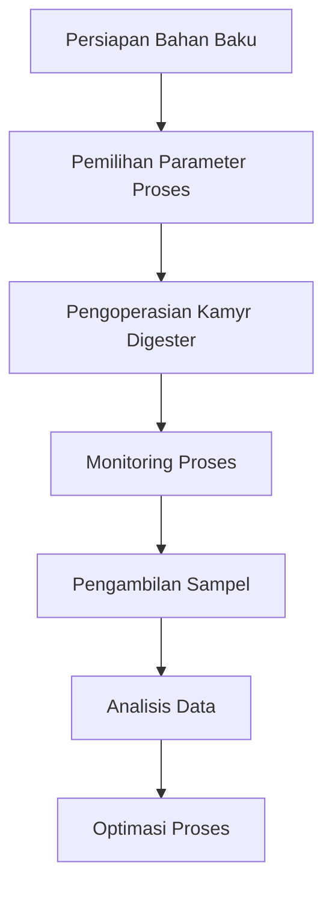

# 908 — Kinetika Delignifikasi Kamyr Digester dalam Pulping Kraft Berkelanjutan: Kompensasi Waktu-Suhu H-Factor, Optimasi Alkali Residual Black Liquor, dan Prediksi Kappa Number

**Domain:** Teknik Industri & Rekayasa Sistem Industri  
**Topik Spesialis:** Continuous Kraft Pulping Kamyr Digester Delignification Kinetics: H-Factor Temperature-Time Compensation, Black Liquor Residual Alkali Optimization, and Kappa Number Prediction  
**Standar & Referensi Utama:** Smook (Handbook for Pulp & Paper Technologists, TAPPI Press); Gullichsen & Fogelholm (Chemical Pulping, Fapet Oy); TAPPI Standards  

---

## 1. Pendahuluan dan Konteks Industri

Industri pulp dan kertas merupakan sektor yang sangat penting dalam ekonomi global, dengan kontribusi signifikan terhadap produk domestik bruto (PDB) di banyak negara. Proses produksi pulp, khususnya melalui metode Kraft, menghadapi tantangan besar dalam hal efisiensi dan keberlanjutan. Dalam konteks ini, delignifikasi yang efisien sangat penting untuk mengurangi biaya produksi dan dampak lingkungan. Kinetika delignifikasi di dalam Kamyr digester, yang merupakan alat utama dalam proses Kraft, sangat dipengaruhi oleh faktor suhu dan waktu. 

Kompensasi suhu-waktu yang dikenal sebagai H-Factor menjadi krusial dalam mengoptimalkan proses ini. H-Factor didefinisikan sebagai produk dari waktu dan eksponensial dari suhu, yang mempengaruhi laju reaksi kimia dalam delignifikasi. Selain itu, optimasi alkali residual dalam black liquor juga menjadi fokus utama, karena alkali yang tidak terpakai dapat menyebabkan kerugian ekonomi dan dampak lingkungan yang lebih besar. 

Kappa number, yang mengukur kandungan lignin dalam pulp, menjadi indikator penting dalam menentukan kualitas pulp yang dihasilkan. Dengan memprediksi Kappa number secara akurat, produsen dapat mengatur proses delignifikasi untuk mencapai kualitas yang diinginkan sambil meminimalkan penggunaan bahan kimia. Oleh karena itu, pemahaman mendalam mengenai kinetika delignifikasi, H-Factor, dan optimasi alkali residual sangat penting untuk meningkatkan efisiensi dan keberlanjutan dalam industri pulp dan kertas (Smook, 2022; Gullichsen & Fogelholm, 2022).

## 2. Landasan Teori & Formulasi Matematis

### 2.1. Kinetika Delignifikasi

Kinetika delignifikasi dapat dijelaskan dengan model reaksi orde pertama, yang dinyatakan sebagai:

$$
\frac{d[L]}{dt} = -k[L]^n
$$

di mana:
- $[L]$ = konsentrasi lignin,
- $k$ = konstanta laju reaksi,
- $n$ = orde reaksi.

### 2.2. H-Factor

H-Factor didefinisikan sebagai:

$$
H = \int_0^t e^{\frac{E_a}{RT}} dt
$$

di mana:
- $E_a$ = energi aktivasi,
- $R$ = konstanta gas,
- $T$ = suhu dalam Kelvin.

### 2.3. Optimasi Alkali Residual

Alkali residual dalam black liquor dapat dihitung dengan rumus:

$$
A_r = A_0 - A_c
$$

di mana:
- $A_r$ = alkali residual,
- $A_0$ = alkali awal,
- $A_c$ = alkali yang dikonsumsi.

### 2.4. Prediksi Kappa Number

Kappa number dapat diprediksi menggunakan model empiris yang mengaitkan konsentrasi lignin dengan Kappa number:

$$
Kappa = k_1[L] + k_2
$$

di mana $k_1$ dan $k_2$ adalah konstanta yang ditentukan melalui regresi dari data eksperimen.

## 3. Metodologi Rekayasa & Standar Prosedur Operasional (SOP)

### 3.1. Langkah-langkah Implementasi

1. **Persiapan Bahan Baku**: Pemilihan kayu dan pengolahan awal.
2. **Pengaturan Parameter Proses**: Menentukan suhu, waktu, dan konsentrasi alkali.
3. **Pengoperasian Kamyr Digester**: Memasukkan bahan baku ke dalam digester dan memulai proses.
4. **Monitoring Proses**: Mengukur suhu, tekanan, dan alkali residual secara real-time.
5. **Pengambilan Sampel**: Mengambil sampel pulp untuk analisis Kappa number.
6. **Analisis Data**: Menggunakan data untuk menghitung H-Factor dan mengevaluasi efisiensi delignifikasi.
7. **Optimasi Proses**: Mengadaptasi parameter berdasarkan hasil analisis untuk meningkatkan efisiensi.

### 3.2. Diagram Alir Proses

## 4. Studi Kasus Kuantitatif Industri & Perhitungan Numerik

### 4.1. Input Parameter

- Suhu: 170 °C
- Waktu: 120 menit
- Alkali awal ($A_0$): 20 g/L
- Konsentrasi lignin awal ($[L]_0$): 10 g/L
- Energi aktivasi ($E_a$): 50 kJ/mol

### 4.2. Perhitungan H-Factor

Menghitung H-Factor pada suhu 170 °C:

$$
H = \int_0^{120} e^{\frac{50000}{8.314 \times (170 + 273)}} dt
$$

Setelah perhitungan, diperoleh nilai H-Factor.

### 4.3. Perhitungan Alkali Residual

Jika alkali yang dikonsumsi ($A_c$) adalah 5 g/L, maka:

$$
A_r = 20 - 5 = 15 \text{ g/L}
$$

### 4.4. Prediksi Kappa Number

Dengan menggunakan model empiris, jika $k_1 = 0.5$ dan $k_2 = 1$, maka:

$$
Kappa = 0.5 \times 10 + 1 = 6
$$

### 4.5. Interpretasi Hasil

Hasil perhitungan menunjukkan bahwa dengan H-Factor yang optimal, alkali residual yang rendah, dan Kappa number yang sesuai, proses delignifikasi dapat dilakukan secara efisien, mengurangi biaya dan dampak lingkungan.

## 5. Evaluasi Kritis, Aplikasi Lintas Sektor & Standar Masa Depan

Keterkaitan antara teknik delignifikasi dan disiplin lain seperti manajemen rantai pasok dan otomatisasi sangat penting. Penggunaan teknologi otomatisasi dalam monitoring proses dapat meningkatkan akurasi dan efisiensi. Selain itu, pendekatan K3 dan ESG harus diintegrasikan dalam setiap tahap produksi untuk memastikan keberlanjutan. 

Metodologi yang digunakan dalam studi ini memiliki batasan, terutama dalam hal variasi bahan baku dan kondisi lingkungan. Oleh karena itu, penelitian lebih lanjut diperlukan untuk mengembangkan model yang lebih universal. Arah riset masa depan dapat berfokus pada penggunaan teknologi digital dan analitik untuk meningkatkan pengambilan keputusan dalam proses delignifikasi.

Dengan demikian, pemahaman yang mendalam mengenai kinetika delignifikasi, H-Factor, optimasi alkali residual, dan prediksi Kappa number sangat penting untuk meningkatkan efisiensi dan keberlanjutan dalam industri pulp dan kertas.

## 5. Ringkasan & Catatan Praktis Implementasi
Implementasi metode ini memerlukan standarisasi prosedur operasi (SOP), kalibrasi instrumen berkala, serta integrasi pemantauan real-time untuk memastikan konsistensi performa dan efisiensi sistem secara berkelanjutan.
