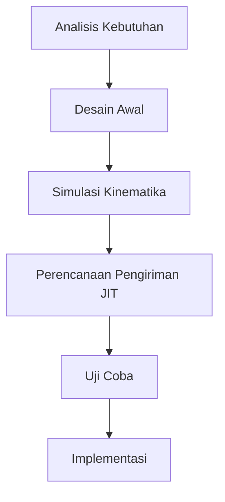

# 911 — Desain untuk Manufaktur dan Perakitan (DfMA) dalam Konstruksi Modular Off-Site: Toleransi Koneksi Struktural Modul, Kinematika Pengangkatan Tandem Crane Berat, dan Pengiriman JIT

**Domain:** Teknik Industri & Rekayasa Sistem Industri  
**Topik Spesialis:** Design for Manufacture and Assembly (DfMA) in Modular Off-Site Construction: Module Structural Connection Tolerance Stack-Up, Heavy Crane Tandem Lifting Kinematics, and JIT Delivery  
**Standar & Referensi Utama:** Gibb (Offsite Fabrication, Whittles Publishing); ISO 22263; Eastman et al. (BIM Handbook: A Guide to Building Information Modeling, 3rd Ed., Wiley)

---

## 1. Pendahuluan dan Konteks Industri

Konstruksi modular off-site telah menjadi pendekatan yang semakin populer dalam industri konstruksi modern. Dengan meningkatnya permintaan untuk efisiensi waktu dan biaya, serta kebutuhan untuk mengurangi limbah dan dampak lingkungan, metode ini menawarkan solusi inovatif. Dalam konteks ini, Design for Manufacture and Assembly (DfMA) menjadi sangat penting. DfMA bertujuan untuk merancang produk dan proses dengan mempertimbangkan kemudahan manufaktur dan perakitan, yang dapat mengurangi biaya dan waktu produksi.

Tantangan utama dalam penerapan DfMA dalam konstruksi modular adalah toleransi koneksi struktural. Koneksi yang tidak tepat dapat menyebabkan masalah struktural yang serius dan meningkatkan biaya perbaikan. Selain itu, pengangkatan modul menggunakan crane berat memerlukan pemahaman mendalam tentang kinematika pengangkatan tandem untuk memastikan keselamatan dan efisiensi. Pengiriman Just-In-Time (JIT) juga menjadi krusial untuk mengurangi biaya penyimpanan dan memastikan bahwa material tersedia saat dibutuhkan.

Menurut Gibb (2022), penggunaan fabrikasi off-site dapat mengurangi waktu konstruksi hingga 50% dan biaya hingga 20%. Namun, tantangan dalam manajemen rantai pasok dan integrasi teknologi informasi dalam proses ini masih menjadi hambatan. Oleh karena itu, pemahaman yang mendalam tentang toleransi koneksi, kinematika pengangkatan, dan pengiriman JIT sangat diperlukan untuk memaksimalkan potensi DfMA dalam konstruksi modular.

## 2. Landasan Teori & Formulasi Matematis

### 2.1 Toleransi Koneksi Struktural

Toleransi koneksi struktural dapat didefinisikan sebagai batasan yang ditetapkan untuk variasi dimensi dan bentuk dari elemen struktural yang saling berhubungan. Toleransi ini penting untuk memastikan bahwa semua komponen dapat dirakit dengan baik tanpa masalah struktural. Toleransi dapat dihitung menggunakan rumus berikut:

$$
T = \sum_{i=1}^{n} t_i
$$

di mana:
- \( T \) = total toleransi
- \( t_i \) = toleransi individu dari setiap koneksi

### 2.2 Kinematika Pengangkatan Tandem Crane Berat

Kinematika pengangkatan tandem crane berat melibatkan analisis gaya dan momen yang bekerja pada modul yang diangkat. Misalkan \( F \) adalah gaya angkat, \( m \) adalah massa modul, dan \( g \) adalah percepatan gravitasi. Maka, gaya angkat dapat dihitung dengan:

$$
F = m \cdot g
$$

Di mana:
- \( F \) = gaya angkat (N)
- \( m \) = massa modul (kg)
- \( g \) = 9.81 m/s²

### 2.3 Pengiriman Just-In-Time (JIT)

Pengiriman JIT bertujuan untuk mengurangi waktu tunggu dan biaya penyimpanan. Model JIT dapat dinyatakan dalam bentuk persamaan:

$$
C = D \cdot L + S
$$

di mana:
- \( C \) = total biaya
- \( D \) = biaya per unit (Rp)
- \( L \) = jumlah unit yang dikirim
- \( S \) = biaya penyimpanan per unit (Rp)

## 3. Metodologi Rekayasa & Standar Prosedur Operasional (SOP)

### 3.1 Langkah-langkah Implementasi DfMA

1. **Analisis Kebutuhan**: Identifikasi kebutuhan proyek dan spesifikasi modul.
2. **Desain Awal**: Buat desain awal modul dengan mempertimbangkan toleransi koneksi.
3. **Simulasi Kinematika**: Lakukan simulasi kinematika pengangkatan untuk menentukan konfigurasi crane yang optimal.
4. **Perencanaan Pengiriman JIT**: Rencanakan pengiriman material dengan mempertimbangkan waktu dan biaya.
5. **Uji Coba**: Lakukan uji coba perakitan untuk memastikan semua komponen sesuai toleransi.
6. **Implementasi**: Laksanakan perakitan di lokasi dengan pengawasan ketat.

### 3.2 Diagram Alir Proses

## 4. Studi Kasus Kuantitatif Industri & Perhitungan Numerik

### 4.1 Contoh Kasus

Misalkan sebuah modul memiliki massa \( m = 2000 \) kg dan biaya per unit \( D = 50000 \) Rp. Jika jumlah unit yang dikirim \( L = 10 \) dan biaya penyimpanan per unit \( S = 1000 \) Rp, maka:

#### 4.1.1 Perhitungan Gaya Angkat

$$
F = m \cdot g = 2000 \cdot 9.81 = 19620 \text{ N}
$$

#### 4.1.2 Perhitungan Total Biaya

$$
C = D \cdot L + S = 50000 \cdot 10 + 1000 = 501000 \text{ Rp}
$$

### 4.2 Interpretasi Hasil

Dari perhitungan di atas, gaya angkat yang diperlukan untuk mengangkat modul adalah 19620 N, dan total biaya pengiriman JIT adalah 501000 Rp. Hasil ini menunjukkan bahwa perencanaan yang baik dalam pengiriman dan pengangkatan modul dapat mengurangi biaya dan meningkatkan efisiensi.

## 5. Evaluasi Kritis, Aplikasi Lintas Sektor & Standar Masa Depan

Penerapan DfMA dalam konstruksi modular tidak hanya terbatas pada sektor konstruksi, tetapi juga dapat diterapkan dalam industri otomotif dan elektronik. Dalam konteks rantai pasok, DfMA dapat meningkatkan kolaborasi antara pemasok dan produsen, mengurangi waktu siklus dan biaya. Selain itu, dengan meningkatnya fokus pada keberlanjutan, DfMA dapat berkontribusi pada praktik ramah lingkungan dengan mengurangi limbah.

Namun, terdapat batasan dalam metodologi ini, seperti kompleksitas desain dan keterbatasan dalam teknologi fabrikasi. Oleh karena itu, arah riset masa depan perlu difokuskan pada pengembangan teknologi fabrikasi yang lebih canggih dan integrasi sistem informasi yang lebih baik untuk mendukung DfMA.

Dengan demikian, DfMA dalam konstruksi modular off-site menawarkan potensi besar untuk meningkatkan efisiensi dan mengurangi biaya, namun memerlukan pendekatan yang sistematis dan kolaboratif untuk mengatasi tantangan yang ada.

## 5. Ringkasan & Catatan Praktis Implementasi
Implementasi metode ini memerlukan standarisasi prosedur operasi (SOP), kalibrasi instrumen berkala, serta integrasi pemantauan real-time untuk memastikan konsistensi performa dan efisiensi sistem secara berkelanjutan.
