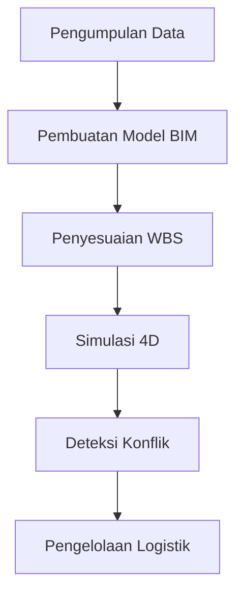

# 914 — Simulasi Urutan Konstruksi 4D Building Information Modeling (BIM): Penyesuaian Work Breakdown Structure (WBS), Deteksi Konflik Ruang-Waktu, dan Aliran Logistik Situs

**Domain:** Teknik Industri & Rekayasa Sistem Industri  
**Topik Spesialis:** 4D Building Information Modeling (BIM) Construction Sequencing Simulation: Work Breakdown Structure (WBS) Alignment, Space-Time Workspace Conflict Detection, and Site Logistics Flow  
**Standar & Referensi Utama:** Eastman et al. (BIM Handbook, Wiley); ISO 19650-1/2; Sacks et al. (BIM and Lean Construction)

---

## 1. Pendahuluan dan Konteks Industri

Industri konstruksi saat ini menghadapi tantangan yang kompleks dan beragam, mulai dari peningkatan biaya, keterlambatan proyek, hingga kebutuhan untuk memenuhi standar keberlanjutan yang semakin ketat. Dalam konteks ini, Building Information Modeling (BIM) telah muncul sebagai solusi inovatif yang tidak hanya meningkatkan efisiensi operasional tetapi juga mengoptimalkan pengelolaan proyek secara keseluruhan. Terutama, penerapan 4D BIM, yang mengintegrasikan dimensi waktu ke dalam model informasi bangunan, memungkinkan perencanaan dan simulasi urutan konstruksi yang lebih akurat.

Berdasarkan laporan dari Eastman et al. (2011), penggunaan BIM dapat mengurangi biaya konstruksi hingga 10% dan mempercepat waktu penyelesaian proyek hingga 20%. Namun, tantangan utama yang dihadapi adalah penyesuaian Work Breakdown Structure (WBS) yang tepat, deteksi konflik ruang-waktu, dan pengelolaan aliran logistik di lokasi konstruksi. Dalam konteks ini, ISO 19650-1/2 memberikan kerangka kerja yang jelas untuk pengelolaan informasi dalam proyek konstruksi, memastikan bahwa semua pihak terlibat memiliki akses ke informasi yang konsisten dan akurat.

Dengan meningkatnya kompleksitas proyek dan kebutuhan untuk kolaborasi lintas disiplin, penting bagi para profesional teknik industri untuk memahami dan menerapkan metodologi 4D BIM secara efektif. Hal ini tidak hanya akan meningkatkan efisiensi proyek tetapi juga meminimalkan risiko yang terkait dengan konflik ruang dan waktu, serta memastikan bahwa aliran logistik di lokasi konstruksi berjalan dengan lancar.

## 2. Landasan Teori & Formulasi Matematis

### 2.1. Work Breakdown Structure (WBS)

WBS adalah alat manajemen proyek yang membagi proyek menjadi bagian-bagian yang lebih kecil dan lebih mudah dikelola. Dalam konteks BIM, WBS harus diselaraskan dengan model informasi bangunan untuk memastikan bahwa semua elemen proyek terintegrasi dengan baik. 

Definisi WBS dapat dinyatakan sebagai:

$$
WBS = \{E_1, E_2, ..., E_n\}
$$

di mana $E_i$ adalah elemen dari proyek yang mencakup semua tugas dan sub-tugas yang diperlukan untuk menyelesaikan proyek.

### 2.2. Deteksi Konflik Ruang-Waktu

Deteksi konflik ruang-waktu dalam 4D BIM dapat dinyatakan dengan model matematis yang mempertimbangkan posisi dan waktu dari setiap elemen konstruksi. Misalkan $P_i(t)$ adalah posisi elemen $i$ pada waktu $t$, maka konflik dapat terdeteksi jika:

$$
\exists t_1, t_2 \quad \text{s.t.} \quad P_i(t_1) \cap P_j(t_2) \neq \emptyset
$$

di mana $P_i(t)$ dan $P_j(t)$ adalah dua elemen yang berbeda dalam model.

### 2.3. Aliran Logistik

Aliran logistik di lokasi konstruksi dapat dimodelkan menggunakan teori antrian. Misalkan $\lambda$ adalah laju kedatangan material dan $\mu$ adalah laju pelayanan, maka waktu tunggu rata-rata ($W_q$) dalam sistem antrian dapat dinyatakan dengan rumus:

$$
W_q = \frac{\lambda}{\mu(\mu - \lambda)}
$$

dengan asumsi bahwa sistem mengikuti model antrian M/M/1.

## 3. Metodologi Rekayasa & Standar Prosedur Operasional (SOP)

### 3.1. Langkah-langkah Implementasi

1. **Pengumpulan Data**: Mengumpulkan semua data yang relevan terkait proyek, termasuk spesifikasi teknis, jadwal, dan sumber daya.
2. **Pembuatan Model BIM**: Mengembangkan model 3D dari proyek menggunakan perangkat lunak BIM.
3. **Penyesuaian WBS**: Menyelaraskan WBS dengan model BIM untuk memastikan semua elemen proyek terintegrasi.
4. **Simulasi 4D**: Menggunakan perangkat lunak untuk mensimulasikan urutan konstruksi dengan mempertimbangkan waktu.
5. **Deteksi Konflik**: Menerapkan algoritma untuk mendeteksi konflik ruang-waktu dalam model.
6. **Pengelolaan Logistik**: Mengembangkan rencana logistik berdasarkan hasil simulasi dan deteksi konflik.

### 3.2. Diagram Alir Proses

## 4. Studi Kasus Kuantitatif Industri & Perhitungan Numerik

### 4.1. Contoh Kasus

Misalkan sebuah proyek konstruksi gedung dengan parameter berikut:
- Laju kedatangan material ($\lambda$): 10 unit/jam
- Laju pelayanan ($\mu$): 15 unit/jam

### 4.2. Perhitungan Waktu Tunggu

Dengan menggunakan rumus waktu tunggu rata-rata dalam sistem antrian M/M/1:

$$
W_q = \frac{\lambda}{\mu(\mu - \lambda)} = \frac{10}{15(15 - 10)} = \frac{10}{75} = 0.1333 \text{ jam} \approx 8 \text{ menit}
$$

### 4.3. Interpretasi Hasil

Hasil perhitungan menunjukkan bahwa waktu tunggu rata-rata untuk material di lokasi konstruksi adalah sekitar 8 menit. Hal ini menunjukkan bahwa sistem logistik perlu diperbaiki untuk mengurangi waktu tunggu dan meningkatkan efisiensi aliran material.

## 5. Evaluasi Kritis, Aplikasi Lintas Sektor & Standar Masa Depan

Penerapan 4D BIM tidak hanya terbatas pada industri konstruksi tetapi juga dapat diterapkan dalam disiplin lain seperti manajemen rantai pasok, di mana integrasi waktu dan ruang menjadi krusial. Dalam konteks otomasi, penggunaan teknologi seperti Internet of Things (IoT) dapat meningkatkan akurasi deteksi konflik dan pengelolaan logistik.

Namun, terdapat batasan dalam metodologi ini, termasuk kebutuhan untuk data yang akurat dan real-time, serta tantangan dalam kolaborasi lintas disiplin. Arah riset masa depan dapat difokuskan pada pengembangan algoritma yang lebih canggih untuk deteksi konflik dan integrasi sistem BIM dengan teknologi baru seperti kecerdasan buatan (AI) dan pembelajaran mesin (ML).

Dengan demikian, pemahaman yang mendalam tentang 4D BIM dan penerapannya dalam konteks industri yang lebih luas akan menjadi kunci untuk mencapai efisiensi dan keberlanjutan dalam proyek konstruksi modern.