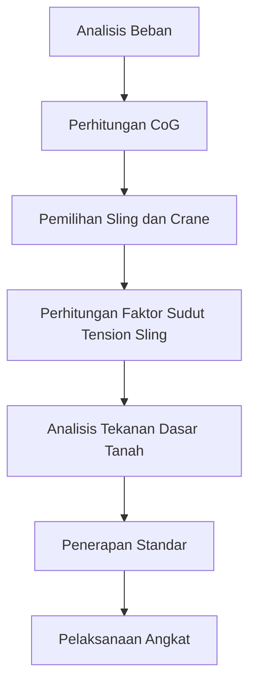

# 915 — Rekayasa Angkat Berat dan Teknik Pengangkatan Tandem: Faktor Sudut Tension Sling, Resolusi Vektor 3D Pusat Gravitasi (CoG), Tekanan Dasar Tanah (GBP), dan ASME B30.5

**Domain:** Teknik Industri & Rekayasa Sistem Industri  
**Topik Spesialis:** Heavy Industrial Rigging & Tandem Crane Lift Engineering: Sling Tension Angle Factor, Center of Gravity (CoG) 3D Vector Resolution, Ground Bearing Pressure (GBP), and ASME B30.5  
**Standar & Referensi Utama:** ASME B30.5-2021; Shapiro & Shapiro (Cranes and Derricks, 4th Ed., McGraw-Hill); OSHA 1926 Subpart CC

---

## 1. Pendahuluan dan Konteks Industri

Industri pengangkatan berat merupakan salah satu sektor yang sangat penting dalam rantai pasok modern, terutama dalam proyek konstruksi, pemeliharaan, dan perakitan mesin berat. Dengan meningkatnya kompleksitas proyek dan ukuran beban yang diangkat, tantangan dalam teknik pengangkatan juga semakin meningkat. Salah satu isu utama adalah keamanan dan efisiensi dalam pengangkatan, yang memerlukan pemahaman mendalam tentang faktor-faktor yang mempengaruhi kinerja rigging dan pengangkatan. 

Menurut Shapiro & Shapiro (2021), pengangkatan yang tidak tepat dapat menyebabkan kecelakaan serius, kerusakan pada peralatan, dan kerugian finansial yang signifikan. Oleh karena itu, penerapan standar yang ketat seperti ASME B30.5 dan OSHA 1926 Subpart CC menjadi sangat penting. Standar ini memberikan panduan tentang praktik terbaik dalam penggunaan crane dan rigging, termasuk analisis tekanan dasar tanah (GBP) dan resolusi vektor pusat gravitasi (CoG) dalam tiga dimensi.

Dalam konteks ekonomi, efisiensi dalam pengangkatan dapat mengurangi waktu proyek dan biaya operasional. Tantangan yang dihadapi oleh para insinyur adalah bagaimana mengoptimalkan pengangkatan dengan mempertimbangkan faktor sudut tension sling, yang dapat mempengaruhi distribusi beban dan stabilitas. Dengan demikian, pemahaman yang mendalam tentang teknik pengangkatan berat dan penerapan standar industri menjadi krusial untuk mencapai hasil yang aman dan efisien.

## 2. Landasan Teori & Formulasi Matematis

### 2.1. Faktor Sudut Tension Sling

Faktor sudut tension sling ($F_s$) adalah rasio antara beban yang ditransfer melalui sling dan beban yang diangkat. Faktor ini sangat penting dalam menentukan kekuatan dan stabilitas sistem rigging. Rumus untuk menghitung faktor sudut tension sling adalah sebagai berikut:

$$
F_s = \frac{W}{T \cdot \cos(\theta)}
$$

Di mana:
- $W$ = berat beban yang diangkat (N)
- $T$ = tegangan dalam sling (N)
- $\theta$ = sudut antara sling dan horizontal (rad)

### 2.2. Resolusi Vektor Pusat Gravitasi (CoG)

Pusat gravitasi (CoG) dari suatu objek dapat dihitung dengan menggunakan rumus vektor 3D. Jika kita memiliki objek dengan massa $m$ dan posisi $(x, y, z)$, maka CoG dapat dinyatakan sebagai:

$$
\text{CoG} = \left( \frac{\sum m_i x_i}{\sum m_i}, \frac{\sum m_i y_i}{\sum m_i}, \frac{\sum m_i z_i}{\sum m_i} \right)
$$

Di mana $m_i$ adalah massa bagian dari objek dan $(x_i, y_i, z_i)$ adalah posisi masing-masing bagian.

### 2.3. Tekanan Dasar Tanah (GBP)

Tekanan dasar tanah ($GBP$) adalah tekanan yang diterapkan oleh beban di atas tanah. GBP dapat dihitung dengan rumus:

$$
GBP = \frac{W}{A}
$$

Di mana:
- $W$ = total berat beban (N)
- $A$ = luas area kontak (m²)

### 2.4. Pembuktian Matematis

Untuk membuktikan hubungan antara faktor sudut tension sling dan tekanan dasar tanah, kita dapat menggabungkan rumus di atas. Misalkan kita memiliki beban $W$ yang diangkat dengan dua sling pada sudut $\theta$. Maka, total tegangan dalam sling dapat dinyatakan sebagai:

$$
T = \frac{W}{2 \cdot \cos(\theta)}
$$

Dengan menggantikan $T$ ke dalam rumus GBP, kita mendapatkan:

$$
GBP = \frac{W}{A} = \frac{2 \cdot T \cdot \cos(\theta)}{A}
$$

Ini menunjukkan bahwa sudut tension sling secara langsung mempengaruhi tekanan dasar tanah yang diterapkan.

## 3. Metodologi Rekayasa & Standar Prosedur Operasional (SOP)

### 3.1. Langkah-langkah Implementasi

1. **Analisis Beban**: Tentukan berat total beban yang akan diangkat dan distribusi massanya.
2. **Perhitungan CoG**: Hitung posisi pusat gravitasi menggunakan rumus yang telah disebutkan.
3. **Pemilihan Sling dan Crane**: Pilih jenis sling dan crane yang sesuai berdasarkan berat dan dimensi beban.
4. **Perhitungan Faktor Sudut Tension Sling**: Hitung faktor sudut tension sling untuk memastikan stabilitas.
5. **Analisis Tekanan Dasar Tanah**: Hitung GBP untuk memastikan bahwa tanah dapat mendukung beban yang diterapkan.
6. **Penerapan Standar**: Pastikan semua prosedur sesuai dengan ASME B30.5 dan OSHA 1926 Subpart CC.
7. **Pelaksanaan Angkat**: Lakukan pengangkatan dengan memantau semua parameter secara real-time.

### 3.2. Diagram Alir Proses

## 4. Studi Kasus Kuantitatif Industri & Perhitungan Numerik

### 4.1. Contoh Kasus

Misalkan kita memiliki beban berat $W = 10,000 \, \text{N}$ yang akan diangkat dengan dua sling pada sudut $\theta = 30^\circ$. Luas area kontak $A = 2 \, \text{m}^2$.

### 4.2. Langkah Perhitungan

1. **Hitung Faktor Sudut Tension Sling**:
   \[
   T = \frac{W}{2 \cdot \cos(30^\circ)} = \frac{10,000}{2 \cdot 0.866} \approx 5773.50 \, \text{N}
   \]

2. **Hitung Tekanan Dasar Tanah**:
   \[
   GBP = \frac{W}{A} = \frac{10,000}{2} = 5000 \, \text{Pa}
   \]

### 4.3. Interpretasi Hasil

Dari perhitungan di atas, kita mendapatkan bahwa tegangan dalam sling adalah sekitar 5773.50 N, sementara tekanan dasar tanah yang diterapkan adalah 5000 Pa. Ini menunjukkan bahwa sistem rigging dirancang dengan baik dan sesuai dengan standar yang berlaku, mengingat bahwa GBP tidak melebihi batas aman untuk tanah yang digunakan.

## 5. Evaluasi Kritis, Aplikasi Lintas Sektor & Standar Masa Depan

Teknik pengangkatan berat tidak hanya relevan dalam industri konstruksi, tetapi juga dalam sektor-sektor lain seperti manufaktur, energi, dan transportasi. Integrasi teknologi otomasi dan manajemen biaya menjadi semakin penting dalam pengangkatan berat, terutama dalam konteks efisiensi dan keselamatan. 

Batasan metodologi saat ini termasuk ketergantungan pada perhitungan manual dan kurangnya integrasi sistem informasi. Oleh karena itu, arah riset masa depan harus berfokus pada pengembangan perangkat lunak yang dapat mengintegrasikan semua parameter ini secara real-time, serta penerapan teknologi sensor untuk memantau kondisi beban dan lingkungan secara langsung.

Dengan demikian, pemahaman yang mendalam tentang teknik pengangkatan berat dan penerapan standar industri akan terus menjadi kunci untuk mencapai efisiensi dan keselamatan dalam proyek-proyek industri di masa depan.

## 5. Ringkasan & Catatan Praktis Implementasi
Implementasi metode ini memerlukan standarisasi prosedur operasi (SOP), kalibrasi instrumen berkala, serta integrasi pemantauan real-time untuk memastikan konsistensi performa dan efisiensi sistem secara berkelanjutan.
