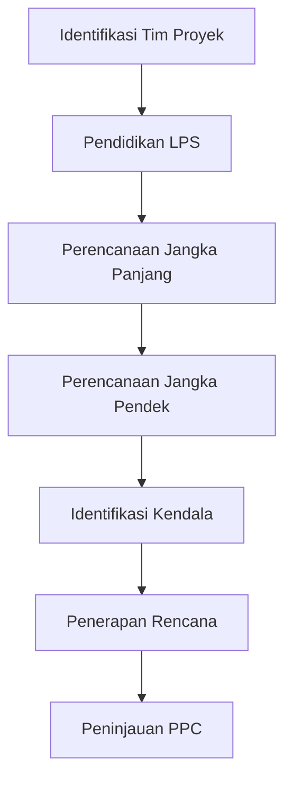

# 918 — Analisis Keterandalan Last Planner System (LPS) dan Percent Plan Complete (PPC) dalam Konstruksi Fast-Track Industri: Analisis Kendala Make-Ready, Rencana Kerja Mingguan, dan Pareto Akar Penyebab

**Domain:** Teknik Industri & Rekayasa Sistem Industri  
**Topik Spesialis:** Last Planner System (LPS) and Percent Plan Complete (PPC) Reliability in Industrial Fast-Track Construction: Make-Ready Constraint Analysis, Weekly Work Plans, and Root-Cause Pareto  
**Standar & Referensi Utama:** Ballard (The Last Planner System of Production Control, PhD Thesis); Howell & Koskela (Lean Construction Institute); Forbes & Ahmed (Modern Construction)

---

## 1. Pendahuluan dan Konteks Industri

Konstruksi industri modern menghadapi tantangan yang kompleks dalam memenuhi permintaan pasar yang terus meningkat, terutama dalam konteks proyek fast-track. Proyek fast-track mengharuskan penyelesaian yang cepat dan efisien, sering kali dengan batasan waktu yang ketat. Dalam konteks ini, Last Planner System (LPS) menjadi metode yang penting untuk meningkatkan kolaborasi dan perencanaan dalam tim proyek, yang pada gilirannya berkontribusi pada peningkatan efisiensi operasional dan pengurangan pemborosan.

LPS berfokus pada perencanaan yang lebih baik dan pengelolaan ketidakpastian, yang merupakan tantangan utama dalam konstruksi. Ketidakpastian ini dapat berasal dari berbagai sumber, termasuk keterlambatan pengiriman material, masalah tenaga kerja, dan perubahan desain. Oleh karena itu, analisis kendala make-ready dan penerapan Percent Plan Complete (PPC) menjadi krusial dalam memastikan bahwa setiap rencana kerja mingguan dapat dilaksanakan dengan baik.

Dalam konteks ini, Howell dan Koskela (2000) menekankan pentingnya mengurangi pemborosan dan meningkatkan nilai bagi pelanggan melalui pendekatan lean construction. Dengan menerapkan LPS dan PPC, tim proyek dapat lebih responsif terhadap perubahan dan lebih mampu mengidentifikasi serta mengatasi masalah yang muncul selama pelaksanaan proyek. Penelitian ini bertujuan untuk mengeksplorasi keterandalan LPS dan PPC dalam konteks konstruksi fast-track, dengan fokus pada analisis kendala, rencana kerja mingguan, dan analisis akar penyebab menggunakan metode Pareto.

## 2. Landasan Teori & Formulasi Matematis

### Last Planner System (LPS)

LPS adalah sistem perencanaan yang menekankan kolaborasi antara semua pemangku kepentingan dalam proyek konstruksi. Proses ini terdiri dari beberapa langkah, termasuk:

1. **Perencanaan Jangka Panjang**: Menentukan tujuan dan sasaran proyek.
2. **Perencanaan Jangka Pendek**: Menyusun rencana kerja mingguan berdasarkan kapasitas dan komitmen tim.
3. **Pelaksanaan dan Peninjauan**: Mengimplementasikan rencana dan meninjau hasilnya.

### Percent Plan Complete (PPC)

PPC adalah metrik yang digunakan untuk mengukur seberapa baik rencana kerja mingguan dilaksanakan. Rumus untuk menghitung PPC adalah:

$$
PPC = \frac{\text{Jumlah Pekerjaan yang Selesai}}{\text{Jumlah Pekerjaan yang Direncanakan}} \times 100\%
$$

### Analisis Kendala Make-Ready

Kendala make-ready adalah faktor yang menghambat pelaksanaan rencana kerja. Untuk menganalisis kendala ini, kita dapat menggunakan pendekatan berikut:

1. Identifikasi kendala yang ada.
2. Kategorikan kendala berdasarkan dampaknya terhadap pelaksanaan rencana.
3. Gunakan diagram Pareto untuk menentukan prioritas penyelesaian kendala.

### Derivasi Matematis

Misalkan kita memiliki $n$ pekerjaan yang direncanakan dalam satu minggu, dengan $m$ pekerjaan yang selesai. Maka, PPC dapat ditulis sebagai:

$$
PPC = \frac{m}{n} \times 100\%
$$

Jika kita ingin menganalisis pengaruh kendala terhadap PPC, kita dapat mendefinisikan variabel $C_i$ sebagai jumlah kendala yang mempengaruhi pekerjaan ke-$i$. Maka, kita dapat mengekspresikan PPC yang terpengaruh oleh kendala sebagai:

$$
PPC_{adjusted} = PPC \times \left(1 - \frac{C}{n}\right)
$$

di mana $C$ adalah total jumlah kendala yang teridentifikasi.

## 3. Metodologi Rekayasa & Standar Prosedur Operasional (SOP)

### Langkah-langkah Implementasi

1. **Identifikasi Tim Proyek**: Bentuk tim yang terdiri dari semua pemangku kepentingan, termasuk kontraktor, subkontraktor, dan pemilik proyek.
2. **Pelatihan LPS**: Berikan pelatihan tentang prinsip-prinsip LPS kepada semua anggota tim.
3. **Perencanaan Jangka Panjang**: Lakukan perencanaan jangka panjang untuk menentukan tujuan proyek.
4. **Perencanaan Jangka Pendek**: Setiap minggu, lakukan perencanaan kerja berdasarkan kapasitas tim.
5. **Identifikasi Kendala**: Selama perencanaan, identifikasi kendala yang mungkin muncul.
6. **Pelaksanaan dan Peninjauan**: Implementasikan rencana dan lakukan peninjauan mingguan untuk mengevaluasi PPC.

### Diagram Alir Proses

## 4. Studi Kasus Kuantitatif Industri & Perhitungan Numerik

### Contoh Kasus

Misalkan sebuah proyek konstruksi memiliki rencana kerja mingguan dengan 20 pekerjaan yang direncanakan. Setelah pelaksanaan, tim menyelesaikan 15 pekerjaan. Maka, kita dapat menghitung PPC sebagai berikut:

1. Hitung PPC:
   $$
   PPC = \frac{15}{20} \times 100\% = 75\%
   $$

2. Identifikasi kendala:
   - Keterlambatan pengiriman material (2 pekerjaan terpengaruh)
   - Masalah tenaga kerja (3 pekerjaan terpengaruh)

Total kendala $C = 2 + 3 = 5$.

3. Hitung PPC yang disesuaikan:
   $$
   PPC_{adjusted} = 75\% \times \left(1 - \frac{5}{20}\right) = 75\% \times 0.75 = 56.25\%
   $$

### Interpretasi Hasil

Dari perhitungan di atas, kita dapat melihat bahwa kendala yang ada mengurangi PPC dari 75% menjadi 56.25%. Ini menunjukkan pentingnya mengidentifikasi dan mengatasi kendala untuk meningkatkan kinerja proyek.

## 5. Evaluasi Kritis, Aplikasi Lintas Sektor & Standar Masa Depan

LPS dan PPC tidak hanya relevan dalam konteks konstruksi, tetapi juga dapat diterapkan dalam disiplin lain seperti manajemen rantai pasok, otomasi, dan manajemen biaya. Dalam manajemen rantai pasok, misalnya, pendekatan ini dapat membantu dalam merencanakan dan mengelola aliran barang dan informasi secara lebih efisien.

Namun, terdapat batasan dalam metodologi ini, seperti ketidakpastian dalam estimasi waktu dan sumber daya. Oleh karena itu, penelitian lebih lanjut diperlukan untuk mengembangkan model yang lebih akurat dan responsif terhadap perubahan kondisi.

Ke depan, integrasi teknologi seperti Internet of Things (IoT) dan analitik data dapat meningkatkan efektivitas LPS dan PPC. Dengan memanfaatkan data real-time, tim proyek dapat lebih cepat mengidentifikasi kendala dan membuat keputusan yang lebih baik.

---

Dokumen ini memberikan panduan komprehensif tentang penerapan Last Planner System dan Percent Plan Complete dalam konteks konstruksi fast-track. Dengan mengikuti langkah-langkah yang diuraikan dan menerapkan analisis yang tepat, tim proyek dapat meningkatkan efisiensi dan efektivitas dalam pelaksanaan proyek konstruksi.