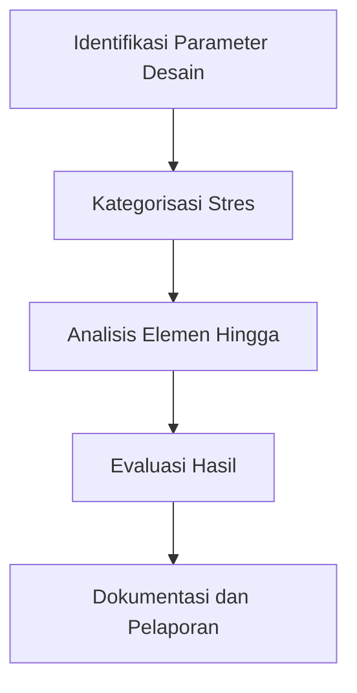

# 920 — Desain Analisis untuk Perangkat Tekanan: Kategorisasi Stres Menggunakan Metode Elemen Hingga

**Domain:** Teknik Industri & Rekayasa Sistem Industri  
**Topik Spesialis:** ASME Boiler & Pressure Vessel Code Section VIII Division 2 (Design by Analysis): Finite Element Stress Categorization (Pm, Pl, Pb, Q), Elastic-Plastic Collapse, and Fatigue Exemption  
**Standar & Referensi Utama:** ASME BPVC Section VIII Division 2 (2023); Farr & Jawad (Guidebook for the Design of ASME Section VIII Pressure Vessels, ASME Press); Bednar (Pressure Vessel Design Handbook)

---

## 1. Pendahuluan dan Konteks Industri

Perangkat tekanan seperti boiler dan bejana tekan memainkan peranan krusial dalam berbagai sektor industri, mulai dari pembangkit listrik hingga pengolahan kimia. Dengan meningkatnya permintaan untuk efisiensi energi dan keselamatan operasional, desain dan analisis yang tepat dari perangkat ini menjadi sangat penting. ASME Boiler & Pressure Vessel Code (BPVC) Section VIII Division 2 memberikan panduan yang komprehensif untuk desain berbasis analisis, yang mencakup kategorisasi stres menggunakan metode elemen hingga.

Dalam konteks ini, tantangan yang dihadapi oleh insinyur adalah bagaimana memastikan bahwa desain tidak hanya memenuhi standar keselamatan tetapi juga efisien secara ekonomi. Kegagalan dalam desain dapat mengakibatkan konsekuensi yang serius, baik dari segi keselamatan maupun kerugian finansial. Oleh karena itu, pemahaman yang mendalam tentang kategorisasi stres (Pm, Pl, Pb, Q) dan analisis elastis-plastik menjadi sangat penting.

Berdasarkan laporan dari International Energy Agency (IEA, 2022), sektor industri menyumbang sekitar 30% dari total emisi gas rumah kaca global. Oleh karena itu, penerapan desain yang efisien dan aman pada perangkat tekanan dapat berkontribusi signifikan terhadap pengurangan emisi tersebut. Dengan demikian, penerapan metodologi yang tepat dalam desain dan analisis perangkat tekanan tidak hanya penting untuk kepatuhan terhadap regulasi, tetapi juga untuk keberlanjutan industri secara keseluruhan.

## 2. Landasan Teori & Formulasi Matematis

### 2.1 Kategorisasi Stres

Dalam desain bejana tekan, stres yang dialami oleh material dapat dikategorikan menjadi beberapa jenis, yaitu:

- **Pm**: Stres maksimum yang diizinkan dalam kondisi elastis.
- **Pl**: Stres yang diizinkan dalam kondisi elastis-plastik.
- **Pb**: Stres batas untuk kondisi beban luar.
- **Q**: Stres akibat fluktuasi beban.

Kategorisasi ini dapat dinyatakan dalam bentuk matematis sebagai berikut:

$$
\sigma_{max} = \frac{P}{A}
$$

di mana:
- $P$ = tekanan internal (N/m²)
- $A$ = luas penampang (m²)

### 2.2 Analisis Elastis-Plastik

Analisis elastis-plastik dilakukan untuk menentukan titik di mana material mulai mengalami deformasi permanen. Hubungan antara stres ($\sigma$) dan regangan ($\epsilon$) dapat dinyatakan dengan hukum Hooke untuk kondisi elastis:

$$
\sigma = E \cdot \epsilon
$$

di mana:
- $E$ = modulus elastisitas (Pa)

Setelah mencapai batas elastis, hubungan ini berubah menjadi:

$$
\sigma = \sigma_y + K \cdot (\epsilon - \epsilon_y)^n
$$

di mana:
- $\sigma_y$ = batas luluh (Pa)
- $K$ = modulus kekerasan (Pa)
- $n$ = eksponen kekerasan

### 2.3 Pembuktian dan Derivasi

Untuk membuktikan bahwa desain memenuhi kriteria elastis-plastik, kita dapat menggunakan kriteria von Mises, yang menyatakan bahwa:

$$
\sigma_{vm} = \sqrt{\sigma_1^2 + \sigma_2^2 - \sigma_1 \sigma_2}
$$

dengan $\sigma_1$ dan $\sigma_2$ adalah komponen stres utama. Kriteria ini digunakan untuk menentukan apakah material akan mengalami deformasi plastis.

## 3. Metodologi Rekayasa & Standar Prosedur Operasional (SOP)

### 3.1 Langkah-langkah Implementasi

1. **Identifikasi Parameter Desain**: Tentukan parameter seperti tekanan maksimum, suhu, dan material yang akan digunakan.
2. **Kategorisasi Stres**: Hitung stres yang dialami oleh bejana menggunakan rumus yang telah dijelaskan.
3. **Analisis Elemen Hingga**: Gunakan perangkat lunak analisis elemen hingga untuk memodelkan geometri dan kondisi batas.
4. **Evaluasi Hasil**: Bandingkan hasil analisis dengan kriteria desain yang ditetapkan dalam ASME BPVC Section VIII Division 2.
5. **Dokumentasi dan Pelaporan**: Buat laporan lengkap yang mencakup semua analisis dan hasil evaluasi.

### 3.2 Diagram Alir Proses

## 4. Studi Kasus Kuantitatif Industri & Perhitungan Numerik

### 4.1 Contoh Kasus

Misalkan kita memiliki bejana tekan dengan spesifikasi sebagai berikut:
- Tekanan internal, $P = 2 \times 10^6$ Pa
- Diameter, $D = 0.5$ m
- Ketebalan, $t = 0.01$ m
- Modulus elastisitas, $E = 200 \times 10^9$ Pa
- Batas luluh, $\sigma_y = 250 \times 10^6$ Pa

### 4.2 Langkah Kalkulasi

1. **Hitung Luas Penampang**:
   $$ A = \frac{\pi D^2}{4} = \frac{\pi (0.5)^2}{4} = 0.1963 \, \text{m}^2 $$

2. **Hitung Stres Maksimum**:
   $$ \sigma_{max} = \frac{P}{A} = \frac{2 \times 10^6}{0.1963} = 10.18 \times 10^6 \, \text{Pa} $$

3. **Evaluasi Kategorisasi Stres**:
   - Bandingkan $\sigma_{max}$ dengan $\sigma_y$:
   $$ \sigma_{max} < \sigma_y \implies \text{Desain aman dalam kondisi elastis} $$

4. **Analisis Elastis-Plastik**:
   - Hitung regangan:
   $$ \epsilon = \frac{\sigma_{max}}{E} = \frac{10.18 \times 10^6}{200 \times 10^9} = 5.09 \times 10^{-5} $$

### 4.3 Interpretasi Hasil

Hasil perhitungan menunjukkan bahwa stres maksimum yang dialami oleh bejana tekan berada dalam batas aman, sehingga desain dapat diterima. Namun, perlu dilakukan analisis lebih lanjut untuk kondisi beban berulang guna mengevaluasi kemungkinan kelelahan material.

## 5. Evaluasi Kritis, Aplikasi Lintas Sektor & Standar Masa Depan

Kategorisasi stres dan analisis elastis-plastik tidak hanya relevan untuk desain bejana tekan, tetapi juga dapat diterapkan dalam berbagai disiplin teknik lainnya, termasuk otomasi dan manajemen biaya. Dalam konteks rantai pasok, penerapan desain yang efisien dapat mengurangi biaya produksi dan meningkatkan keselamatan.

Dengan meningkatnya fokus pada keberlanjutan dan tanggung jawab sosial perusahaan (CSR), penelitian di masa depan dapat berfokus pada pengembangan material baru yang lebih kuat dan ringan, serta teknik analisis yang lebih canggih untuk memprediksi perilaku material di bawah kondisi ekstrem.

Standar masa depan mungkin akan mencakup penggunaan teknologi digital seperti simulasi berbasis AI dan machine learning untuk meningkatkan akurasi analisis dan efisiensi desain. Penelitian lebih lanjut dalam bidang ini akan sangat penting untuk memenuhi tuntutan industri yang terus berkembang dan kompleks.

---

Dokumen ini memberikan gambaran menyeluruh mengenai desain analisis untuk perangkat tekanan sesuai dengan ASME BPVC Section VIII Division 2, serta metodologi dan aplikasi praktis yang relevan dalam konteks industri saat ini.

## 5. Ringkasan & Catatan Praktis Implementasi
Implementasi metode ini memerlukan standarisasi prosedur operasi (SOP), kalibrasi instrumen berkala, serta integrasi pemantauan real-time untuk memastikan konsistensi performa dan efisiensi sistem secara berkelanjutan.
