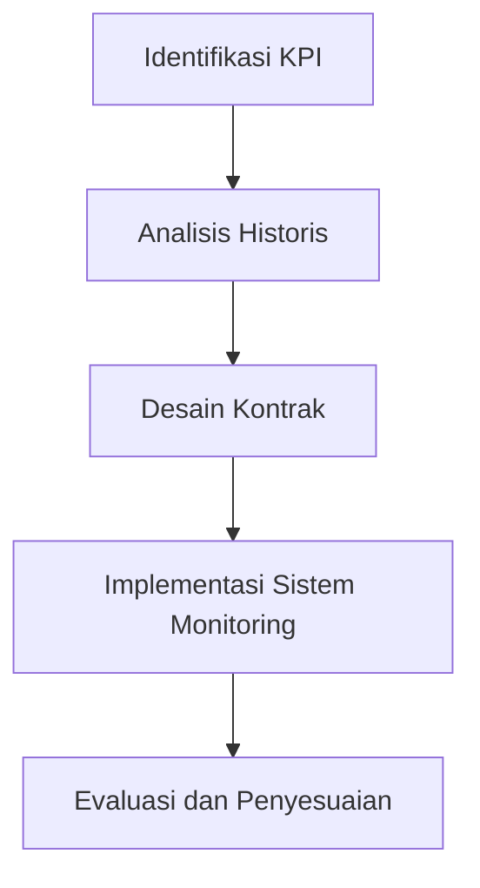

# 939 — Performance-Based Contracting (PBC) dan Pengelolaan Aset Power-by-the-Hour: Ambang KPI Jaminan Ketersediaan, Alokasi Risiko Gainshare/Painshare, dan Desain Matematis Penalti

**Domain:** Teknik Industri & Rekayasa Sistem Industri  
**Topik Spesialis:** Performance-Based Contracting (PBC) and Power-by-the-Hour Asset Governance: Availability Guarantee KPI Thresholds, Gainshare/Painshare Risk Allocation, and Penalty Mathematical Design  
**Standar & Referensi Utama:** Kim, Cohen & Netessine (2022, Manage. Sci.); Vitasek et al. (Vested Outsourcing: Five Rules That Will Transform Outsourcing, Palgrave Macmillan); SAE AS6837

---

## 1. Pendahuluan dan Konteks Industri

Dalam era industri modern, perusahaan menghadapi tantangan yang semakin kompleks dalam pengelolaan aset dan kontrak. Performance-Based Contracting (PBC) muncul sebagai solusi yang efektif untuk meningkatkan kinerja dan efisiensi operasional. PBC berfokus pada hasil yang diinginkan daripada aktivitas yang dilakukan, sehingga mendorong penyedia layanan untuk berinovasi dan meningkatkan nilai tambah bagi pelanggan. Hal ini sangat relevan dalam konteks industri manufaktur dan rantai pasok, di mana ketersediaan aset dan keandalan layanan menjadi faktor penentu keberhasilan.

Ketersediaan aset yang tinggi sangat penting untuk menjaga kelangsungan operasi dan meminimalkan downtime. Dalam konteks ini, Power-by-the-Hour (PBH) menjadi model bisnis yang menarik, di mana pelanggan membayar berdasarkan waktu penggunaan aset, bukan kepemilikan. Model ini mendorong penyedia untuk memastikan ketersediaan maksimum dan meminimalkan risiko kegagalan. Namun, tantangan muncul dalam penentuan ambang KPI jaminan ketersediaan, alokasi risiko antara pihak-pihak yang terlibat, serta desain penalti yang adil dan efektif.

Dalam literatur, Kim, Cohen & Netessine (2022) menekankan pentingnya pengukuran kinerja yang tepat dalam PBC, sementara Vitasek et al. menguraikan prinsip-prinsip Vested Outsourcing yang dapat diterapkan dalam konteks ini. Standar SAE AS6837 juga memberikan panduan tentang praktik terbaik dalam pengelolaan aset berbasis kinerja. Dengan memahami dan menerapkan prinsip-prinsip ini, perusahaan dapat meningkatkan efisiensi operasional dan mencapai keunggulan kompetitif yang berkelanjutan.

## 2. Landasan Teori & Formulasi Matematis

### 2.1. Definisi Variabel

Dalam konteks PBC dan PBH, beberapa variabel kunci yang perlu didefinisikan adalah sebagai berikut:

- $A$: Ketersediaan aset (dalam persen)
- $T$: Total waktu operasional yang dijadwalkan (dalam jam)
- $D$: Total waktu downtime yang tidak terencana (dalam jam)
- $KPI$: Indikator Kinerja Utama
- $R$: Risiko yang dialokasikan antara penyedia dan pelanggan
- $P$: Penalti yang dikenakan jika KPI tidak tercapai

### 2.2. Rumus Ketersediaan Aset

Ketersediaan aset dapat dihitung dengan rumus berikut:

$$
A = \frac{T - D}{T} \times 100\%
$$

### 2.3. Ambang KPI Jaminan Ketersediaan

Ambang KPI untuk jaminan ketersediaan dapat ditentukan berdasarkan analisis historis dan benchmarking industri. Misalnya, jika rata-rata ketersediaan aset dalam industri adalah 95%, maka ambang KPI dapat ditetapkan pada 92% untuk memberikan ruang bagi fluktuasi yang tidak terduga.

### 2.4. Alokasi Risiko Gainshare/Painshare

Model alokasi risiko dapat dinyatakan sebagai berikut:

$$
R = \begin{cases} 
R_g & \text{jika KPI tercapai} \\
R_p & \text{jika KPI tidak tercapai} 
\end{cases}
$$

Di mana:
- $R_g$: Alokasi risiko gainshare (manfaat bagi penyedia)
- $R_p$: Alokasi risiko painshare (kerugian bagi penyedia)

### 2.5. Desain Matematis Penalti

Desain penalti dapat dinyatakan dengan rumus:

$$
P = \alpha \times (KPI_{target} - KPI_{actual}) \times \beta
$$

Di mana:
- $\alpha$: Faktor penalti yang ditentukan berdasarkan kesepakatan kontrak
- $\beta$: Koefisien yang mencerminkan dampak finansial dari ketidakpencapaian KPI

## 3. Metodologi Rekayasa & Standar Prosedur Operasional (SOP)

### 3.1. Langkah-langkah Implementasi

1. **Identifikasi KPI**: Tentukan KPI yang relevan berdasarkan tujuan bisnis dan kebutuhan pelanggan.
2. **Analisis Historis**: Lakukan analisis data historis untuk menetapkan ambang KPI yang realistis.
3. **Desain Kontrak**: Rancang kontrak PBC yang mencakup ketentuan tentang alokasi risiko dan penalti.
4. **Implementasi Sistem Monitoring**: Kembangkan sistem untuk memantau kinerja aset secara real-time.
5. **Evaluasi dan Penyesuaian**: Lakukan evaluasi berkala terhadap kinerja dan sesuaikan kontrak jika diperlukan.

### 3.2. Diagram Alir Proses

## 4. Studi Kasus Kuantitatif Industri & Perhitungan Numerik

### 4.1. Contoh Kasus

Misalkan sebuah perusahaan manufaktur memiliki total waktu operasional yang dijadwalkan $T = 1000$ jam dan mengalami downtime tidak terencana $D = 50$ jam.

### 4.2. Perhitungan Ketersediaan Aset

Menggunakan rumus ketersediaan:

$$
A = \frac{1000 - 50}{1000} \times 100\% = 95\%
$$

### 4.3. Penetapan Ambang KPI

Jika ambang KPI ditetapkan pada 92%, maka perusahaan memenuhi KPI.

### 4.4. Alokasi Risiko

Jika KPI tercapai, alokasi risiko gainshare $R_g = 10\%$ dari biaya kontrak, dan jika tidak tercapai, alokasi risiko painshare $R_p = 5\%$ dari biaya kontrak.

### 4.5. Perhitungan Penalti

Misalkan target KPI adalah 95% dan KPI aktual adalah 90%. Jika faktor penalti $\alpha = 1000$ dan koefisien $\beta = 1$, maka:

$$
P = 1000 \times (95 - 90) \times 1 = 5000
$$

Interpretasi hasil: Perusahaan harus membayar penalti sebesar $5000 karena tidak mencapai KPI yang disepakati.

## 5. Evaluasi Kritis, Aplikasi Lintas Sektor & Standar Masa Depan

Penerapan PBC dan PBH tidak hanya terbatas pada industri manufaktur, tetapi juga dapat diterapkan dalam sektor transportasi, energi, dan layanan kesehatan. Dalam konteks rantai pasok, PBC dapat meningkatkan kolaborasi antara pemasok dan pelanggan, mengurangi biaya, dan meningkatkan efisiensi.

Namun, terdapat batasan dalam metodologi ini, seperti ketidakpastian dalam perhitungan KPI dan alokasi risiko yang dapat mempengaruhi hubungan antara pihak-pihak yang terlibat. Oleh karena itu, penelitian lebih lanjut diperlukan untuk mengembangkan model yang lebih adaptif dan responsif terhadap perubahan kondisi pasar.

Ke depan, standar dan praktik terbaik dalam PBC dan PBH diharapkan dapat terus berkembang, dengan fokus pada integrasi teknologi digital dan analitik data untuk meningkatkan pengukuran kinerja dan pengambilan keputusan.$.

## 5. Ringkasan & Catatan Praktis Implementasi
Implementasi metode ini memerlukan standarisasi prosedur operasi (SOP), kalibrasi instrumen berkala, serta integrasi pemantauan real-time untuk memastikan konsistensi performa dan efisiensi sistem secara berkelanjutan.
