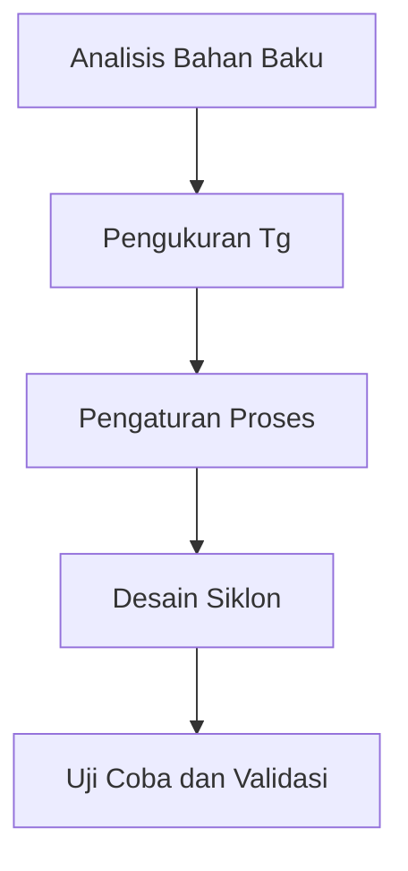

# 949 — Pencegahan Stickiness dan Caking pada Pengeringan Semprot Susu Industri

**Domain:** Teknik Industri & Rekayasa Sistem Industri  
**Topik Spesialis:** Industrial Milk Powder Spray Drying Stickiness and Caking Prevention: Williams-Landel-Ferry (WLF) State Diagram, Amorphous Lactose Glass Transition Temperature (Tg), and Cyclone Design  
**Standar & Referensi Utama:** Bhandari et al. (Food Powders, Springer); Roos (Phase Transitions in Foods, Academic Press); Dairy Processing Handbook (Tetra Pak)

---

## 1. Pendahuluan dan Konteks Industri

Industri susu merupakan salah satu sektor penting dalam perekonomian global, dengan produk susu bubuk yang menjadi komoditas utama dalam rantai pasok makanan. Proses pengeringan semprot (spray drying) adalah metode yang umum digunakan untuk menghasilkan susu bubuk dari susu cair. Namun, tantangan utama yang dihadapi dalam proses ini adalah fenomena stickiness dan caking yang dapat mengganggu efisiensi produksi dan kualitas produk akhir. Stickiness terjadi ketika partikel susu bubuk saling menempel, sedangkan caking adalah penggumpalan partikel yang mengakibatkan kesulitan dalam pengolahan dan penyimpanan.

Menurut Bhandari et al. (2022), stickiness dan caking dapat disebabkan oleh beberapa faktor, termasuk kelembapan, temperatur, dan komposisi kimia dari susu. Dalam konteks ini, pemahaman mengenai diagram keadaan Williams-Landel-Ferry (WLF) dan suhu transisi gelas (Tg) dari laktosa amorf sangat penting untuk merancang proses yang optimal. Roos (2022) menekankan bahwa suhu transisi gelas adalah titik kritis di mana material beralih dari keadaan kaku menjadi keadaan yang lebih fleksibel, sehingga mempengaruhi sifat aliran dan pengemasan produk.

Dalam industri, tantangan ini tidak hanya berdampak pada efisiensi operasional, tetapi juga pada kualitas produk dan kepuasan pelanggan. Oleh karena itu, penting untuk mengembangkan strategi pencegahan yang efektif, termasuk desain siklon yang efisien untuk memisahkan partikel halus dan mencegah akumulasi. Dengan memahami dan menerapkan prinsip-prinsip ilmiah ini, industri dapat meningkatkan kualitas produk susu bubuk dan mengurangi kerugian akibat caking.

## 2. Landasan Teori & Formulasi Matematis

### 2.1. Diagram Keadaan Williams-Landel-Ferry (WLF)

Diagram WLF digunakan untuk menggambarkan hubungan antara viskositas dan temperatur pada material amorf. Persamaan WLF dapat dinyatakan sebagai berikut:

$$
\log_{10} \eta = A + \frac{B}{T - T_g}
$$

di mana:
- $\eta$ = viskositas (Pa·s)
- $A$ dan $B$ = konstanta empiris
- $T$ = temperatur (K)
- $T_g$ = suhu transisi gelas (K)

### 2.2. Suhu Transisi Gelas (Tg)

Suhu transisi gelas dari laktosa amorf dapat dihitung menggunakan rumus:

$$
T_g = \frac{T_m}{1 + k \cdot \phi}
$$

di mana:
- $T_m$ = suhu lebur (K)
- $k$ = konstanta yang tergantung pada jenis material
- $\phi$ = fraksi volumetrik dari komponen amorf

### 2.3. Desain Siklon

Desain siklon untuk pemisahan partikel halus dapat dihitung dengan menggunakan persamaan berikut:

$$
D_p = \frac{(18 \cdot \mu \cdot Q^2)}{(C_d \cdot \rho \cdot g \cdot D^3)}
$$

di mana:
- $D_p$ = diameter partikel (m)
- $\mu$ = viskositas fluida (Pa·s)
- $Q$ = laju aliran (m³/s)
- $C_d$ = koefisien drag
- $\rho$ = densitas fluida (kg/m³)
- $g$ = percepatan gravitasi (m/s²)
- $D$ = diameter siklon (m)

## 3. Metodologi Rekayasa & Standar Prosedur Operasional (SOP)

### 3.1. Langkah-langkah Implementasi

1. **Analisis Bahan Baku**: Lakukan analisis komposisi kimia dan sifat fisik susu cair untuk menentukan parameter pengeringan yang optimal.
2. **Pengukuran Suhu Transisi Gelas**: Hitung suhu transisi gelas ($T_g$) dari laktosa menggunakan rumus yang telah dijelaskan.
3. **Pengaturan Proses Pengeringan**: Atur temperatur dan kelembapan dalam pengeringan semprot berdasarkan hasil analisis WLF untuk menghindari stickiness.
4. **Desain Siklon**: Rancang siklon dengan parameter yang sesuai untuk memisahkan partikel halus, menggunakan rumus desain siklon.
5. **Uji Coba dan Validasi**: Lakukan uji coba untuk memvalidasi desain dan parameter yang telah ditentukan, serta lakukan penyesuaian jika diperlukan.

### 3.2. Diagram Alir Proses

## 4. Studi Kasus Kuantitatif Industri & Perhitungan Numerik

### 4.1. Parameter Input

Misalkan kita memiliki susu cair dengan parameter sebagai berikut:
- Viskositas ($\mu$) = 0.001 Pa·s
- Laju aliran ($Q$) = 0.5 m³/s
- Koefisien drag ($C_d$) = 0.5
- Densitas ($\rho$) = 1000 kg/m³
- Diameter siklon ($D$) = 0.1 m
- Suhu lebur ($T_m$) = 333 K
- Fraksi volumetrik ($\phi$) = 0.2
- Konstanta ($k$) = 0.5

### 4.2. Perhitungan

1. **Hitung Suhu Transisi Gelas ($T_g$)**:

$$
T_g = \frac{333}{1 + 0.5 \cdot 0.2} = \frac{333}{1.1} \approx 302.73 \text{ K}
$$

2. **Hitung Diameter Partikel ($D_p$)**:

$$
D_p = \frac{(18 \cdot 0.001 \cdot (0.5)^2)}{(0.5 \cdot 1000 \cdot 9.81 \cdot (0.1)^3)} = \frac{(18 \cdot 0.001 \cdot 0.25)}{(0.5 \cdot 1000 \cdot 9.81 \cdot 0.001)} \approx 0.00091 \text{ m} = 0.91 \text{ mm}
$$

### 4.3. Interpretasi Hasil

Diameter partikel yang dihasilkan adalah 0.91 mm, yang menunjukkan bahwa desain siklon yang tepat dapat memisahkan partikel halus dengan efisiensi tinggi. Dengan mengatur suhu pengeringan di atas $T_g$ dan memastikan viskositas tetap rendah, risiko stickiness dapat diminimalkan, sehingga meningkatkan kualitas produk akhir.

## 5. Evaluasi Kritis, Aplikasi Lintas Sektor & Standar Masa Depan

Penerapan prinsip-prinsip yang dibahas dalam modul ini tidak hanya terbatas pada industri susu, tetapi juga dapat diterapkan dalam sektor lain seperti farmasi dan bahan kimia. Dalam konteks rantai pasok, pemahaman tentang sifat fisik bahan dapat membantu dalam pengelolaan inventaris dan pengiriman produk. Selain itu, integrasi teknologi otomasi dalam proses pengeringan dapat meningkatkan efisiensi dan mengurangi biaya operasional.

Namun, terdapat batasan dalam metodologi yang digunakan, seperti variabilitas dalam komposisi bahan baku dan kondisi lingkungan yang dapat mempengaruhi hasil. Oleh karena itu, penelitian lebih lanjut diperlukan untuk mengembangkan model yang lebih akurat dan adaptif.

Ke depan, fokus riset dapat diarahkan pada pengembangan teknologi baru yang dapat meningkatkan efisiensi proses pengeringan, serta penerapan teknik pemodelan dan simulasi untuk memprediksi perilaku bahan dalam kondisi yang berbeda. Dengan demikian, industri dapat terus berinovasi dan memenuhi permintaan pasar yang semakin meningkat akan produk berkualitas tinggi.

## 5. Ringkasan & Catatan Praktis Implementasi
Implementasi metode ini memerlukan standarisasi prosedur operasi (SOP), kalibrasi instrumen berkala, serta integrasi pemantauan real-time untuk memastikan konsistensi performa dan efisiensi sistem secara berkelanjutan.
