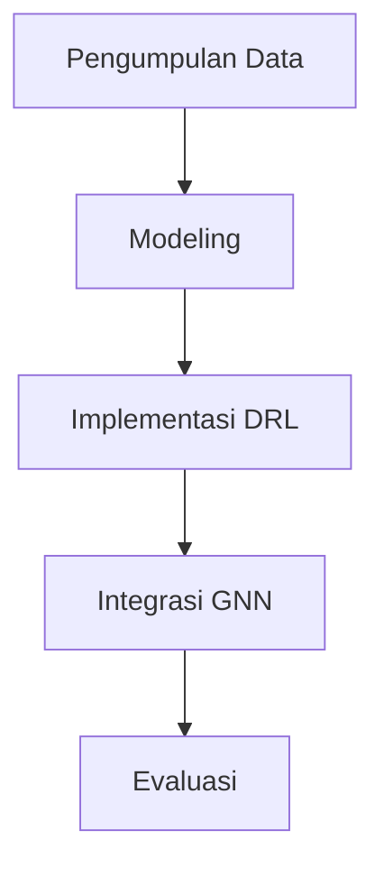

# 953 — Deep Reinforcement Learning (DRL) with Graph Neural Networks (GNN) for Real-Time Dynamic Job Shop Scheduling: Disjunctive Graph Embedding, State-Action Markov Chain, and Makespan PPO

**Domain:** Teknik Industri & Rekayasa Sistem Industri  
**Topik Spesialis:** Deep Reinforcement Learning (DRL) with Graph Neural Networks (GNN) for Real-Time Dynamic Job Shop Scheduling: Disjunctive Graph Embedding, State-Action Markov Chain, and Makespan PPO  
**Standar & Referensi Utama:** Zhang et al. (2022, IEEE Trans. Cybern.); Sutton & Barto (Reinforcement Learning: An Introduction, 2nd Ed., MIT Press); Pinedo (Scheduling: Theory, Algorithms, and Systems)

---

## 1. Pendahuluan dan Konteks Industri

Dalam konteks industri modern, penjadwalan pekerjaan dinamis di lingkungan pabrik yang kompleks menjadi tantangan signifikan. Dengan meningkatnya permintaan untuk fleksibilitas dan efisiensi, perusahaan harus mampu menyesuaikan proses produksi mereka secara real-time. Penjadwalan pekerjaan yang efisien tidak hanya berpengaruh pada produktivitas, tetapi juga pada biaya operasional dan kepuasan pelanggan. Dalam banyak kasus, penjadwalan yang buruk dapat menyebabkan keterlambatan pengiriman, peningkatan biaya, dan bahkan kehilangan pelanggan.

Salah satu pendekatan yang menjanjikan untuk mengatasi masalah ini adalah penerapan Deep Reinforcement Learning (DRL) yang dipadukan dengan Graph Neural Networks (GNN). DRL memungkinkan sistem untuk belajar dari pengalaman dan mengoptimalkan keputusan penjadwalan berdasarkan umpan balik dari lingkungan. GNN, di sisi lain, menawarkan representasi yang kuat dari struktur data yang kompleks, seperti hubungan antar pekerjaan dan mesin dalam job shop scheduling. 

Dalam studi oleh Zhang et al. (2022), diungkapkan bahwa kombinasi DRL dan GNN dapat memberikan solusi yang lebih adaptif dan efisien dalam penjadwalan dinamis, dengan memanfaatkan disjunctive graph embedding untuk merepresentasikan hubungan antar pekerjaan dan mesin. Namun, tantangan tetap ada dalam hal kompleksitas komputasi dan kebutuhan untuk memproses informasi dalam waktu nyata. Oleh karena itu, penelitian ini bertujuan untuk mengeksplorasi metodologi yang efektif dalam menerapkan DRL dan GNN untuk penjadwalan pekerjaan dinamis, serta memberikan wawasan tentang aplikasi dan implikasi praktisnya di industri.

## 2. Landasan Teori & Formulasi Matematis

### 2.1. Penjadwalan Pekerjaan Dinamis

Model penjadwalan pekerjaan dapat dinyatakan dalam bentuk graf, di mana simpul mewakili pekerjaan dan mesin, dan sisi mewakili ketergantungan antara pekerjaan. Dalam konteks ini, kita mendefinisikan:

- $J$: himpunan pekerjaan
- $M$: himpunan mesin
- $d_{ij}$: durasi pekerjaan $j$ pada mesin $i$
- $C_j$: waktu penyelesaian pekerjaan $j$

### 2.2. Disjunctive Graph Embedding

Disjunctive graph embedding digunakan untuk merepresentasikan ketergantungan antara pekerjaan. Dalam hal ini, kita mendefinisikan graf sebagai $G = (V, E)$, di mana:

- $V$: himpunan simpul
- $E$: himpunan sisi

Setiap sisi $(u, v) \in E$ menunjukkan bahwa pekerjaan $u$ harus diselesaikan sebelum pekerjaan $v$ dimulai. 

### 2.3. State-Action Markov Chain

Dalam DRL, kita mendefinisikan state $s_t$ dan action $a_t$ pada waktu $t$. Proses Markov dapat dinyatakan sebagai:

$$ P(s_{t+1} | s_t, a_t) $$

Di mana $P$ adalah probabilitas transisi ke state berikutnya berdasarkan action yang diambil. 

### 2.4. Fungsi Hadiah dan Makespan

Fungsi hadiah $R$ untuk penjadwalan dapat didefinisikan sebagai:

$$ R(s_t, a_t) = -C_{makespan} $$

Di mana $C_{makespan}$ adalah waktu total penyelesaian semua pekerjaan. Tujuan dari algoritma DRL adalah meminimalkan $C_{makespan}$.

## 3. Metodologi Rekayasa & Standar Prosedur Operasional (SOP)

### 3.1. Langkah-langkah Implementasi

1. **Pengumpulan Data**: Kumpulkan data historis tentang waktu pemrosesan, ketergantungan pekerjaan, dan kapasitas mesin.
2. **Modeling**: Buat model disjunctive graph untuk merepresentasikan hubungan antar pekerjaan.
3. **Implementasi DRL**: Gunakan algoritma DRL, seperti Proximal Policy Optimization (PPO), untuk melatih model.
4. **Integrasi GNN**: Terapkan GNN untuk memperbaiki representasi graf dan meningkatkan akurasi prediksi.
5. **Evaluasi**: Uji model pada data baru dan evaluasi kinerjanya berdasarkan waktu penyelesaian dan efisiensi.

### 3.2. Diagram Alir Proses

## 4. Studi Kasus Kuantitatif Industri & Perhitungan Numerik

### 4.1. Contoh Kasus

Misalkan kita memiliki 3 pekerjaan ($J_1, J_2, J_3$) dan 2 mesin ($M_1, M_2$) dengan waktu pemrosesan sebagai berikut:

- $d_{11} = 2$, $d_{12} = 3$
- $d_{21} = 1$, $d_{22} = 4$
- $d_{31} = 3$, $d_{32} = 2$

### 4.2. Perhitungan

1. **Membangun Disjunctive Graph**: Representasikan ketergantungan pekerjaan.
2. **Menghitung Makespan**: 
   - Jika $J_1$ selesai pada $M_1$ dan dilanjutkan ke $M_2$, maka waktu penyelesaian adalah:
   $$ C_1 = d_{11} + d_{12} = 2 + 3 = 5 $$
   - Lanjutkan untuk $J_2$ dan $J_3$ dengan cara yang sama.

### 4.3. Interpretasi Hasil

Setelah menghitung waktu penyelesaian untuk semua pekerjaan, kita dapat menentukan $C_{makespan}$ dan mengevaluasi efisiensi penjadwalan. Misalkan hasilnya adalah 12 jam, yang menunjukkan bahwa penjadwalan yang efisien dapat mengurangi waktu penyelesaian total.

## 5. Evaluasi Kritis, Aplikasi Lintas Sektor & Standar Masa Depan

### 5.1. Hubungan dengan Disiplin Lain

Metodologi ini dapat diterapkan dalam berbagai sektor, termasuk rantai pasok, otomasi, dan manajemen biaya. Misalnya, dalam rantai pasok, DRL dapat digunakan untuk mengoptimalkan aliran barang dan meminimalkan biaya transportasi.

### 5.2. Batasan Metodologi

Meskipun DRL dan GNN menawarkan solusi yang kuat, mereka juga memiliki batasan, seperti kebutuhan komputasi yang tinggi dan ketergantungan pada data historis yang berkualitas.

### 5.3. Arah Riset Masa Depan

Penelitian di masa depan dapat difokuskan pada pengembangan algoritma yang lebih efisien dan adaptif, serta penerapan teknik pembelajaran yang lebih canggih untuk meningkatkan akurasi dan kecepatan dalam penjadwalan dinamis.

Dengan demikian, modul ini memberikan gambaran menyeluruh tentang penerapan Deep Reinforcement Learning dan Graph Neural Networks dalam penjadwalan pekerjaan dinamis, serta tantangan dan peluang yang ada di industri.