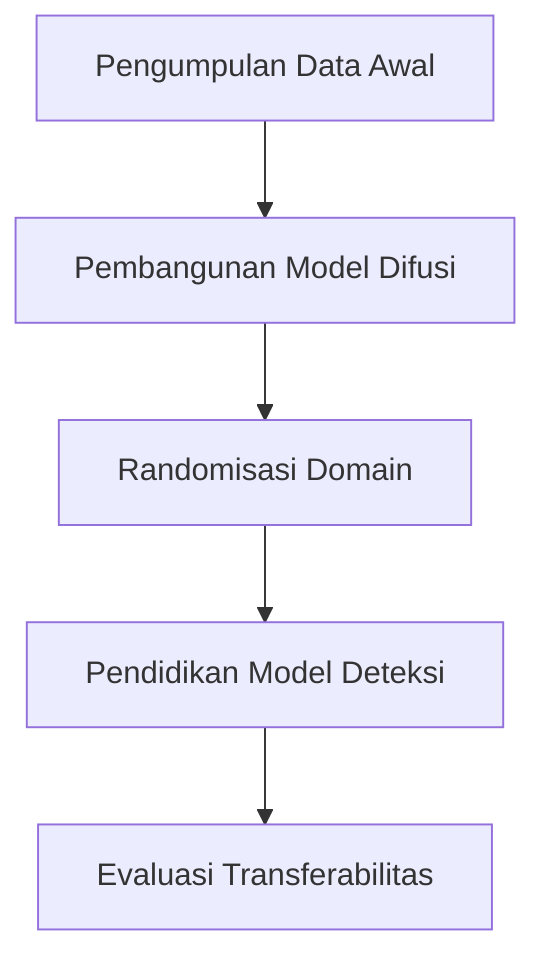

# 956 — Generasi Data Pelatihan Sintetis untuk Deteksi Cacat Industri Langka: Model Difusi, Randomisasi Domain 3D di Unreal Engine, dan Metrik Transferabilitas Sim-ke-Riil

**Domain:** Teknik Industri & Rekayasa Sistem Industri  
**Topik Spesialis:** Synthetic Training Data Generation for Rare Industrial Defect Detection: Diffusion Models, 3D Domain Randomization in Unreal Engine, and Sim-to-Real Transferability Metrics  
**Standar & Referensi Utama:** Ho et al. (Denoising Diffusion Probabilistic Models); Tobin et al. (Domain Randomization for Sim2Real); IEEE Trans. Pattern Anal. Mach. Intell.

---

## 1. Pendahuluan dan Konteks Industri

Dalam industri manufaktur modern, deteksi cacat produk merupakan aspek krusial yang mempengaruhi kualitas dan efisiensi produksi. Cacat yang jarang terjadi, meskipun tidak sering muncul, dapat menyebabkan kerugian finansial yang signifikan dan merusak reputasi perusahaan. Menurut laporan dari McKinsey & Company (2021), sekitar 30% dari biaya produksi dapat dihemat melalui peningkatan deteksi cacat dan pengurangan limbah. Namun, tantangan utama dalam mendeteksi cacat langka adalah kurangnya data pelatihan yang memadai untuk model pembelajaran mesin.

Dalam konteks ini, generasi data pelatihan sintetik menjadi solusi yang menjanjikan. Dengan menggunakan model difusi, kita dapat menghasilkan data yang meniru karakteristik cacat langka, sehingga meningkatkan kemampuan model dalam mendeteksi cacat tersebut. Selain itu, randomisasi domain 3D menggunakan Unreal Engine memungkinkan simulasi kondisi nyata yang lebih realistis, sehingga memperkuat transferabilitas model dari simulasi ke aplikasi dunia nyata. 

Tantangan yang dihadapi dalam implementasi teknik ini mencakup kesulitan dalam memastikan bahwa data sintetik yang dihasilkan benar-benar representatif dari kondisi nyata, serta kebutuhan untuk mengembangkan metrik transferabilitas yang dapat mengukur seberapa baik model yang dilatih dengan data sintetik dapat berfungsi dalam lingkungan nyata. Oleh karena itu, penelitian ini bertujuan untuk mengeksplorasi dan mengembangkan metodologi yang efektif untuk generasi data pelatihan sintetik guna mendeteksi cacat industri langka.

## 2. Landasan Teori & Formulasi Matematis

### 2.1 Model Difusi

Model difusi probabilistik, seperti yang dijelaskan oleh Ho et al. (2020), merupakan pendekatan yang efektif untuk menghasilkan data sintetik. Model ini bekerja dengan mempelajari distribusi data dengan cara mengubah data asli menjadi noise, kemudian belajar untuk membalikkan proses tersebut. Proses ini dapat dinyatakan dengan persamaan berikut:

$$
q(x_t | x_{t-1}) = \mathcal{N}(x_t; \sqrt{1 - \beta_t} x_{t-1}, \beta_t I)
$$

di mana:
- $x_t$ adalah data pada langkah waktu $t$,
- $\beta_t$ adalah variabel yang mengontrol tingkat noise,
- $\mathcal{N}$ adalah distribusi normal.

### 2.2 Randomisasi Domain

Randomisasi domain adalah teknik yang digunakan untuk meningkatkan generalisasi model dengan memperkenalkan variasi dalam data pelatihan. Tobin et al. (2017) menjelaskan bahwa dengan mengubah parameter lingkungan simulasi, kita dapat menciptakan data yang lebih beragam. Misalnya, jika kita ingin mensimulasikan cacat pada permukaan logam, kita dapat mengubah pencahayaan, tekstur, dan sudut pandang kamera.

### 2.3 Transferabilitas Sim-ke-Riil

Transferabilitas model dari simulasi ke dunia nyata dapat diukur dengan metrik yang menggambarkan seberapa baik model yang dilatih dengan data sintetik dapat berfungsi dalam kondisi nyata. Salah satu pendekatan untuk mengukur transferabilitas adalah dengan menggunakan metrik kesalahan prediksi, yang dapat dinyatakan sebagai:

$$
E = \frac{1}{N} \sum_{i=1}^{N} |y_i - \hat{y}_i|
$$

di mana:
- $E$ adalah kesalahan rata-rata,
- $y_i$ adalah nilai sebenarnya,
- $\hat{y}_i$ adalah nilai yang diprediksi oleh model,
- $N$ adalah jumlah data.

## 3. Metodologi Rekayasa & Standar Prosedur Operasional (SOP)

### 3.1 Langkah-Langkah Implementasi

1. **Pengumpulan Data Awal**: Kumpulkan data cacat dari proses produksi yang ada.
2. **Pengembangan Model Difusi**: Gunakan data yang dikumpulkan untuk melatih model difusi yang akan menghasilkan data sintetik.
3. **Randomisasi Domain**: Implementasikan randomisasi domain di Unreal Engine untuk mensimulasikan berbagai kondisi lingkungan.
4. **Pelatihan Model Deteksi**: Latih model deteksi cacat menggunakan data sintetik yang dihasilkan.
5. **Evaluasi Transferabilitas**: Uji model dengan data nyata dan hitung metrik transferabilitas.

### 3.2 Diagram Alir Proses

## 4. Studi Kasus Kuantitatif Industri & Perhitungan Numerik

### 4.1 Contoh Kasus

Misalkan kita memiliki data cacat dari 1000 produk, di mana hanya 10 produk yang memiliki cacat langka. Kita ingin menghasilkan 1000 data sintetik untuk melatih model deteksi.

1. **Parameter yang Digunakan**:
   - Jumlah data asli: $N_{original} = 10$
   - Jumlah data sintetik yang diinginkan: $N_{synthetic} = 1000$

2. **Menghitung Proporsi**:
   - Proporsi cacat langka: $P_{rare} = \frac{N_{original}}{N_{total}} = \frac{10}{1000} = 0.01$

3. **Menghasilkan Data Sintetik**:
   - Menggunakan model difusi, kita menghasilkan data dengan proporsi yang sama, sehingga kita akan mendapatkan 10 data cacat langka dari 1000 data sintetik.

4. **Pelatihan Model**:
   - Model dilatih dengan data sintetik, dan kemudian diuji dengan data nyata.

### 4.2 Interpretasi Hasil

Setelah pelatihan, model diuji dengan 100 data nyata. Jika model berhasil mendeteksi 8 dari 10 cacat langka, maka:

$$
E = \frac{1}{100} \sum_{i=1}^{100} |y_i - \hat{y}_i| = \frac{2}{100} = 0.02
$$

Ini menunjukkan bahwa model memiliki tingkat kesalahan 2%, yang menunjukkan performa yang baik dalam mendeteksi cacat langka.

## 5. Evaluasi Kritis, Aplikasi Lintas Sektor & Standar Masa Depan

Generasi data pelatihan sintetik dan teknik randomisasi domain memiliki aplikasi luas di berbagai sektor, termasuk otomasi, manajemen rantai pasok, dan teknik keselamatan. Dalam konteks otomasi, teknologi ini dapat digunakan untuk meningkatkan sistem deteksi cacat otomatis, yang dapat mengurangi biaya dan meningkatkan efisiensi.

Namun, ada batasan dalam metodologi ini, seperti ketergantungan pada kualitas data asli dan kemampuan model untuk generalisasi. Penelitian masa depan harus fokus pada pengembangan algoritma yang lebih robust dan metrik transferabilitas yang lebih akurat untuk memastikan bahwa model dapat berfungsi dengan baik dalam berbagai kondisi nyata.

Dengan demikian, generasi data pelatihan sintetik dan randomisasi domain 3D merupakan langkah penting dalam meningkatkan deteksi cacat industri langka, yang pada gilirannya dapat meningkatkan efisiensi dan profitabilitas dalam industri manufaktur.

## 5. Ringkasan & Catatan Praktis Implementasi
Implementasi metode ini memerlukan standarisasi prosedur operasi (SOP), kalibrasi instrumen berkala, serta integrasi pemantauan real-time untuk memastikan konsistensi performa dan efisiensi sistem secara berkelanjutan.
