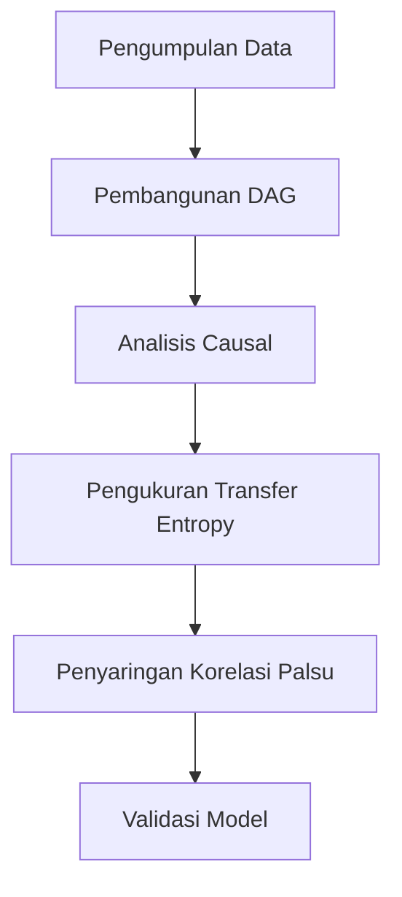

# 958 — Diagnosis Banjir Alarm Akar Penyebab di Pabrik Kimia Menggunakan Causal AI dan Pemodelan Persamaan Struktur Directed Acyclic Graph (DAG): Do-Calculus Pearl, Entropi Transfer, dan Penyaringan Korelasi Palsu

**Domain:** Teknik Industri & Rekayasa Sistem Industri  
**Topik Spesialis:** Causal AI and Directed Acyclic Graph (DAG) Structural Equation Modeling for Chemical Plant Root-Cause Alarm Flood Diagnosis: Pearl's Do-Calculus, Transfer Entropy, and Spurious Correlation Filtering  
**Standar & Referensi Utama:** Pearl (Causality: Models, Reasoning, and Inference, Cambridge University Press); Peters, Janzing & Schölkopf (Elements of Causal Inference, MIT Press); ISA-18.2 (Alarm Management)

---

## 1. Pendahuluan dan Konteks Industri

Dalam industri kimia, pengelolaan alarm yang efektif sangat penting untuk memastikan keselamatan operasional dan efisiensi produksi. Alarm yang tidak terkelola dengan baik dapat menyebabkan "banjir alarm," di mana banyak alarm berbunyi secara bersamaan, mengakibatkan kebingungan dan potensi pengabaian alarm yang kritis. Menurut standar ISA-18.2, alarm yang tidak relevan atau berlebihan dapat mengurangi respons operator terhadap situasi darurat, yang pada gilirannya dapat menyebabkan kecelakaan industri yang serius dan kerugian ekonomi yang signifikan.

Tantangan utama dalam manajemen alarm adalah mengidentifikasi akar penyebab dari alarm yang berbunyi. Dengan meningkatnya kompleksitas sistem dan interaksi antar variabel dalam pabrik kimia, pendekatan tradisional untuk diagnosis akar penyebab sering kali tidak cukup. Oleh karena itu, penerapan Causal AI dan pemodelan grafis seperti Directed Acyclic Graph (DAG) menjadi semakin relevan. Causal AI memungkinkan kita untuk memahami hubungan sebab-akibat antar variabel, sedangkan DAG memberikan representasi visual yang jelas dari hubungan tersebut.

Dalam konteks ini, Pearl's Do-Calculus, Transfer Entropy, dan penyaringan korelasi palsu menjadi alat penting untuk menganalisis dan menginterpretasi data alarm. Dengan menggunakan metode ini, kita dapat mengurangi kebisingan dalam data dan fokus pada hubungan yang benar-benar signifikan, sehingga meningkatkan kemampuan kita untuk mendiagnosis akar penyebab dari alarm yang berbunyi. Penelitian ini bertujuan untuk memberikan panduan sistematis dalam menerapkan teknik-teknik ini untuk diagnosis banjir alarm di pabrik kimia.

## 2. Landasan Teori & Formulasi Matematis

### 2.1. Causal AI dan Do-Calculus

Causal AI berfokus pada pemahaman hubungan sebab-akibat dalam sistem kompleks. Salah satu alat utama dalam Causal AI adalah Do-Calculus yang diperkenalkan oleh Judea Pearl. Do-Calculus memungkinkan kita untuk melakukan intervensi dalam model kausal dan menghitung efek dari intervensi tersebut.

Misalkan kita memiliki variabel acak $X$, $Y$, dan $Z$, di mana $X$ mempengaruhi $Y$ dan $Z$. Do-Calculus dapat digunakan untuk menghitung efek dari intervensi pada $X$ terhadap $Y$ dengan rumus:

$$ P(Y | do(X)) = \sum_{Z} P(Y | X, Z) P(Z) $$

### 2.2. Directed Acyclic Graph (DAG)

DAG adalah representasi grafis dari hubungan kausal antar variabel. Setiap simpul dalam graf mewakili variabel, dan setiap tepi menunjukkan hubungan kausal. DAG harus memenuhi syarat tidak adanya siklus, sehingga tidak ada variabel yang dapat mempengaruhi dirinya sendiri secara langsung atau tidak langsung.

### 2.3. Transfer Entropy

Transfer Entropy ($TE$) adalah ukuran dari ketergantungan informasi antara dua variabel acak. Ini dapat digunakan untuk mengidentifikasi arah pengaruh antara variabel. Transfer Entropy dari variabel $X$ ke $Y$ didefinisikan sebagai:

$$ TE(X \rightarrow Y) = \sum_{y} \sum_{x_{t-1}} P(y, x_{t-1}) \log \frac{P(y | x_{t-1})}{P(y | x_{t-1}, x_t)} $$

### 2.4. Penyaringan Korelasi Palsu

Penyaringan korelasi palsu bertujuan untuk mengidentifikasi dan menghilangkan hubungan yang tampak signifikan tetapi tidak kausal. Ini dapat dilakukan dengan menggunakan metode statistik seperti regresi dan analisis varians untuk memisahkan variabel yang berkontribusi terhadap hasil.

## 3. Metodologi Rekayasa & Standar Prosedur Operasional (SOP)

### 3.1. Langkah-langkah Implementasi

1. **Pengumpulan Data**: Kumpulkan data alarm dari sistem manajemen alarm pabrik kimia, termasuk waktu, jenis alarm, dan variabel proses terkait.
2. **Pembangunan DAG**: Buat model DAG berdasarkan pengetahuan domain dan data yang dikumpulkan. Identifikasi variabel yang berpotensi mempengaruhi alarm.
3. **Analisis Causal**: Gunakan Do-Calculus untuk menghitung efek intervensi pada variabel yang relevan.
4. **Pengukuran Transfer Entropy**: Hitung Transfer Entropy untuk mengidentifikasi arah pengaruh antar variabel.
5. **Penyaringan Korelasi Palsu**: Terapkan analisis regresi untuk menghilangkan variabel yang tidak signifikan.
6. **Validasi Model**: Uji model dengan data baru untuk memastikan keakuratan dan keandalan diagnosis.

### 3.2. Diagram Alir Proses

## 4. Studi Kasus Kuantitatif Industri & Perhitungan Numerik

### 4.1. Contoh Kasus

Misalkan sebuah pabrik kimia mengalami banjir alarm yang disebabkan oleh fluktuasi tekanan dalam reaktor. Data yang dikumpulkan menunjukkan variabel berikut:

- Tekanan reaktor ($P$)
- Suhu reaktor ($T$)
- Alarm ($A$)

### 4.2. Parameter Input

- Rata-rata tekanan ($P_{avg}$) = 150 psi
- Rata-rata suhu ($T_{avg}$) = 200 °C
- Jumlah alarm yang berbunyi = 50

### 4.3. Langkah Kalkulasi

1. **Membangun DAG**: 
   - Hubungan: $P \rightarrow A$, $T \rightarrow A$

2. **Menghitung Transfer Entropy**:
   - Misalkan $P(A | P)$ dan $P(A | T)$ telah dihitung sebagai berikut:
     - $P(A | P) = 0.8$
     - $P(A | T) = 0.6$

3. **Menghitung TE**:
   $$ TE(P \rightarrow A) = P(A | P) \log \frac{P(A | P)}{P(A | T)} = 0.8 \log \frac{0.8}{0.6} \approx 0.2 $$

### 4.4. Interpretasi Hasil

Hasil Transfer Entropy menunjukkan bahwa tekanan reaktor memiliki pengaruh yang lebih besar terhadap alarm dibandingkan suhu. Dengan demikian, langkah-langkah perbaikan harus difokuskan pada pengendalian tekanan untuk mengurangi frekuensi alarm.

## 5. Evaluasi Kritis, Aplikasi Lintas Sektor & Standar Masa Depan

Metodologi yang dijelaskan dalam modul ini tidak hanya relevan untuk industri kimia, tetapi juga dapat diterapkan dalam berbagai sektor seperti otomasi, manajemen rantai pasok, dan teknik keselamatan. Dalam konteks otomasi, pemodelan kausal dapat membantu dalam mendeteksi dan mencegah kegagalan sistem secara proaktif. Dalam manajemen rantai pasok, pemahaman hubungan sebab-akibat dapat meningkatkan efisiensi operasional dan mengurangi biaya.

Namun, terdapat batasan dalam metodologi ini, seperti kebutuhan akan data yang berkualitas tinggi dan representatif. Selain itu, kompleksitas model dapat meningkat dengan jumlah variabel yang terlibat, yang dapat menyulitkan interpretasi hasil.

Ke depan, penelitian harus difokuskan pada pengembangan algoritma yang lebih efisien untuk analisis kausal dan penerapan teknik pembelajaran mesin untuk meningkatkan akurasi diagnosis. Integrasi dengan teknologi IoT juga dapat memberikan data real-time yang lebih baik untuk analisis dan pengambilan keputusan yang lebih cepat.

Dengan demikian, penerapan Causal AI dan DAG dalam diagnosis banjir alarm di pabrik kimia menawarkan potensi besar untuk meningkatkan keselamatan dan efisiensi operasional, serta memberikan kontribusi signifikan terhadap pengembangan praktik terbaik dalam manajemen alarm industri.

## 5. Ringkasan & Catatan Praktis Implementasi
Implementasi metode ini memerlukan standarisasi prosedur operasi (SOP), kalibrasi instrumen berkala, serta integrasi pemantauan real-time untuk memastikan konsistensi performa dan efisiensi sistem secara berkelanjutan.
