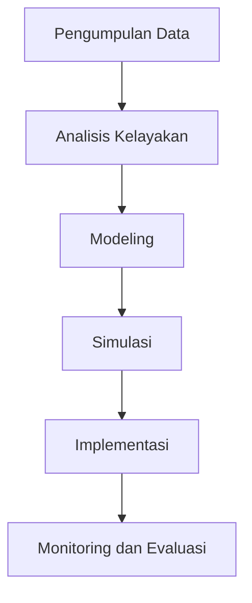

# 961 — Optimasi Penjadwalan Keberangkatan/Kedatangan Landasan Bandara dan Pemisahan Wake Vortex: Pemisahan Berbasis Waktu (TBS), Standar RECAT-EU, dan Penugasan Gerbang Campuran

**Domain:** Teknik Industri & Rekayasa Sistem Industri  
**Topik Spesialis:** Airport Runway Departure/Arrival Sequencing and Wake Vortex Separation Optimization: Time-Based Separation (TBS), RECAT-EU Standards, and Mixed-Integer Gate Assignment  
**Standar & Referensi Utama:** ICAO Doc 4444 (PANS-ATM); de Neufville & Odoni (Airport Systems: Planning, Design and Management, 2nd Ed., McGraw-Hill); FAA Runway Capacity Guidelines

---

## 1. Pendahuluan dan Konteks Industri

Industri penerbangan global menghadapi tantangan yang semakin kompleks dalam pengelolaan lalu lintas udara, terutama terkait dengan penjadwalan keberangkatan dan kedatangan pesawat di bandara. Dengan meningkatnya jumlah penumpang dan penerbangan, efisiensi operasional menjadi sangat penting untuk mengurangi kemacetan dan meningkatkan keselamatan. Menurut laporan ICAO, pada tahun 2022, jumlah penumpang global diperkirakan mencapai 4,5 miliar, yang menunjukkan pertumbuhan signifikan dibandingkan tahun-tahun sebelumnya. Tantangan utama yang dihadapi adalah bagaimana mengoptimalkan penggunaan landasan pacu dengan mempertimbangkan pemisahan wake vortex dan standar keselamatan yang ketat.

Pemisahan wake vortex adalah fenomena aerodinamis yang terjadi akibat turbulensi yang ditinggalkan oleh pesawat, yang dapat berbahaya bagi pesawat yang lepas landas atau mendarat di belakangnya. Oleh karena itu, penerapan Time-Based Separation (TBS) menjadi krusial untuk memastikan jarak aman antar pesawat. Standar RECAT-EU yang diperkenalkan oleh EASA memberikan pedoman tentang bagaimana mengelompokkan pesawat berdasarkan karakteristik wake vortex mereka, sehingga meningkatkan kapasitas landasan pacu.

Dalam konteks ini, penugasan gerbang campuran juga menjadi penting, di mana pesawat dari berbagai jenis dapat ditugaskan ke gerbang yang sama dengan mempertimbangkan waktu kedatangan dan keberangkatan. Hal ini tidak hanya meningkatkan efisiensi operasional tetapi juga mengurangi waktu tunggu dan emisi karbon. Oleh karena itu, penelitian dan pengembangan dalam bidang ini sangat penting untuk menciptakan sistem yang lebih efisien dan aman di bandara.

## 2. Landasan Teori & Formulasi Matematis

### 2.1. Notasi dan Definisi Variabel

- $T_i$: Waktu keberangkatan pesawat ke-i
- $A_i$: Waktu kedatangan pesawat ke-i
- $D_i$: Durasi lepas landas pesawat ke-i
- $S_{ij}$: Jarak pemisahan yang diperlukan antara pesawat ke-i dan ke-j
- $V_i$: Kecepatan pesawat ke-i
- $W_i$: Kategori wake vortex pesawat ke-i

### 2.2. Pemisahan Berbasis Waktu (TBS)

Pemisahan berbasis waktu dapat dinyatakan dengan rumus:

$$
TBS_{ij} = T_i + D_i + S_{ij} \cdot \frac{1}{V_j}
$$

Di mana $TBS_{ij}$ adalah waktu yang diperlukan untuk pesawat ke-j lepas landas setelah pesawat ke-i. Pemisahan ini harus memenuhi standar yang ditetapkan oleh ICAO dan RECAT-EU.

### 2.3. Penugasan Gerbang Campuran

Model penugasan gerbang dapat dinyatakan sebagai masalah optimasi campuran bulat (Mixed-Integer Programming):

$$
\text{Minimize} \quad \sum_{i=1}^{n} \sum_{j=1}^{m} C_{ij} x_{ij}
$$

Dengan batasan:

1. Setiap pesawat harus ditugaskan ke satu gerbang:
   $$ \sum_{j=1}^{m} x_{ij} = 1, \quad \forall i $$
2. Kapasitas gerbang tidak boleh terlampaui:
   $$ \sum_{i=1}^{n} x_{ij} \leq K_j, \quad \forall j $$

Di mana $C_{ij}$ adalah biaya penugasan pesawat ke-i ke gerbang j, $x_{ij}$ adalah variabel biner yang menunjukkan apakah pesawat ke-i ditugaskan ke gerbang j, dan $K_j$ adalah kapasitas maksimum gerbang j.

## 3. Metodologi Rekayasa & Standar Prosedur Operasional (SOP)

### 3.1. Langkah-langkah Implementasi

1. **Pengumpulan Data**: Kumpulkan data tentang jadwal penerbangan, kategori wake vortex, dan kapasitas gerbang.
2. **Analisis Kelayakan**: Lakukan analisis kelayakan untuk menentukan apakah TBS dapat diterapkan pada jadwal yang ada.
3. **Modeling**: Gunakan model matematis untuk menentukan penugasan gerbang dan pemisahan waktu yang optimal.
4. **Simulasi**: Lakukan simulasi untuk menguji model dan mengidentifikasi potensi masalah.
5. **Implementasi**: Terapkan model yang telah disimulasikan ke dalam sistem operasional bandara.
6. **Monitoring dan Evaluasi**: Lakukan monitoring terhadap kinerja sistem dan evaluasi untuk perbaikan berkelanjutan.

### 3.2. Diagram Alir Proses

## 4. Studi Kasus Kuantitatif Industri & Perhitungan Numerik

### 4.1. Contoh Perhitungan

Misalkan kita memiliki tiga pesawat dengan parameter sebagai berikut:

- Pesawat 1: $T_1 = 10:00$, $D_1 = 0.2$ jam, $W_1 = 1$
- Pesawat 2: $T_2 = 10:05$, $D_2 = 0.25$ jam, $W_2 = 2$
- Pesawat 3: $T_3 = 10:10$, $D_3 = 0.15$ jam, $W_3 = 1$

Jarak pemisahan yang diperlukan adalah sebagai berikut:

- $S_{12} = 3$ detik
- $S_{13} = 4$ detik
- $S_{23} = 2$ detik

Kecepatan pesawat adalah $V_i = 250$ m/s untuk semua pesawat.

### 4.2. Perhitungan TBS

1. Hitung TBS untuk pesawat 1 dan 2:

$$
TBS_{12} = T_1 + D_1 + S_{12} \cdot \frac{1}{V_2} = 10:00 + 0.2 + \frac{3}{250} = 10:00 + 0.2 + 0.012 = 10:00 + 0.212 = 10:12
$$

2. Hitung TBS untuk pesawat 1 dan 3:

$$
TBS_{13} = T_1 + D_1 + S_{13} \cdot \frac{1}{V_3} = 10:00 + 0.2 + \frac{4}{250} = 10:00 + 0.2 + 0.016 = 10:00 + 0.216 = 10:12
$$

3. Hitung TBS untuk pesawat 2 dan 3:

$$
TBS_{23} = T_2 + D_2 + S_{23} \cdot \frac{1}{V_3} = 10:05 + 0.25 + \frac{2}{250} = 10:05 + 0.25 + 0.008 = 10:05 + 0.258 = 10:13
$$

### 4.3. Interpretasi Hasil

Dari perhitungan di atas, kita dapat melihat bahwa pesawat 1 dan 2 dapat lepas landas pada waktu yang sama, tetapi pesawat 3 harus menunggu hingga waktu TBS yang lebih panjang. Ini menunjukkan pentingnya pemisahan berbasis waktu dalam mengoptimalkan jadwal penerbangan.

## 5. Evaluasi Kritis, Aplikasi Lintas Sektor & Standar Masa Depan

Optimasi penjadwalan keberangkatan dan kedatangan pesawat tidak hanya relevan dalam konteks penerbangan, tetapi juga memiliki aplikasi luas dalam disiplin lain seperti manajemen rantai pasok dan otomasi. Dalam manajemen rantai pasok, prinsip pemisahan waktu dapat diterapkan untuk mengoptimalkan alur barang dan mengurangi waktu tunggu di titik distribusi. Selain itu, teknik optimasi yang sama dapat digunakan dalam sistem produksi untuk meningkatkan efisiensi dan mengurangi biaya.

Namun, terdapat beberapa batasan dalam metodologi ini, seperti ketidakpastian dalam waktu kedatangan dan keberangkatan, serta variabilitas dalam kecepatan pesawat. Oleh karena itu, penelitian lebih lanjut diperlukan untuk mengembangkan model yang lebih robust yang dapat mengatasi ketidakpastian ini.

Arah riset masa depan dapat mencakup pengembangan algoritma pembelajaran mesin untuk memprediksi pola lalu lintas udara dan mengoptimalkan penjadwalan secara real-time. Selain itu, integrasi teknologi canggih seperti drone dan kendaraan otonom dalam sistem bandara dapat membuka peluang baru untuk efisiensi operasional.

Dengan demikian, optimasi penjadwalan keberangkatan dan kedatangan pesawat di bandara adalah bidang yang dinamis dan terus berkembang, dengan potensi untuk meningkatkan efisiensi dan keselamatan dalam industri penerbangan global.

## 5. Ringkasan & Catatan Praktis Implementasi
Implementasi metode ini memerlukan standarisasi prosedur operasi (SOP), kalibrasi instrumen berkala, serta integrasi pemantauan real-time untuk memastikan konsistensi performa dan efisiensi sistem secara berkelanjutan.
