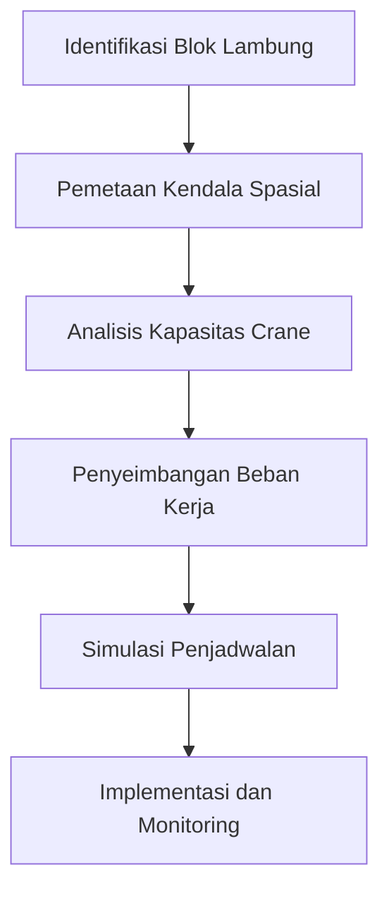

# 962 — Penjadwalan Perakitan Blok Lambung Kapal Komersial Mega dan Pemasangan Dock Kering: Graf Kendala Spasial, Kapasitas Crane Goliath Berat, dan Penyeimbangan Beban Pra-Pengadaan

**Domain:** Teknik Industri & Rekayasa Sistem Industri  
**Topik Spesialis:** Mega Commercial Shipyard Hull Block Assembly & Drydock Erection Scheduling: Spatial Constraint Graph, Heavy Gantry Goliath Crane Capacity, and Pre-Outfitting Workload Balancing  
**Standar & Referensi Utama:** Storch, Clark & Lamb (Ship Production, 2nd Ed., Cornell Maritime Press); Eyres & Bruce (Ship Construction, 7th Ed., Butterworth-Heinemann); SNAME Transactions

---

## 1. Pendahuluan dan Konteks Industri

Industri perkapalan merupakan salah satu sektor yang sangat penting dalam perekonomian global, berfungsi sebagai tulang punggung transportasi barang dan penumpang di seluruh dunia. Dalam konteks ini, perakitan blok lambung kapal di galangan kapal besar menjadi aspek krusial yang mempengaruhi efisiensi dan produktivitas. Penjadwalan yang tepat dalam perakitan blok lambung dan pemasangan dock kering sangat penting untuk mengurangi waktu siklus produksi dan biaya operasional. Tantangan yang dihadapi dalam proses ini meliputi pengelolaan ruang yang terbatas, kapasitas alat berat seperti crane, serta penyeimbangan beban kerja pra-pengadaan.

Salah satu tantangan utama adalah pengelolaan kendala spasial yang muncul dari interaksi antara berbagai elemen dalam proses perakitan. Graf kendala spasial digunakan untuk memodelkan hubungan antara berbagai blok lambung dan alat berat yang digunakan dalam proses tersebut. Selain itu, kapasitas crane goliath yang berat harus dioptimalkan untuk memastikan bahwa semua blok dapat dipindahkan dengan efisien tanpa mengganggu proses lainnya. Penyeimbangan beban kerja pra-pengadaan juga menjadi penting untuk memastikan bahwa semua aktivitas dapat dilakukan secara bersamaan tanpa penundaan yang signifikan.

Dengan meningkatnya kompleksitas proyek perkapalan, penting bagi manajer proyek untuk memiliki pemahaman yang mendalam tentang metode penjadwalan dan teknik optimasi yang dapat diterapkan. Penelitian ini bertujuan untuk memberikan wawasan yang lebih baik tentang bagaimana graf kendala spasial, kapasitas crane, dan penyeimbangan beban kerja dapat diintegrasikan untuk meningkatkan efisiensi dalam perakitan blok lambung kapal.

## 2. Landasan Teori & Formulasi Matematis

### 2.1. Graf Kendala Spasial

Graf kendala spasial adalah representasi matematis dari hubungan antara berbagai elemen dalam sistem perakitan. Dalam konteks ini, kita dapat mendefinisikan graf sebagai $G = (V, E)$, di mana $V$ adalah himpunan simpul yang mewakili blok lambung dan $E$ adalah himpunan sisi yang mewakili kendala antara blok.

### 2.2. Kapasitas Crane Goliath

Kapasitas crane goliath dapat dinyatakan dalam bentuk rumus:

$$
C = \frac{W}{H}
$$

di mana:
- $C$ = kapasitas angkat (ton)
- $W$ = berat maksimum yang diangkat (ton)
- $H$ = tinggi angkat maksimum (m)

### 2.3. Penyeimbangan Beban Kerja

Penyeimbangan beban kerja dapat dimodelkan dengan menggunakan rumus:

$$
B = \sum_{i=1}^{n} \frac{W_i}{T_i}
$$

di mana:
- $B$ = beban kerja total
- $W_i$ = beban kerja untuk aktivitas ke-$i$
- $T_i$ = waktu yang dibutuhkan untuk aktivitas ke-$i$

### 2.4. Pembuktian

Untuk membuktikan bahwa graf kendala spasial dapat digunakan untuk optimasi, kita dapat menggunakan algoritma pencarian seperti algoritma Dijkstra untuk menemukan jalur terpendek dalam graf yang mewakili urutan perakitan blok.

## 3. Metodologi Rekayasa & Standar Prosedur Operasional (SOP)

### 3.1. Langkah-langkah Implementasi

1. **Identifikasi Blok Lambung:** Tentukan semua blok lambung yang akan dirakit.
2. **Pemetaan Kendala Spasial:** Buat graf kendala spasial berdasarkan hubungan antar blok.
3. **Analisis Kapasitas Crane:** Hitung kapasitas crane goliath yang tersedia dan sesuaikan dengan kebutuhan.
4. **Penyeimbangan Beban Kerja:** Tentukan beban kerja untuk setiap aktivitas dan sesuaikan dengan waktu yang tersedia.
5. **Simulasi Penjadwalan:** Gunakan perangkat lunak simulasi untuk menguji berbagai skenario penjadwalan.
6. **Implementasi dan Monitoring:** Laksanakan rencana yang telah disusun dan lakukan monitoring untuk evaluasi.

### 3.2. Diagram Alir Proses

## 4. Studi Kasus Kuantitatif Industri & Perhitungan Numerik

### 4.1. Contoh Kasus

Misalkan kita memiliki tiga blok lambung dengan berat masing-masing sebagai berikut:
- Blok A: 100 ton
- Blok B: 150 ton
- Blok C: 200 ton

Kapasitas crane goliath adalah 250 ton. Kita ingin menghitung beban kerja total dan memverifikasi apakah crane dapat mengangkat semua blok.

### 4.2. Perhitungan

1. **Hitung Beban Kerja:**

$$
B = \frac{W_A}{T_A} + \frac{W_B}{T_B} + \frac{W_C}{T_C}
$$

Misalkan waktu untuk masing-masing blok adalah:
- $T_A = 2$ jam
- $T_B = 3$ jam
- $T_C = 4$ jam

Maka:

$$
B = \frac{100}{2} + \frac{150}{3} + \frac{200}{4} = 50 + 50 + 50 = 150 \text{ ton/jam}
$$

2. **Verifikasi Kapasitas Crane:**

Kapasitas crane adalah 250 ton, sehingga dapat mengangkat semua blok secara bersamaan.

### 4.3. Interpretasi Hasil

Dari perhitungan di atas, kita dapat menyimpulkan bahwa dengan kapasitas crane yang ada, semua blok dapat diangkat dalam waktu yang efisien. Penjadwalan yang baik akan memastikan bahwa tidak ada waktu tunggu yang signifikan.

## 5. Evaluasi Kritis, Aplikasi Lintas Sektor & Standar Masa Depan

### 5.1. Hubungan dengan Disiplin Lain

Metode yang digunakan dalam penjadwalan perakitan blok lambung dapat diterapkan dalam berbagai disiplin lain, seperti manajemen rantai pasok dan otomasi industri. Penggunaan teknologi seperti Internet of Things (IoT) dan analitik data besar dapat meningkatkan efisiensi dan mengurangi biaya.

### 5.2. Batasan Metodologi

Salah satu batasan dari metodologi ini adalah ketergantungan pada data yang akurat. Ketidakpastian dalam estimasi waktu dan berat dapat menyebabkan penjadwalan yang tidak efisien.

### 5.3. Arah Riset Masa Depan

Riset di masa depan dapat difokuskan pada pengembangan algoritma optimasi yang lebih canggih, serta integrasi teknologi baru untuk meningkatkan akurasi dan efisiensi dalam penjadwalan perakitan blok lambung.

---

Dokumen ini memberikan gambaran menyeluruh tentang penjadwalan perakitan blok lambung kapal komersial mega, dengan fokus pada graf kendala spasial, kapasitas crane, dan penyeimbangan beban kerja. Dengan mengikuti metodologi yang telah diuraikan, diharapkan dapat meningkatkan efisiensi dan produktivitas di galangan kapal.

## 5. Ringkasan & Catatan Praktis Implementasi
Implementasi metode ini memerlukan standarisasi prosedur operasi (SOP), kalibrasi instrumen berkala, serta integrasi pemantauan real-time untuk memastikan konsistensi performa dan efisiensi sistem secara berkelanjutan.
