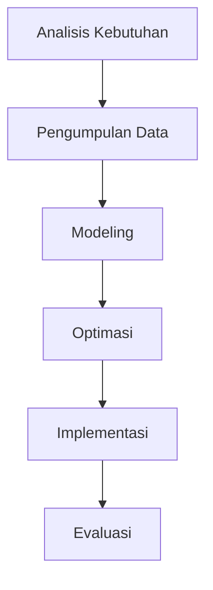

# 964 — Optimasi Klasifikasi Kereta Barang di Hump Yard: Kontrol Kecepatan Retarder Mobil, Penugasan Dinamis Jalur Shunting, dan Penjadwalan Blok Kereta

**Domain:** Teknik Industri & Rekayasa Sistem Industri  
**Topik Spesialis:** Automated Rail Freight Classification Hump Yard Optimization: Car Retarder Velocity Control, Track Shunting Dynamic Assignment, and Train Block Formation Scheduling  
**Standar & Referensi Utama:** Armstrong (The Railroad: What It Is, What It Does); Boysen et al. (2022, Eur. J. Oper. Res.); AREMA Manual for Railway Engineering

---

## 1. Pendahuluan dan Konteks Industri

Industri perkeretaapian memainkan peran penting dalam sistem transportasi global, khususnya dalam pengangkutan barang. Hump yard, sebagai bagian dari infrastruktur perkeretaapian, berfungsi untuk mengklasifikasikan dan mengarahkan kereta barang ke jalur yang sesuai dengan tujuan akhir mereka. Dengan meningkatnya permintaan untuk efisiensi operasional dan pengurangan biaya, optimasi hump yard menjadi sangat penting. Tantangan yang dihadapi dalam pengoperasian hump yard meliputi pengaturan kecepatan retarder mobil, penugasan jalur shunting yang dinamis, dan penjadwalan blok kereta yang efisien.

Menurut Armstrong (2022), pengelolaan yang efektif dari hump yard dapat mengurangi waktu tunggu dan meningkatkan throughput, yang berdampak langsung pada biaya operasional dan kepuasan pelanggan. Boysen et al. (2022) menekankan pentingnya algoritma optimasi dalam meningkatkan efisiensi operasional di hump yard. Dalam konteks ini, tantangan utama adalah bagaimana mengintegrasikan kontrol kecepatan retarder mobil dengan penugasan jalur shunting dan penjadwalan blok kereta secara optimal.

Dengan meningkatnya kompleksitas sistem transportasi dan kebutuhan untuk mematuhi standar keselamatan yang ketat, seperti yang diuraikan dalam AREMA Manual for Railway Engineering, pendekatan sistematis dan berbasis data untuk optimasi hump yard menjadi sangat penting. Penelitian ini bertujuan untuk memberikan pemahaman yang mendalam tentang teknik-teknik optimasi yang dapat diterapkan dalam konteks industri perkeretaapian modern.

## 2. Landasan Teori & Formulasi Matematis

### 2.1. Notasi dan Definisi Variabel

- $v_r$: Kecepatan retarder mobil (m/s)
- $d$: Jarak antara retarder dan jalur shunting (m)
- $t$: Waktu yang dibutuhkan untuk mencapai jalur shunting (s)
- $a$: Percepatan kereta (m/s²)
- $F$: Gaya yang diterapkan pada kereta (N)
- $m$: Massa kereta (kg)

### 2.2. Kontrol Kecepatan Retarder

Kecepatan retarder dapat dihitung menggunakan persamaan gerak dasar:

$$
v_r = a \cdot t
$$

Di mana percepatan $a$ dapat ditentukan dari gaya yang diterapkan:

$$
F = m \cdot a \implies a = \frac{F}{m}
$$

### 2.3. Penugasan Dinamis Jalur Shunting

Penugasan jalur shunting dapat dimodelkan sebagai masalah optimasi dengan fungsi tujuan untuk meminimalkan waktu total shunting. Misalkan $T_{total}$ adalah waktu total yang dibutuhkan untuk menyelesaikan semua penugasan jalur, maka:

$$
T_{total} = \sum_{i=1}^{n} T_i
$$

Di mana $T_i$ adalah waktu yang dibutuhkan untuk penugasan jalur ke-i.

### 2.4. Penjadwalan Blok Kereta

Penjadwalan blok kereta dapat dimodelkan dengan menggunakan algoritma penjadwalan berbasis graf. Misalkan $G = (V, E)$ adalah graf di mana $V$ adalah himpunan blok kereta dan $E$ adalah relasi antar blok. Fungsi tujuan adalah meminimalkan waktu tunggu:

$$
\min \sum_{j \in V} W_j
$$

Di mana $W_j$ adalah waktu tunggu untuk blok kereta ke-j.

## 3. Metodologi Rekayasa & Standar Prosedur Operasional (SOP)

### 3.1. Langkah-langkah Implementasi

1. **Analisis Kebutuhan**: Identifikasi kebutuhan operasional dan teknis dari hump yard.
2. **Pengumpulan Data**: Kumpulkan data historis tentang kecepatan retarder, waktu shunting, dan pola penjadwalan.
3. **Modeling**: Buat model matematis berdasarkan data yang dikumpulkan.
4. **Optimasi**: Terapkan algoritma optimasi untuk menentukan kecepatan retarder, penugasan jalur, dan penjadwalan blok.
5. **Implementasi**: Terapkan solusi yang dihasilkan dalam sistem operasional.
6. **Evaluasi**: Monitor kinerja sistem dan lakukan penyesuaian jika diperlukan.

### 3.2. Diagram Alir Proses

## 4. Studi Kasus Kuantitatif Industri & Perhitungan Numerik

### 4.1. Contoh Kasus

Misalkan sebuah hump yard memiliki 5 kereta dengan massa masing-masing 100 ton (100,000 kg). Gaya yang diterapkan pada retarder adalah 10,000 N. Hitung kecepatan retarder dan waktu yang dibutuhkan untuk mencapai jalur shunting sejauh 200 m.

### 4.2. Perhitungan

1. **Hitung Percepatan**:

$$
a = \frac{F}{m} = \frac{10,000}{100,000} = 0.1 \text{ m/s}^2
$$

2. **Hitung Waktu**:

Dengan menggunakan persamaan gerak:

$$
d = \frac{1}{2} a t^2 \implies t = \sqrt{\frac{2d}{a}} = \sqrt{\frac{2 \cdot 200}{0.1}} = \sqrt{4000} \approx 63.25 \text{ s}
$$

3. **Hitung Kecepatan**:

$$
v_r = a \cdot t = 0.1 \cdot 63.25 \approx 6.33 \text{ m/s}
$$

### 4.3. Interpretasi Hasil

Hasil perhitungan menunjukkan bahwa kecepatan retarder yang optimal adalah 6.33 m/s dan waktu yang dibutuhkan untuk mencapai jalur shunting adalah sekitar 63.25 detik. Ini memberikan wawasan penting bagi manajer operasional dalam merencanakan dan mengoptimalkan proses shunting.

## 5. Evaluasi Kritis, Aplikasi Lintas Sektor & Standar Masa Depan

Optimasi hump yard tidak hanya relevan untuk industri perkeretaapian, tetapi juga dapat diterapkan dalam konteks lain seperti manajemen rantai pasok dan otomasi. Dalam konteks rantai pasok, teknik yang sama dapat digunakan untuk mengoptimalkan aliran barang di pusat distribusi. Selain itu, dengan meningkatnya fokus pada keberlanjutan dan keselamatan (K3/ESG), penerapan teknologi baru seperti IoT dan AI dalam optimasi hump yard dapat meningkatkan efisiensi dan mengurangi dampak lingkungan.

Namun, terdapat batasan dalam metodologi yang ada, seperti ketidakpastian dalam data dan variabilitas operasional. Oleh karena itu, arah riset masa depan harus fokus pada pengembangan model yang lebih adaptif dan responsif terhadap perubahan kondisi operasional.

Dengan demikian, optimasi hump yard merupakan bidang yang menjanjikan untuk penelitian lebih lanjut, dengan potensi untuk memberikan kontribusi signifikan terhadap efisiensi operasional dan keberlanjutan dalam industri perkeretaapian.

## 5. Ringkasan & Catatan Praktis Implementasi
Implementasi metode ini memerlukan standarisasi prosedur operasi (SOP), kalibrasi instrumen berkala, serta integrasi pemantauan real-time untuk memastikan konsistensi performa dan efisiensi sistem secara berkelanjutan.
