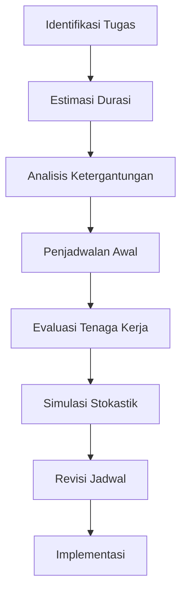

# 968 — Penjadwalan Bay Pemeliharaan Berat MRO Penerbangan: Metode Jalur Kritis dengan Kendala Tenaga Kerja Mekanik Terampil, Stokastik Penemuan Kartu Non-Rutinitas, dan FAA Bagian 145

**Domain:** Teknik Industri & Rekayasa Sistem Industri  
**Topik Spesialis:** Aviation MRO Heavy Maintenance (C-Check & D-Check) Bay Scheduling: Critical Path Method with Skilled Mechanic Labor Constraints, Non-Routine Card Discovery Stochastics, and FAA Part 145  
**Standar & Referensi Utama:** FAA CFR 14 Part 145; Friend (Aircraft Maintenance Management, Longman); Kinnison & Siddiqui (Aviation Maintenance Management, 2nd Ed., McGraw-Hill)

---

## 1. Pendahuluan dan Konteks Industri

Industri penerbangan mengalami tantangan signifikan dalam hal pemeliharaan pesawat, terutama dalam konteks MRO (Maintenance, Repair, and Overhaul) yang melibatkan pemeliharaan berat seperti C-Check dan D-Check. C-Check adalah pemeriksaan menyeluruh yang dilakukan setiap 6 hingga 12 bulan, sedangkan D-Check adalah pemeliharaan yang lebih mendalam dan dilakukan setiap 6 hingga 10 tahun. Penjadwalan yang efisien untuk kegiatan ini sangat penting untuk meminimalkan waktu pesawat tidak beroperasi dan mengoptimalkan penggunaan sumber daya.

Salah satu tantangan utama dalam penjadwalan pemeliharaan adalah keterbatasan tenaga kerja terampil. Dengan meningkatnya kompleksitas pesawat modern dan regulasi yang ketat dari FAA CFR 14 Part 145, manajemen harus mempertimbangkan ketersediaan mekanik terampil dalam merencanakan dan menjadwalkan pekerjaan. Selain itu, penemuan kartu non-rutinitas yang tidak terduga selama pemeliharaan dapat menyebabkan penundaan yang signifikan, yang memerlukan pendekatan stokastik untuk memprediksi dan mengelola ketidakpastian ini.

Dalam konteks ini, penerapan Metode Jalur Kritis (CPM) menjadi sangat relevan. CPM memungkinkan manajer untuk mengidentifikasi jalur kritis dalam proyek pemeliharaan, memprioritaskan tugas-tugas yang paling penting, dan mengalokasikan sumber daya secara optimal. Dengan mengintegrasikan kendala tenaga kerja terampil dan stokastik penemuan kartu non-rutinitas, manajemen dapat merumuskan strategi yang lebih efektif untuk meningkatkan efisiensi dan mengurangi biaya operasional.

## 2. Landasan Teori & Formulasi Matematis

### 2.1. Metode Jalur Kritis (CPM)

Metode Jalur Kritis adalah teknik manajemen proyek yang digunakan untuk menentukan durasi minimum proyek dengan mengidentifikasi tugas-tugas yang paling penting. Dalam konteks pemeliharaan pesawat, setiap tugas dapat dinyatakan sebagai node dalam diagram jaringan, dan ketergantungan antar tugas dapat dinyatakan sebagai edge.

Misalkan kita memiliki $n$ tugas yang dinyatakan sebagai $T_1, T_2, \ldots, T_n$. Durasi setiap tugas dinyatakan sebagai $d_i$ untuk tugas $T_i$. Waktu mulai dan selesai dari setiap tugas dapat dinyatakan sebagai:

$$
S_i = \max(S_j + d_j \text{ untuk semua } j \text{ yang mendahului } T_i)
$$

$$
F_i = S_i + d_i
$$

Di mana $S_i$ adalah waktu mulai dan $F_i$ adalah waktu selesai dari tugas $T_i$.

### 2.2. Kendala Tenaga Kerja Terampil

Kendala tenaga kerja terampil dapat dimodelkan dengan memperkenalkan variabel $L_k$, yang menyatakan jumlah mekanik terampil yang tersedia untuk tugas $T_k$. Jika $L_k < L_{min}$, maka tugas $T_k$ tidak dapat dimulai.

### 2.3. Stokastik Penemuan Kartu Non-Rutinitas

Penemuan kartu non-rutinitas dapat dimodelkan sebagai variabel acak $X$ yang mengikuti distribusi probabilitas tertentu. Misalkan $X \sim \mathcal{N}(\mu, \sigma^2)$, di mana $\mu$ adalah rata-rata waktu tambahan yang diperlukan untuk menyelesaikan tugas akibat penemuan kartu non-rutinitas, dan $\sigma^2$ adalah variansnya. Probabilitas bahwa waktu penyelesaian tugas $T_k$ melebihi waktu yang direncanakan dapat dinyatakan sebagai:

$$
P(T_k > t) = 1 - \Phi\left(\frac{t - \mu}{\sigma}\right)
$$

di mana $\Phi$ adalah fungsi distribusi kumulatif dari distribusi normal.

## 3. Metodologi Rekayasa & Standar Prosedur Operasional (SOP)

### 3.1. Langkah-langkah Implementasi

1. **Identifikasi Tugas**: Buat daftar semua tugas yang diperlukan untuk C-Check dan D-Check.
2. **Estimasi Durasi**: Tentukan durasi setiap tugas berdasarkan data historis dan standar industri.
3. **Analisis Ketergantungan**: Identifikasi ketergantungan antar tugas dan buat diagram jaringan.
4. **Penjadwalan Awal**: Gunakan CPM untuk membuat jadwal awal.
5. **Evaluasi Tenaga Kerja**: Analisis ketersediaan tenaga kerja terampil dan sesuaikan jadwal jika diperlukan.
6. **Simulasi Stokastik**: Lakukan simulasi untuk memperkirakan dampak penemuan kartu non-rutinitas.
7. **Revisi Jadwal**: Sesuaikan jadwal berdasarkan hasil simulasi dan analisis tenaga kerja.
8. **Implementasi**: Laksanakan jadwal yang telah disusun dan monitor pelaksanaannya.

### 3.2. Diagram Alir Proses

## 4. Studi Kasus Kuantitatif Industri & Perhitungan Numerik

### 4.1. Contoh Kasus

Misalkan kita memiliki 5 tugas untuk C-Check dengan durasi sebagai berikut:

- Tugas 1: $d_1 = 10$ jam
- Tugas 2: $d_2 = 8$ jam
- Tugas 3: $d_3 = 6$ jam
- Tugas 4: $d_4 = 4$ jam
- Tugas 5: $d_5 = 2$ jam

Ketergantungan antar tugas adalah sebagai berikut:

- Tugas 2 dan 3 harus selesai sebelum Tugas 4 dimulai.
- Tugas 4 harus selesai sebelum Tugas 5 dimulai.

### 4.2. Perhitungan

1. **Jadwal Awal**:
   - Tugas 1: $S_1 = 0$, $F_1 = S_1 + d_1 = 10$
   - Tugas 2: $S_2 = F_1 = 10$, $F_2 = S_2 + d_2 = 18$
   - Tugas 3: $S_3 = F_1 = 10$, $F_3 = S_3 + d_3 = 16$
   - Tugas 4: $S_4 = \max(F_2, F_3) = 18$, $F_4 = S_4 + d_4 = 22$
   - Tugas 5: $S_5 = F_4 = 22$, $F_5 = S_5 + d_5 = 24$

2. **Durasi Total**: Durasi total pemeliharaan adalah $F_5 = 24$ jam.

### 4.3. Interpretasi Hasil

Dari perhitungan di atas, total waktu yang dibutuhkan untuk menyelesaikan C-Check adalah 24 jam. Dengan mempertimbangkan kendala tenaga kerja terampil dan potensi penemuan kartu non-rutinitas, manajemen dapat memperkirakan kemungkinan penundaan dan merencanakan sumber daya dengan lebih baik.

## 5. Evaluasi Kritis, Aplikasi Lintas Sektor & Standar Masa Depan

Metode yang dibahas dalam modul ini tidak hanya berlaku untuk industri penerbangan, tetapi juga dapat diterapkan dalam sektor lain seperti manufaktur dan konstruksi. Dalam konteks rantai pasok, integrasi teknik pemeliharaan dengan manajemen inventaris dan pengiriman dapat meningkatkan efisiensi secara keseluruhan.

Selain itu, dengan kemajuan teknologi seperti otomatisasi dan analitik data besar, masa depan pemeliharaan pesawat dapat melibatkan penggunaan algoritma pembelajaran mesin untuk memprediksi kebutuhan pemeliharaan dan mengoptimalkan penjadwalan. Penelitian lebih lanjut diperlukan untuk mengeksplorasi penerapan teknik ini dalam konteks pemeliharaan berbasis kondisi dan pengelolaan risiko yang lebih baik.

Dengan demikian, penerapan Metode Jalur Kritis yang dipadukan dengan analisis stokastik dan pertimbangan tenaga kerja terampil akan menjadi kunci dalam meningkatkan efisiensi dan efektivitas pemeliharaan pesawat di masa depan.

## 5. Ringkasan & Catatan Praktis Implementasi
Implementasi metode ini memerlukan standarisasi prosedur operasi (SOP), kalibrasi instrumen berkala, serta integrasi pemantauan real-time untuk memastikan konsistensi performa dan efisiensi sistem secara berkelanjutan.
