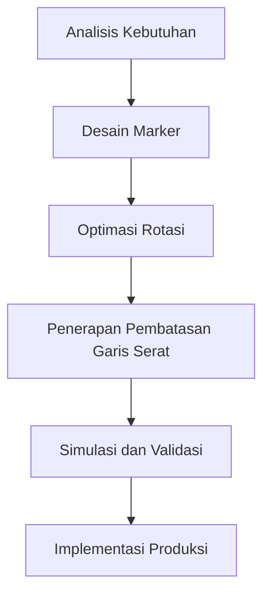

# 972 — Optimasi Pembuatan Marker Irregular 2D dan Nesting Otomatis dalam Pemotongan Tekstil

**Domain:** Teknik Industri & Rekayasa Sistem Industri  
**Topik Spesialis:** 2D Irregular Piece Marker Making & Automatic Nesting in Textile Cutting: No-Fit Polygon (NFP) Geometry, Genetic Algorithm Rotation Optimization, and Fabric Grain Line Constraints  
**Standar & Referensi Utama:** Burke et al. (2022, Comput. Oper. Res.); Dowsland & Dowsland (Packing Problems); ISO 3759

---

## 1. Pendahuluan dan Konteks Industri

Dalam industri tekstil, efisiensi dalam pemotongan bahan merupakan faktor kunci yang mempengaruhi biaya produksi dan keberlanjutan. Proses pemotongan yang tidak efisien dapat menyebabkan pemborosan material, yang berdampak langsung pada profitabilitas perusahaan. Dengan meningkatnya permintaan akan produk tekstil yang berkualitas tinggi dan beragam, tantangan dalam pembuatan marker dan nesting otomatis menjadi semakin kompleks. Marker yang tidak optimal dapat mengakibatkan sisa bahan yang signifikan, yang tidak hanya meningkatkan biaya, tetapi juga berkontribusi pada limbah industri.

Sistem pemotongan yang efisien memerlukan pendekatan yang cermat dalam merancang marker untuk potongan-potongan irregular 2D. Dalam konteks ini, penggunaan geometri No-Fit Polygon (NFP) menjadi penting untuk menghindari tumpang tindih antara potongan. Selain itu, penerapan algoritma genetik untuk optimasi rotasi marker dapat meningkatkan penggunaan bahan dengan memaksimalkan area yang terpakai. Di sisi lain, pertimbangan terhadap arah serat kain juga menjadi aspek penting dalam menjaga kualitas dan integritas produk akhir. 

Berdasarkan ISO 3759, standar yang mengatur simbol-simbol pemotongan kain, penting bagi industri untuk mengadopsi praktik terbaik dalam pembuatan marker dan nesting. Dengan demikian, pemahaman yang mendalam tentang teknik-teknik ini menjadi sangat penting bagi para profesional di bidang teknik industri dan rekayasa sistem industri.

## 2. Landasan Teori & Formulasi Matematis

### 2.1 Geometri No-Fit Polygon (NFP)

Geometri NFP digunakan untuk menentukan area di mana dua potongan tidak dapat tumpang tindih. Untuk dua potongan $A$ dan $B$, NFP dapat dihitung dengan cara berikut:

1. Tentukan titik-titik sudut dari potongan $A$ dan $B$.
2. Hitung semua kemungkinan posisi $B$ relatif terhadap $A$.
3. Gambar poligon yang mencakup semua posisi di mana $A$ dan $B$ tidak dapat tumpang tindih.

Misalkan $A$ dan $B$ adalah dua poligon dengan titik sudut $A_i$ dan $B_j$. NFP dapat dinyatakan sebagai:

$$
NFP(A, B) = \{(x, y) \mid (x + A_i) \cap (y + B_j) = \emptyset \}
$$

### 2.2 Optimasi Rotasi dengan Algoritma Genetik

Algoritma genetik (GA) digunakan untuk mencari solusi optimal dalam ruang pencarian yang besar. Dalam konteks ini, setiap individu dalam populasi dapat direpresentasikan sebagai kromosom yang menunjukkan rotasi dan posisi dari potongan. Fungsi objektif dapat dinyatakan sebagai:

$$
f(x) = \text{minimize} \left( \sum_{i=1}^{n} \text{Area}_{\text{waste}}(i) \right)
$$

Di mana $\text{Area}_{\text{waste}}(i)$ adalah area sisa yang dihasilkan dari pemotongan potongan ke-$i$.

### 2.3 Pembatasan Garis Serat Kain

Pembatasan garis serat kain harus diperhatikan untuk menjaga kualitas potongan. Misalkan $G$ adalah garis serat kain, maka untuk setiap potongan $P$, kita harus memastikan bahwa sudut antara $G$ dan tepi potongan $P$ tidak melebihi batas tertentu, yang dapat dinyatakan sebagai:

$$
\theta(P, G) \leq \theta_{\text{max}}
$$

Di mana $\theta_{\text{max}}$ adalah sudut maksimum yang diperbolehkan.

## 3. Metodologi Rekayasa & Standar Prosedur Operasional (SOP)

### 3.1 Langkah-Langkah Implementasi

1. **Analisis Kebutuhan**: Identifikasi jenis potongan dan spesifikasi kain.
2. **Desain Marker**: Gunakan perangkat lunak CAD untuk merancang marker berdasarkan geometri NFP.
3. **Optimasi Rotasi**: Terapkan algoritma genetik untuk menentukan rotasi optimal dari potongan.
4. **Penerapan Pembatasan Garis Serat**: Pastikan setiap potongan sesuai dengan arah serat kain.
5. **Simulasi dan Validasi**: Lakukan simulasi pemotongan untuk memvalidasi desain marker.
6. **Implementasi Produksi**: Terapkan desain marker dalam proses pemotongan aktual.

### 3.2 Diagram Alir Proses

## 4. Studi Kasus Kuantitatif Industri & Perhitungan Numerik

### 4.1 Contoh Kasus

Misalkan kita memiliki dua potongan kain dengan dimensi sebagai berikut:

- Potongan A: Panjang = 100 cm, Lebar = 50 cm
- Potongan B: Panjang = 80 cm, Lebar = 40 cm

### 4.2 Langkah Kalkulasi

1. **Hitung Area Potongan**:
   - Area A: $A_A = 100 \times 50 = 5000 \text{ cm}^2$
   - Area B: $A_B = 80 \times 40 = 3200 \text{ cm}^2$

2. **Hitung Area Sisa**:
   - Jika potongan A dan B ditempatkan berdampingan tanpa tumpang tindih, total area yang digunakan adalah:
   $$ 
   A_{\text{total}} = A_A + A_B = 5000 + 3200 = 8200 \text{ cm}^2 
   $$

3. **Hitung Area Kain yang Tersedia**:
   - Misalkan kain yang tersedia memiliki dimensi 200 cm x 100 cm:
   $$ 
   A_{\text{kain}} = 200 \times 100 = 20000 \text{ cm}^2 
   $$

4. **Hitung Area Sisa Kain**:
   $$ 
   A_{\text{sisa}} = A_{\text{kain}} - A_{\text{total}} = 20000 - 8200 = 11800 \text{ cm}^2 
   $$

### 4.3 Interpretasi Hasil

Dari perhitungan di atas, area sisa kain yang signifikan menunjukkan bahwa desain marker dan proses nesting perlu dioptimalkan lebih lanjut untuk mengurangi limbah. Dengan menerapkan algoritma genetik dan mempertimbangkan NFP, kita dapat meningkatkan efisiensi penggunaan kain.

## 5. Evaluasi Kritis, Aplikasi Lintas Sektor & Standar Masa Depan

Penerapan teknik marker dan nesting tidak hanya terbatas pada industri tekstil, tetapi juga dapat diadaptasi dalam industri lain seperti otomotif dan kemasan. Dalam konteks rantai pasok, optimasi ini dapat mengurangi biaya dan meningkatkan keberlanjutan dengan mengurangi limbah. 

Namun, terdapat beberapa batasan dalam metodologi ini, seperti kompleksitas komputasi algoritma genetik dan kebutuhan untuk validasi yang ekstensif. Penelitian masa depan dapat berfokus pada pengembangan algoritma yang lebih efisien dan integrasi teknologi otomatisasi untuk meningkatkan kecepatan dan akurasi dalam proses pemotongan.

Dengan demikian, pemahaman yang mendalam tentang teknik-teknik ini sangat penting untuk meningkatkan efisiensi dan keberlanjutan dalam industri modern.

## 5. Ringkasan & Catatan Praktis Implementasi
Implementasi metode ini memerlukan standarisasi prosedur operasi (SOP), kalibrasi instrumen berkala, serta integrasi pemantauan real-time untuk memastikan konsistensi performa dan efisiensi sistem secara berkelanjutan.
