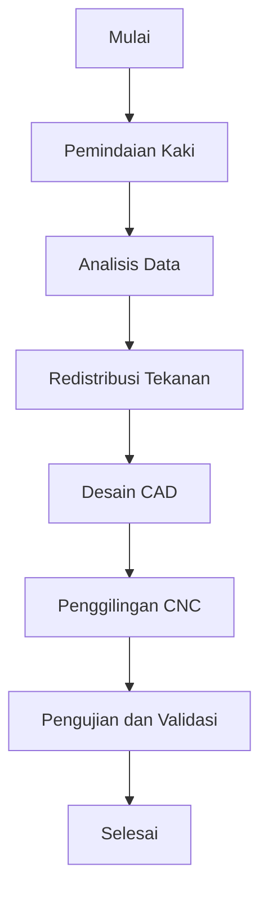

# 973 — Desain CAD Last Sepatu Kustom Massal: Pemindaian Permukaan Kaki 3D, Redistribusi Distribusi Tekanan Plantar, dan Penggilingan Last Sepatu CNC Otomatis

**Domain:** Teknik Industri & Rekayasa Sistem Industri  
**Topik Spesialis:** Mass-Customized Footwear Last CAD Design: 3D Foot Surface Optical Scanner Morphing, Plantar Pressure Distribution Redistribution, and Automated CNC Shoe-Last Milling  
**Standar & Referensi Utama:** Luximon & Goonetilleke (Footwear Design and Manufacture, Woodhead Publishing); ISO 19952; Ergonomics (Taylor & Francis)

---

## 1. Pendahuluan dan Konteks Industri

Industri alas kaki mengalami transformasi signifikan dalam beberapa tahun terakhir, terutama dengan meningkatnya permintaan untuk produk yang dapat disesuaikan secara massal. Kustomisasi massal memungkinkan produsen untuk memenuhi preferensi individu konsumen tanpa mengorbankan efisiensi produksi. Dalam konteks ini, desain last sepatu yang tepat menjadi sangat penting, karena last berfungsi sebagai cetakan yang menentukan bentuk dan kenyamanan sepatu. 

Tantangan utama dalam manufaktur sepatu kustom adalah bagaimana mengintegrasikan teknologi pemindaian permukaan kaki 3D dengan proses desain CAD dan penggilingan CNC. Pemindaian permukaan kaki 3D menggunakan pemindai optik dapat menghasilkan model digital yang akurat dari kaki pengguna, yang kemudian dapat dimodifikasi untuk redistribusi tekanan plantar yang optimal. Hal ini penting untuk mencegah masalah kesehatan yang terkait dengan pemakaian sepatu yang tidak sesuai, seperti nyeri kaki dan cedera.

Di sisi lain, proses produksi harus efisien dan terstandarisasi untuk memenuhi permintaan pasar yang cepat. ISO 19952 memberikan panduan tentang desain dan pengujian sepatu, sementara literatur seperti yang ditulis oleh Luximon & Goonetilleke menyoroti pentingnya ergonomi dalam desain alas kaki. Dengan demikian, integrasi teknologi pemindaian, desain CAD, dan penggilingan CNC menjadi krusial dalam menciptakan sepatu yang tidak hanya sesuai dengan ukuran kaki, tetapi juga nyaman dan mendukung kesehatan pengguna.

## 2. Landasan Teori & Formulasi Matematis

### 2.1. Pemindaian Permukaan Kaki 3D

Pemindaian permukaan kaki 3D menghasilkan model geometris yang dapat digunakan untuk analisis lebih lanjut. Model ini dapat dinyatakan dalam bentuk fungsi $f(x, y, z)$ yang menggambarkan permukaan kaki dalam koordinat tiga dimensi. 

### 2.2. Redistribusi Tekanan Plantar

Tekanan plantar dapat diukur menggunakan sensor tekanan yang mendistribusikan gaya pada permukaan kaki. Tekanan ini dapat dinyatakan dengan rumus:

$$ P = \frac{F}{A} $$

di mana:
- $P$ = tekanan (N/m²)
- $F$ = gaya yang diterima (N)
- $A$ = area kontak (m²)

Redistribusi tekanan dapat dilakukan dengan memodifikasi bentuk last sepatu untuk mengurangi tekanan di area yang terlalu tinggi dan meningkatkan tekanan di area yang kurang. Ini dapat dilakukan dengan menggunakan algoritma optimasi yang mempertimbangkan distribusi tekanan yang diinginkan.

### 2.3. Desain CAD dan Penggilingan CNC

Setelah model 3D dihasilkan dan tekanan plantar dianalisis, langkah selanjutnya adalah desain CAD dari last sepatu. Desain ini kemudian digunakan untuk penggilingan CNC, yang dapat dinyatakan dengan rumus:

$$ V = \frac{d}{t} $$

di mana:
- $V$ = kecepatan pemotongan (m/s)
- $d$ = jarak pemotongan (m)
- $t$ = waktu pemotongan (s)

Penggilingan CNC memungkinkan presisi tinggi dalam pembuatan last sepatu, yang sangat penting untuk memastikan kenyamanan dan kesesuaian.

## 3. Metodologi Rekayasa & Standar Prosedur Operasional (SOP)

### 3.1. Langkah-langkah Implementasi

1. **Pemindaian Kaki**: Gunakan pemindai optik 3D untuk menangkap bentuk kaki pengguna.
2. **Analisis Data**: Proses data pemindaian untuk menghasilkan model 3D yang akurat.
3. **Redistribusi Tekanan**: Analisis distribusi tekanan plantar dan modifikasi model 3D untuk redistribusi tekanan yang optimal.
4. **Desain CAD**: Buat desain CAD dari last sepatu berdasarkan model 3D yang telah dimodifikasi.
5. **Penggilingan CNC**: Gunakan mesin CNC untuk memproduksi last sepatu sesuai desain CAD.
6. **Pengujian dan Validasi**: Lakukan pengujian pada last sepatu untuk memastikan kenyamanan dan kesesuaian.

### 3.2. Diagram Alir Proses

## 4. Studi Kasus Kuantitatif Industri & Perhitungan Numerik

### 4.1. Contoh Perhitungan

Misalkan kita memiliki data berikut dari pemindaian kaki:
- Gaya yang diterima ($F$) = 600 N
- Area kontak ($A$) = 0.2 m²

#### Langkah 1: Hitung Tekanan

$$ P = \frac{F}{A} = \frac{600 \, \text{N}}{0.2 \, \text{m}^2} = 3000 \, \text{N/m}^2 $$

#### Langkah 2: Redistribusi Tekanan

Jika redistribusi tekanan diperlukan untuk mengurangi tekanan di area yang terlalu tinggi, misalkan kita ingin mengurangi tekanan menjadi 2500 N/m². Maka, kita perlu menghitung gaya baru yang diperlukan:

$$ F_{baru} = P_{baru} \times A = 2500 \, \text{N/m}^2 \times 0.2 \, \text{m}^2 = 500 \, \text{N} $$

#### Interpretasi Hasil

Pengurangan tekanan dari 3000 N/m² menjadi 2500 N/m² menunjukkan bahwa redistribusi tekanan berhasil dilakukan, yang akan meningkatkan kenyamanan pengguna dan mengurangi risiko cedera.

## 5. Evaluasi Kritis, Aplikasi Lintas Sektor & Standar Masa Depan

Integrasi teknologi dalam desain sepatu tidak hanya relevan untuk industri alas kaki, tetapi juga memiliki implikasi luas dalam disiplin lain seperti manajemen rantai pasok, otomasi, dan teknik ergonomi. Dalam konteks manajemen biaya, penggunaan teknologi pemindaian dan penggilingan CNC dapat mengurangi limbah material dan meningkatkan efisiensi produksi.

Di masa depan, penelitian lebih lanjut diperlukan untuk mengembangkan algoritma optimasi yang lebih canggih untuk redistribusi tekanan dan untuk meningkatkan akurasi pemindaian permukaan kaki. Selain itu, penerapan prinsip-prinsip K3 dan ESG dalam proses produksi akan semakin penting untuk memenuhi standar keberlanjutan dan keselamatan kerja.

Dengan demikian, desain last sepatu kustom massal tidak hanya berfokus pada aspek teknis, tetapi juga mempertimbangkan aspek sosial dan lingkungan, menjadikannya sebagai langkah penting menuju industri alas kaki yang lebih berkelanjutan dan responsif terhadap kebutuhan pengguna.