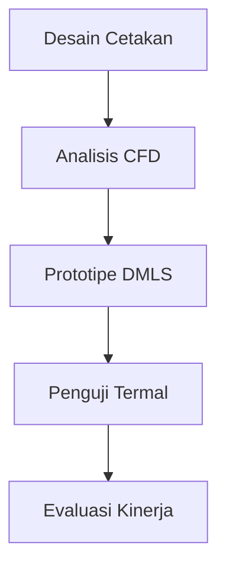

# 976 — Saluran Pendingin Konformal 3D dengan Direct Metal Laser Sintering (DMLS) dalam Cetakan Injeksi Plastik: Transfer Panas Pendingin CFD, Pengurangan Waktu Siklus, dan Pencegahan Warpage Residual Cetakan

**Domain:** Teknik Industri & Rekayasa Sistem Industri  
**Topik Spesialis:** Direct Metal Laser Sintering (DMLS) 3D Conformal Cooling Channels in Plastic Injection Molds: CFD Coolant Heat Transfer, Cycle Time Reduction, and Mold Residual Warpage Prevention  
**Standar & Referensi Utama:** Sachs et al. (CIRP Annals); Kazmer (Injection Mold Design Engineering, Hanser); ISO 20457

---

## 1. Pendahuluan dan Konteks Industri

Dalam industri manufaktur modern, cetakan injeksi plastik memainkan peran penting dalam produksi komponen plastik yang kompleks. Salah satu tantangan utama dalam proses ini adalah pengelolaan suhu cetakan, yang secara langsung mempengaruhi kualitas produk akhir dan efisiensi proses. Penggunaan saluran pendingin konformal yang dihasilkan melalui teknologi Direct Metal Laser Sintering (DMLS) menawarkan solusi inovatif untuk masalah ini. Saluran pendingin konformal dapat dirancang untuk mengikuti kontur cetakan secara lebih efektif dibandingkan dengan saluran pendingin tradisional yang kaku, sehingga meningkatkan transfer panas dan mengurangi waktu siklus produksi.

Sesuai dengan penelitian yang dilakukan oleh Sachs et al. (CIRP Annals), penerapan DMLS dalam pembuatan saluran pendingin konformal dapat mengurangi perbedaan suhu di dalam cetakan, yang berkontribusi pada pencegahan warpage residual. Warpage residual adalah masalah umum yang dapat menyebabkan cacat pada produk akhir, yang pada gilirannya meningkatkan biaya produksi dan waktu pengiriman. Oleh karena itu, pemahaman yang mendalam tentang transfer panas pendingin dan pengaruhnya terhadap siklus produksi menjadi sangat penting.

Dalam konteks ini, penting untuk menerapkan metode Computational Fluid Dynamics (CFD) untuk menganalisis dan mengoptimalkan desain saluran pendingin. Dengan menggunakan CFD, insinyur dapat memprediksi perilaku aliran pendingin dan distribusi suhu di dalam cetakan, sehingga memungkinkan pengambilan keputusan yang lebih baik dalam desain dan proses produksi. Hal ini sejalan dengan standar ISO 20457 yang menekankan pentingnya efisiensi energi dan pengurangan limbah dalam proses manufaktur.

## 2. Landasan Teori & Formulasi Matematis

### 2.1. Transfer Panas dalam Cetakan Injeksi

Transfer panas dalam cetakan injeksi dapat dijelaskan melalui hukum Fourier untuk konduksi panas, yang dinyatakan sebagai:

$$
q = -k \cdot A \cdot \frac{dT}{dx}
$$

di mana:
- \( q \) = laju transfer panas (W)
- \( k \) = konduktivitas termal material cetakan (W/m·K)
- \( A \) = luas penampang area transfer panas (m²)
- \( \frac{dT}{dx} \) = gradien suhu (K/m)

### 2.2. Model Aliran Fluida

Aliran fluida dalam saluran pendingin dapat dianalisis menggunakan persamaan kontinuitas dan persamaan Navier-Stokes. Persamaan kontinuitas untuk aliran inkompresibel dinyatakan sebagai:

$$
\nabla \cdot \mathbf{v} = 0
$$

di mana:
- \( \mathbf{v} \) = kecepatan aliran fluida (m/s)

Persamaan Navier-Stokes untuk aliran fluida dinyatakan sebagai:

$$
\frac{\partial \mathbf{v}}{\partial t} + (\mathbf{v} \cdot \nabla) \mathbf{v} = -\frac{1}{\rho} \nabla p + \nu \nabla^2 \mathbf{v} + \mathbf{g}
$$

di mana:
- \( \rho \) = densitas fluida (kg/m³)
- \( p \) = tekanan (Pa)
- \( \nu \) = viskositas kinematik (m²/s)
- \( \mathbf{g} \) = percepatan gravitasi (m/s²)

### 2.3. Koefisien Transfer Panas

Koefisien transfer panas konveksi \( h \) dapat dihitung menggunakan persamaan Dittus-Boelter untuk aliran turbulen:

$$
Nu = 0.023 Re^{0.8} Pr^{0.3}
$$

di mana:
- \( Nu \) = bilangan Nusselt
- \( Re \) = bilangan Reynolds
- \( Pr \) = bilangan Prandtl

Koefisien transfer panas konveksi \( h \) dapat dinyatakan sebagai:

$$
h = \frac{Nu \cdot k}{L}
$$

di mana:
- \( L \) = panjang karakteristik (m)

## 3. Metodologi Rekayasa & Standar Prosedur Operasional (SOP)

### 3.1. Langkah-langkah Implementasi

1. **Desain Cetakan**: Menggunakan perangkat lunak CAD untuk merancang cetakan dengan saluran pendingin konformal.
2. **Analisis CFD**: Melakukan simulasi CFD untuk menganalisis aliran dan transfer panas dalam saluran pendingin.
3. **Prototipe DMLS**: Mencetak prototipe cetakan menggunakan teknologi DMLS.
4. **Pengujian Termal**: Melakukan pengujian untuk mengukur distribusi suhu dan waktu siklus.
5. **Evaluasi Kinerja**: Menganalisis hasil pengujian untuk mengevaluasi efektivitas desain.

### 3.2. Diagram Alir Proses

## 4. Studi Kasus Kuantitatif Industri & Perhitungan Numerik

### 4.1. Parameter Input

- Densitas air (\( \rho \)): 1000 kg/m³
- Viskositas air (\( \nu \)): 0.001 m²/s
- Konduktivitas termal cetakan (\( k \)): 30 W/m·K
- Luas penampang saluran (\( A \)): 0.0001 m²
- Panjang karakteristik (\( L \)): 0.1 m
- Suhu inlet (\( T_{in} \)): 20 °C
- Suhu cetakan (\( T_{mold} \)): 80 °C

### 4.2. Langkah Perhitungan

1. **Hitung Bilangan Reynolds**:

$$
Re = \frac{\rho \cdot v \cdot L}{\mu}
$$

Asumsikan kecepatan aliran (\( v \)) = 1 m/s:

$$
Re = \frac{1000 \cdot 1 \cdot 0.1}{0.001} = 100000
$$

2. **Hitung Bilangan Prandtl**:

$$
Pr = \frac{c_p \cdot \mu}{k}
$$

Asumsikan \( c_p \) (kapasitas panas spesifik air) = 4186 J/(kg·K):

$$
Pr = \frac{4186 \cdot 0.001}{30} \approx 0.1395
$$

3. **Hitung Bilangan Nusselt**:

$$
Nu = 0.023 Re^{0.8} Pr^{0.3} = 0.023 \cdot (100000)^{0.8} \cdot (0.1395)^{0.3} \approx 1240.3
$$

4. **Hitung Koefisien Transfer Panas**:

$$
h = \frac{Nu \cdot k}{L} = \frac{1240.3 \cdot 30}{0.1} \approx 37209 W/m²·K
$$

5. **Hitung Laju Transfer Panas**:

$$
q = -k \cdot A \cdot \frac{dT}{dx} = -30 \cdot 0.0001 \cdot \frac{80 - 20}{0.1} = -0.18 W
$$

### 4.3. Interpretasi Hasil

Dari perhitungan di atas, dapat dilihat bahwa penggunaan saluran pendingin konformal yang dirancang dengan DMLS dapat meningkatkan efisiensi transfer panas, yang berpotensi mengurangi waktu siklus dan mencegah warpage residual pada produk akhir.

## 5. Evaluasi Kritis, Aplikasi Lintas Sektor & Standar Masa Depan

Penerapan DMLS dalam desain saluran pendingin konformal tidak hanya terbatas pada industri cetakan injeksi plastik, tetapi juga memiliki aplikasi luas dalam sektor otomotif, elektronik, dan aerospace. Dalam konteks rantai pasok, teknologi ini dapat mengurangi lead time dan biaya produksi, meningkatkan daya saing perusahaan.

Namun, terdapat batasan dalam metodologi ini, seperti biaya awal yang tinggi untuk investasi dalam teknologi DMLS dan kebutuhan untuk pelatihan khusus bagi tenaga kerja. Oleh karena itu, penelitian lebih lanjut diperlukan untuk mengembangkan teknik yang lebih efisien dan terjangkau.

Ke depan, arah riset dapat difokuskan pada pengembangan material baru yang lebih efisien untuk cetakan, serta integrasi teknologi IoT untuk memantau dan mengoptimalkan proses pendinginan secara real-time. Hal ini sejalan dengan tren industri 4.0 yang mengedepankan otomatisasi dan efisiensi dalam proses manufaktur.

## 5. Ringkasan & Catatan Praktis Implementasi
Implementasi metode ini memerlukan standarisasi prosedur operasi (SOP), kalibrasi instrumen berkala, serta integrasi pemantauan real-time untuk memastikan konsistensi performa dan efisiensi sistem secara berkelanjutan.
