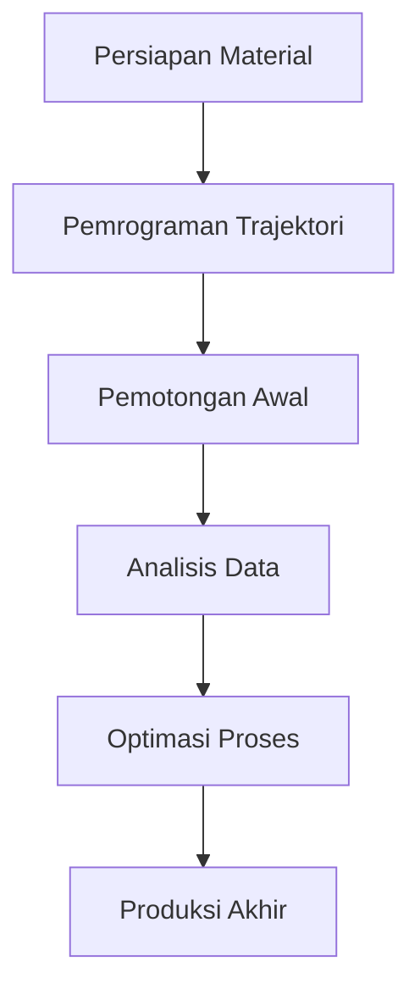

# 977 — Single Point Diamond Turning (SPDT) for Precision Aspheric and Freeform Optical Lenses: Nanometric Tool Trajectory Kinematics, Material Ductile-to-Brittle Transition, and Form Error (PV)

**Domain:** Teknik Industri & Rekayasa Sistem Industri  
**Topik Spesialis:** Single Point Diamond Turning (SPDT) for Precision Aspheric and Freeform Optical Lenses: Nanometric Tool Trajectory Kinematics, Material Ductile-to-Brittle Transition, and Form Error (PV)  
**Standar & Referensi Utama:** Garrard et al. (Precision Engineering); ISO 10110 (Optics and Photonics); Dornfeld et al. (Precision Manufacturing, Springer)

---

## 1. Pendahuluan dan Konteks Industri

Single Point Diamond Turning (SPDT) merupakan teknologi manufaktur presisi yang digunakan untuk memproduksi lensa asferis dan freeform dengan toleransi yang sangat ketat. Dalam konteks industri modern, kebutuhan akan komponen optik presisi semakin meningkat, terutama dalam sektor elektronik, otomotif, dan aerospace. Lensa-lensa ini digunakan dalam aplikasi seperti kamera, proyektor, dan sistem penglihatan malam, di mana kualitas optik yang tinggi sangat penting. 

Tantangan utama dalam proses SPDT adalah pengendalian trajektori alat potong pada tingkat nanometrik, yang mempengaruhi kualitas permukaan akhir dan kesalahan bentuk (form error). Selain itu, transisi dari perilaku material ductile ke brittle pada saat pemotongan juga menjadi perhatian, karena dapat mempengaruhi hasil akhir dan umur alat potong. 

Dalam konteks operasional, efisiensi produksi dan pengurangan biaya menjadi faktor penting. Proses SPDT yang tidak optimal dapat menyebabkan pemborosan material dan waktu, serta meningkatkan risiko cacat produk. Oleh karena itu, pemahaman mendalam tentang kinematika trajektori alat, transisi material, dan pengukuran kesalahan bentuk sangat penting untuk meningkatkan daya saing industri. Penelitian ini bertujuan untuk memberikan wawasan yang lebih baik tentang aspek-aspek tersebut, serta menawarkan solusi praktis untuk tantangan yang ada di lapangan.

## 2. Landasan Teori & Formulasi Matematis

### 2.1 Kinematika Trajektori Alat

Kinematika trajektori alat dalam SPDT dapat dinyatakan dengan persamaan gerak linear dan rotasi. Misalkan $x(t)$ dan $y(t)$ adalah posisi alat potong dalam koordinat Cartesian, maka:

$$
\begin{align*}
x(t) &= r \cos(\theta(t)) \\
y(t) &= r \sin(\theta(t))
\end{align*}
$$

di mana $r$ adalah jari-jari lingkaran yang dilalui oleh alat potong, dan $\theta(t)$ adalah sudut rotasi yang bergantung pada waktu.

### 2.2 Transisi Ductile ke Brittle

Transisi dari perilaku ductile ke brittle dapat dijelaskan dengan menggunakan parameter temperatur dan kecepatan pemotongan. Misalkan $T_c$ adalah temperatur kritis dan $v$ adalah kecepatan pemotongan, maka kondisi transisi dapat dinyatakan sebagai:

$$
T = T_c + k \cdot v
$$

di mana $k$ adalah konstanta material yang tergantung pada sifat fisik material yang dipotong.

### 2.3 Kesalahan Bentuk (Form Error)

Kesalahan bentuk dapat diukur dengan parameter Peak-to-Valley (PV), yang didefinisikan sebagai selisih antara titik tertinggi dan terendah pada profil permukaan. Jika $Z_{max}$ dan $Z_{min}$ adalah nilai tertinggi dan terendah dari profil, maka:

$$
PV = Z_{max} - Z_{min}
$$

Kesalahan bentuk ini sangat penting dalam menentukan kualitas optik dari lensa yang dihasilkan.

## 3. Metodologi Rekayasa & Standar Prosedur Operasional (SOP)

### 3.1 Langkah-Langkah Implementasi

1. **Persiapan Material:** Pilih material yang sesuai dengan karakteristik optik yang diinginkan.
2. **Pengaturan Mesin:** Atur parameter mesin SPDT, termasuk kecepatan pemotongan, kedalaman potong, dan sudut alat.
3. **Pemrograman Trajektori:** Gunakan perangkat lunak CAD/CAM untuk merancang trajektori alat potong berdasarkan spesifikasi lensa.
4. **Pengujian Awal:** Lakukan pemotongan percobaan untuk mengamati perilaku material dan kesalahan bentuk awal.
5. **Analisis Data:** Gunakan alat ukur presisi untuk menganalisis hasil pemotongan dan mengidentifikasi kesalahan bentuk.
6. **Optimasi Proses:** Sesuaikan parameter pemotongan berdasarkan hasil analisis untuk meningkatkan kualitas produk akhir.

### 3.2 Diagram Alir Proses

## 4. Studi Kasus Kuantitatif Industri & Perhitungan Numerik

### 4.1 Contoh Perhitungan

Misalkan kita ingin memproduksi lensa asferis dari material Aluminium dengan parameter berikut:
- Diameter lensa: 50 mm
- Kedalaman potong: 0.1 mm
- Kecepatan pemotongan: 100 mm/min
- Temperatur kritis: 600 °C
- Konstanta material $k$: 0.5 °C/(mm/min)

#### Langkah 1: Hitung Temperatur

$$
T = T_c + k \cdot v = 600 + 0.5 \cdot 100 = 600 + 50 = 650 \, \text{°C}
$$

#### Langkah 2: Hitung Trajektori Alat

Dengan jari-jari $r = 25 \, \text{mm}$, kita dapat menghitung posisi alat pada sudut tertentu. Misalkan pada sudut $\theta = 45°$:

$$
x(45°) = 25 \cos(45°) = 25 \cdot \frac{\sqrt{2}}{2} \approx 17.68 \, \text{mm}
$$

$$
y(45°) = 25 \sin(45°) = 25 \cdot \frac{\sqrt{2}}{2} \approx 17.68 \, \text{mm}
$$

#### Langkah 3: Hitung Kesalahan Bentuk

Misalkan setelah pemotongan, kita mendapatkan $Z_{max} = 0.02 \, \text{mm}$ dan $Z_{min} = -0.01 \, \text{mm}$, maka:

$$
PV = Z_{max} - Z_{min} = 0.02 - (-0.01) = 0.03 \, \text{mm}
$$

### Interpretasi Hasil

Hasil perhitungan menunjukkan bahwa temperatur pemotongan berada dalam batas aman, dan posisi alat potong dapat dikendalikan dengan baik. Kesalahan bentuk yang dihasilkan masih dalam toleransi yang dapat diterima untuk aplikasi optik.

## 5. Evaluasi Kritis, Aplikasi Lintas Sektor & Standar Masa Depan

SPDT tidak hanya relevan dalam industri optik, tetapi juga memiliki aplikasi luas dalam sektor otomotif, elektronik, dan aerospace. Dalam konteks rantai pasok, efisiensi proses SPDT dapat berkontribusi pada pengurangan biaya dan waktu produksi, yang sangat penting dalam lingkungan bisnis yang kompetitif.

Tantangan yang dihadapi dalam SPDT mencakup pengendalian kualitas yang ketat dan kebutuhan untuk inovasi dalam desain alat potong. Selain itu, penerapan teknologi otomasi dan pemantauan berbasis data dapat meningkatkan efisiensi dan mengurangi risiko cacat produk.

Ke depan, penelitian lebih lanjut diperlukan untuk mengembangkan material baru dan teknik pemotongan yang lebih efisien, serta untuk mengeksplorasi integrasi SPDT dengan teknologi manufaktur canggih lainnya seperti additive manufacturing dan machine learning.

Dengan demikian, SPDT tetap menjadi area penelitian yang menjanjikan dan penting dalam pengembangan teknologi manufaktur presisi.

## 5. Ringkasan & Catatan Praktis Implementasi
Implementasi metode ini memerlukan standarisasi prosedur operasi (SOP), kalibrasi instrumen berkala, serta integrasi pemantauan real-time untuk memastikan konsistensi performa dan efisiensi sistem secara berkelanjutan.
