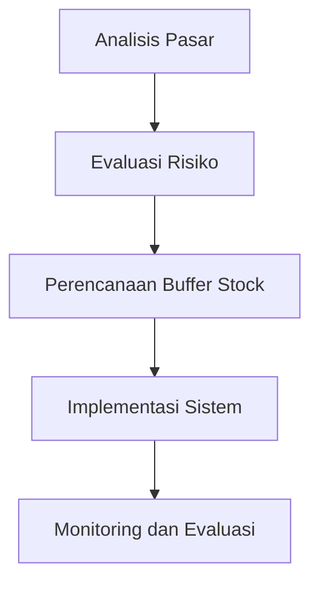

# 981 — Geopolitical Supply Chain Friend-Shoring & Critical Raw Material Risk: Herfindahl-Hirschman Market Concentration Index, Tariff Impact Elasticity, and Buffer Stock Allocation

**Domain:** Teknik Industri & Rekayasa Sistem Industri  
**Topik Spesialis:** Geopolitical Supply Chain Friend-Shoring & Critical Raw Material Risk: Herfindahl-Hirschman Market Concentration Index, Tariff Impact Elasticity, and Buffer Stock Allocation  
**Standar & Referensi Utama:** OECD Due Diligence Guidance for Responsible Supply Chains; EU Critical Raw Materials Act (2024); Simchi-Levi (Operations Rules, MIT Press)

---

## 1. Pendahuluan dan Konteks Industri

Dalam konteks globalisasi yang semakin kompleks, rantai pasok menghadapi tantangan signifikan akibat ketegangan geopolitik, perubahan kebijakan perdagangan, dan risiko terkait bahan baku kritis. Friend-shoring, yang merujuk pada pengalihan produksi ke negara-negara yang memiliki hubungan baik secara politik dan ekonomi, menjadi strategi penting untuk mengurangi risiko yang dihadapi oleh perusahaan. Menurut OECD, rantai pasok yang bertanggung jawab harus mempertimbangkan aspek keberlanjutan dan etika dalam pengadaan bahan baku, terutama yang bersifat kritis. 

Bahan baku kritis, seperti lithium, kobalt, dan nikel, memiliki peran penting dalam industri teknologi tinggi dan energi terbarukan. Ketergantungan pada negara-negara tertentu yang memiliki konsentrasi tinggi dalam produksi bahan ini dapat menyebabkan kerentanan yang signifikan. Sebagai contoh, Herfindahl-Hirschman Index (HHI) digunakan untuk mengukur konsentrasi pasar dan potensi risiko yang terkait. HHI yang tinggi menunjukkan bahwa pasar dikuasai oleh sedikit pemain, yang dapat mempengaruhi stabilitas pasokan dan harga.

Tantangan lain yang dihadapi adalah dampak tarif perdagangan. Elastisitas dampak tarif dapat mempengaruhi keputusan perusahaan dalam memilih lokasi produksi dan pengadaan bahan baku. Oleh karena itu, pemahaman yang mendalam tentang elastisitas permintaan dan penawaran terkait tarif sangat penting untuk perencanaan strategis. 

Dengan demikian, penting bagi perusahaan untuk mengembangkan strategi buffer stock yang efektif untuk mengatasi fluktuasi pasokan dan harga. Penelitian ini bertujuan untuk memberikan wawasan mendalam tentang bagaimana perusahaan dapat mengelola risiko dalam rantai pasok mereka melalui analisis kuantitatif dan penerapan metodologi yang sesuai.

## 2. Landasan Teori & Formulasi Matematis

### 2.1. Herfindahl-Hirschman Index (HHI)

HHI adalah ukuran konsentrasi pasar yang dihitung dengan menjumlahkan kuadrat pangsa pasar dari semua perusahaan dalam industri. Rumus HHI dinyatakan sebagai:

$$
HHI = \sum_{i=1}^{N} s_i^2
$$

di mana \(s_i\) adalah pangsa pasar perusahaan ke-i dan \(N\) adalah jumlah total perusahaan dalam pasar. Nilai HHI berkisar antara 0 hingga 10,000, di mana nilai yang lebih tinggi menunjukkan konsentrasi pasar yang lebih besar.

### 2.2. Elastisitas Dampak Tarif

Elastisitas permintaan terhadap tarif dapat dinyatakan sebagai:

$$
E_d = \frac{\Delta Q / Q}{\Delta T / T}
$$

di mana \(E_d\) adalah elastisitas permintaan, \(\Delta Q\) adalah perubahan kuantitas yang diminta, \(Q\) adalah kuantitas awal, \(\Delta T\) adalah perubahan tarif, dan \(T\) adalah tarif awal.

### 2.3. Alokasi Buffer Stock

Alokasi buffer stock dapat dihitung dengan mempertimbangkan fluktuasi permintaan dan pasokan. Model alokasi buffer stock dapat dinyatakan sebagai:

$$
BS = \frac{(D \cdot L) + (S \cdot Z)}{C}
$$

di mana:
- \(BS\) = buffer stock
- \(D\) = permintaan rata-rata
- \(L\) = lead time
- \(S\) = deviasi standar permintaan
- \(Z\) = nilai z untuk tingkat layanan yang diinginkan
- \(C\) = kapasitas penyimpanan

## 3. Metodologi Rekayasa & Standar Prosedur Operasional (SOP)

### 3.1. Langkah-langkah Implementasi

1. **Analisis Pasar**: Melakukan analisis pasar untuk mengidentifikasi konsentrasi bahan baku kritis menggunakan HHI.
2. **Evaluasi Risiko**: Menggunakan elastisitas dampak tarif untuk mengevaluasi risiko terkait perubahan kebijakan perdagangan.
3. **Perencanaan Buffer Stock**: Menghitung kebutuhan buffer stock berdasarkan permintaan dan fluktuasi pasokan.
4. **Implementasi Sistem**: Mengembangkan sistem manajemen rantai pasok yang responsif terhadap perubahan kondisi pasar.
5. **Monitoring dan Evaluasi**: Melakukan monitoring secara berkala terhadap kinerja rantai pasok dan melakukan evaluasi untuk penyesuaian strategi.

### 3.2. Diagram Alir Proses

## 4. Studi Kasus Kuantitatif Industri & Perhitungan Numerik

### 4.1. Contoh Kasus

Misalkan sebuah perusahaan elektronik mengandalkan kobalt sebagai bahan baku utama. Data yang tersedia adalah sebagai berikut:
- Pangsa pasar kobalt: 
  - Perusahaan A: 40%
  - Perusahaan B: 30%
  - Perusahaan C: 20%
  - Perusahaan D: 10%

### 4.2. Menghitung HHI

$$
HHI = (0.4^2) + (0.3^2) + (0.2^2) + (0.1^2) = 0.16 + 0.09 + 0.04 + 0.01 = 0.30 \quad \text{(atau 3000)}
$$

### 4.3. Menghitung Elastisitas Permintaan

Misalkan tarif awal adalah 5% dan setelah perubahan menjadi 7%, dengan permintaan awal 1000 unit yang turun menjadi 950 unit.

$$
E_d = \frac{(950 - 1000) / 1000}{(7 - 5) / 5} = \frac{-0.05}{0.4} = -0.125
$$

### 4.4. Menghitung Buffer Stock

Misalkan:
- Permintaan rata-rata \(D = 1000\) unit
- Lead time \(L = 2\) bulan
- Deviasi standar permintaan \(S = 200\) unit
- Nilai z untuk tingkat layanan 95% adalah 1.645
- Kapasitas penyimpanan \(C = 5000\) unit

$$
BS = \frac{(1000 \cdot 2) + (200 \cdot 1.645)}{5000} = \frac{2000 + 329}{5000} = \frac{2329}{5000} \approx 0.4658 \quad \text{(atau 466 unit)}
$$

## 5. Evaluasi Kritis, Aplikasi Lintas Sektor & Standar Masa Depan

Analisis ini menunjukkan bahwa pemahaman tentang HHI dan elastisitas tarif sangat penting untuk manajemen risiko dalam rantai pasok. Dalam konteks supply chain, konsep friend-shoring dapat diterapkan untuk mengurangi ketergantungan pada negara-negara dengan konsentrasi pasar tinggi. 

Aplikasi lintas sektor, seperti otomasi dan manajemen biaya, dapat meningkatkan efisiensi operasional dan mengurangi biaya. Namun, batasan metodologi ini termasuk ketidakpastian dalam estimasi parameter dan perubahan kondisi pasar yang cepat. 

Ke depan, penelitian lebih lanjut diperlukan untuk mengembangkan model yang lebih adaptif dan responsif terhadap dinamika pasar global, serta untuk mengeksplorasi hubungan antara keberlanjutan dan efisiensi dalam rantai pasok.

---

Dokumen ini memberikan gambaran menyeluruh tentang tantangan dan strategi dalam manajemen rantai pasok yang berfokus pada geopolitik dan risiko bahan baku kritis, serta pentingnya penerapan metodologi kuantitatif dalam pengambilan keputusan strategis.