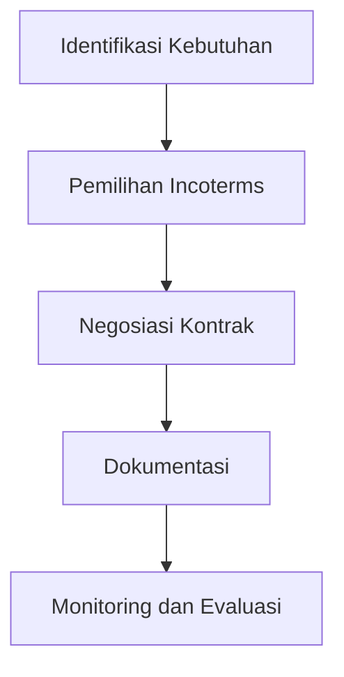

# 983 — Analisis Risiko Hukum dan Alokasi Biaya dalam Kontrak Pengangkutan Multimoda Berdasarkan ICC Incoterms 2020

**Domain:** Teknik Industri & Rekayasa Sistem Industri  
**Topik Spesialis:** ICC Incoterms 2020 Legal Risk & Cost Allocation in Multi-Modal Freight Contracting: Transfer of Title/Risk Matrix (FCA, CPT, CIP vs FOB, CIF), Bill of Lading Endorsement, and UCP 600  
**Standar & Referensi Utama:** International Chamber of Commerce (Incoterms 2020 Rules, ICC Publication No. 723E); Ramberg (ICC Guide to Incoterms 2020); Murray et al. (Schmitthoff's Export Trade)

---

## 1. Pendahuluan dan Konteks Industri

Dalam konteks globalisasi perdagangan, pemahaman yang mendalam mengenai Incoterms 2020 menjadi sangat penting bagi para profesional di bidang teknik industri dan manajemen rantai pasok. Incoterms, yang ditetapkan oleh International Chamber of Commerce (ICC), memberikan kerangka kerja untuk menentukan tanggung jawab dan risiko antara penjual dan pembeli dalam transaksi internasional. Dengan meningkatnya kompleksitas rantai pasok modern, terutama dalam pengangkutan multimoda, tantangan yang dihadapi perusahaan semakin beragam.

Salah satu tantangan utama adalah alokasi biaya dan risiko yang tidak jelas, yang dapat menyebabkan sengketa hukum dan kerugian finansial. Misalnya, dalam pengangkutan menggunakan metode FCA (Free Carrier) atau CPT (Carriage Paid To), risiko berpindah pada titik yang berbeda dibandingkan dengan metode FOB (Free on Board) atau CIF (Cost, Insurance and Freight). Hal ini memerlukan pemahaman yang mendalam tentang kapan dan di mana risiko berpindah, serta bagaimana biaya ditanggung oleh masing-masing pihak.

Dalam konteks ini, penting untuk menganalisis matriks transfer judul dan risiko, serta memahami implikasi hukum dari endorsement Bill of Lading dan UCP 600. Dengan demikian, pemahaman yang baik tentang Incoterms 2020 tidak hanya membantu dalam pengelolaan risiko, tetapi juga dalam pengambilan keputusan yang lebih baik dalam pengadaan dan logistik.

## 2. Landasan Teori & Formulasi Matematis

### 2.1. Definisi Variabel dan Parameter

- $C$: Total biaya pengangkutan
- $R$: Risiko yang terkait dengan pengangkutan
- $T$: Titik transfer risiko
- $F$: Biaya asuransi
- $I$: Biaya tambahan (misalnya, biaya bea cukai)

### 2.2. Rumus Alokasi Biaya dan Risiko

Dalam konteks pengangkutan multimoda, alokasi biaya dan risiko dapat dinyatakan dengan rumus berikut:

$$
C = C_{transport} + C_{insurance} + C_{additional}
$$

Di mana:

- $C_{transport}$ adalah biaya transportasi yang ditanggung oleh penjual atau pembeli tergantung pada Incoterms yang digunakan.
- $C_{insurance}$ adalah biaya asuransi yang ditanggung oleh pihak yang menanggung risiko.
- $C_{additional}$ adalah biaya tambahan yang mungkin timbul selama proses pengangkutan.

### 2.3. Matriks Transfer Judul dan Risiko

Matriks transfer judul dan risiko untuk berbagai Incoterms dapat dinyatakan sebagai berikut:

| Incoterms | Titik Transfer Risiko | Pihak yang Menanggung Biaya Transportasi | Pihak yang Menanggung Biaya Asuransi |
|-----------|-----------------------|------------------------------------------|--------------------------------------|
| FCA       | Titik pengiriman      | Penjual                                   | Pembeli                               |
| CPT       | Titik pengiriman      | Penjual                                   | Pembeli                               |
| CIP       | Titik pengiriman      | Penjual                                   | Pembeli                               |
| FOB       | Di atas kapal         | Penjual                                   | Pembeli                               |
| CIF       | Di atas kapal         | Penjual                                   | Penjual                               |

### 2.4. Pembuktian/Derivasi Matematis

Untuk membuktikan alokasi biaya, kita dapat menggunakan pendekatan probabilistik. Misalkan $P(R)$ adalah probabilitas terjadinya risiko selama pengangkutan, maka ekspektasi biaya terkait risiko dapat dinyatakan sebagai:

$$
E(C) = \sum_{i=1}^{n} P(R_i) \cdot C_i
$$

Di mana $C_i$ adalah biaya yang terkait dengan risiko $R_i$. Dengan demikian, perusahaan dapat meminimalkan ekspektasi biaya dengan memilih Incoterms yang paling sesuai.

## 3. Metodologi Rekayasa & Standar Prosedur Operasional (SOP)

### 3.1. Langkah-langkah Implementasi

1. **Identifikasi Kebutuhan**: Tentukan jenis barang, tujuan pengiriman, dan metode pengangkutan yang akan digunakan.
2. **Pemilihan Incoterms**: Pilih Incoterms yang sesuai berdasarkan analisis risiko dan biaya.
3. **Negosiasi Kontrak**: Lakukan negosiasi kontrak dengan pihak terkait, termasuk klausul mengenai alokasi biaya dan risiko.
4. **Dokumentasi**: Siapkan dokumen yang diperlukan, termasuk Bill of Lading dan dokumen asuransi.
5. **Monitoring dan Evaluasi**: Lakukan monitoring selama proses pengangkutan dan evaluasi hasil setelah pengiriman.

### 3.2. Diagram Alir Proses

## 4. Studi Kasus Kuantitatif Industri & Perhitungan Numerik

### 4.1. Contoh Kasus

Misalkan sebuah perusahaan ingin mengirimkan barang dari Jakarta ke Surabaya dengan menggunakan metode CPT. Biaya transportasi yang ditawarkan adalah $C_{transport} = 5.000.000$, biaya asuransi $C_{insurance} = 500.000$, dan biaya tambahan $C_{additional} = 200.000$.

### 4.2. Perhitungan

Dengan menggunakan rumus alokasi biaya:

$$
C = C_{transport} + C_{insurance} + C_{additional}
$$

Maka:

$$
C = 5.000.000 + 500.000 + 200.000 = 5.700.000
$$

### 4.3. Interpretasi Hasil

Total biaya yang harus ditanggung oleh pembeli dalam pengiriman ini adalah $5.700.000. Dengan menggunakan metode CPT, risiko berpindah pada titik pengiriman, sehingga pembeli harus siap menanggung biaya tambahan yang mungkin timbul setelah barang diterima.

## 5. Evaluasi Kritis, Aplikasi Lintas Sektor & Standar Masa Depan

### 5.1. Hubungan dengan Disiplin Lain

Analisis risiko dan alokasi biaya dalam pengangkutan multimoda memiliki implikasi yang luas dalam disiplin lain, seperti manajemen rantai pasok, otomasi, dan manajemen biaya. Dalam konteks otomasi, penggunaan teknologi seperti IoT dan blockchain dapat meningkatkan transparansi dan efisiensi dalam proses pengangkutan.

### 5.2. Batasan Metodologi

Meskipun analisis ini memberikan kerangka kerja yang kuat, terdapat batasan dalam hal data yang tersedia dan variabilitas kondisi pasar. Oleh karena itu, penelitian lebih lanjut diperlukan untuk mengembangkan model yang lebih adaptif dan responsif terhadap perubahan pasar.

### 5.3. Arah Riset Masa Depan

Ke depan, penelitian dapat difokuskan pada pengembangan algoritma berbasis AI untuk memprediksi risiko dan biaya dalam pengangkutan multimoda. Selain itu, integrasi sistem manajemen rantai pasok yang lebih holistik dapat membantu perusahaan dalam mengoptimalkan proses pengiriman dan mengurangi biaya.

---

Dokumen ini memberikan gambaran menyeluruh mengenai analisis risiko hukum dan alokasi biaya dalam konteks ICC Incoterms 2020, serta implikasi praktisnya dalam industri. Dengan pemahaman yang mendalam, perusahaan dapat mengelola risiko dan biaya dengan lebih efektif, sehingga meningkatkan daya saing di pasar global.