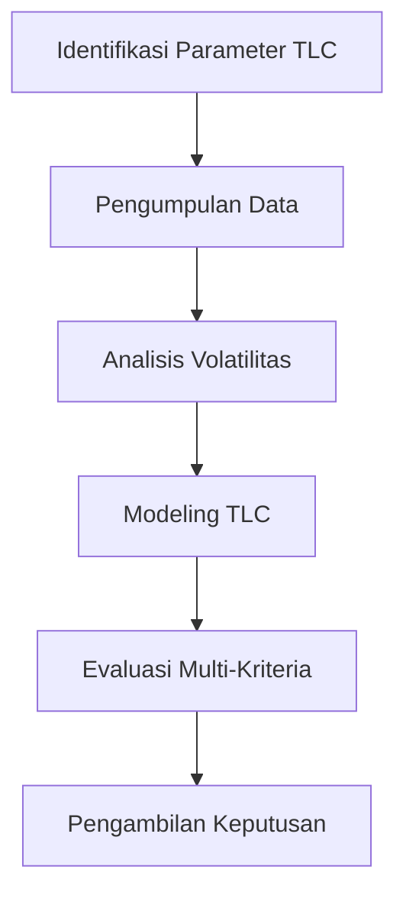

# 985 — Evaluasi Multi-Kriteria Total Landed Cost (TLC) untuk Nearshoring Manufaktur: Volatilitas Pengiriman, Modal Kerja Pipeline, Premi Risiko Negara, dan Opsi Fleksibilitas Waktu Pengerjaan

**Domain:** Teknik Industri & Rekayasa Sistem Industri  
**Topik Spesialis:** Total Landed Cost (TLC) Multi-Criteria Evaluation for Manufacturing Nearshoring: Freight Volatility, Pipeline Working Capital, Country Risk Premium, and Lead-Time Flexibility Options  
**Standar & Referensi Utama:** Ferreira et al. (2022, Supply Chain Manage. Int. J.); Christopher (Logistics & Supply Chain Management, 5th Ed., Pearson); Ellram (Total Cost of Ownership, CAPS)

---

## 1. Pendahuluan dan Konteks Industri

Dalam era globalisasi dan digitalisasi, industri manufaktur menghadapi tantangan yang semakin kompleks. Salah satu tantangan utama adalah pengelolaan Total Landed Cost (TLC) yang mencakup semua biaya yang terkait dengan pengadaan barang dari lokasi produksi hingga ke lokasi konsumen. TLC menjadi semakin penting dalam konteks nearshoring, di mana perusahaan memindahkan produksi lebih dekat ke pasar konsumen untuk mengurangi biaya pengiriman dan waktu respon. Menurut Ferreira et al. (2022), volatilitas biaya pengiriman, modal kerja pipeline, premi risiko negara, dan fleksibilitas waktu pengerjaan adalah faktor-faktor kunci yang perlu dipertimbangkan dalam evaluasi TLC.

Volatilitas biaya pengiriman dapat dipengaruhi oleh fluktuasi harga bahan bakar, perubahan regulasi, dan kondisi pasar global. Modal kerja pipeline mencerminkan kebutuhan modal untuk mendukung operasi yang berkelanjutan, sedangkan premi risiko negara mencakup risiko politik dan ekonomi yang dapat mempengaruhi stabilitas operasional. Fleksibilitas waktu pengerjaan menjadi penting untuk merespons permintaan pasar yang dinamis. Dengan mempertimbangkan semua faktor ini, perusahaan dapat membuat keputusan yang lebih baik dalam memilih lokasi produksi dan strategi rantai pasok.

Tantangan yang dihadapi mencakup ketidakpastian dalam perencanaan, kebutuhan untuk integrasi sistem informasi yang lebih baik, dan pengelolaan risiko yang lebih efektif. Oleh karena itu, pemahaman yang mendalam tentang TLC dan evaluasi multi-kriteria menjadi sangat penting untuk mencapai keunggulan kompetitif dalam industri manufaktur modern.

## 2. Landasan Teori & Formulasi Matematis

Total Landed Cost (TLC) dapat didefinisikan sebagai total biaya yang dikeluarkan untuk mengirimkan produk dari lokasi produksi ke lokasi konsumen. TLC dapat dinyatakan dalam rumus berikut:

$$
TLC = C_f + C_p + C_r + C_w + C_l
$$

Di mana:
- $C_f$: Biaya pengiriman (freight cost)
- $C_p$: Biaya produksi (production cost)
- $C_r$: Biaya risiko (risk cost)
- $C_w$: Modal kerja pipeline (working capital)
- $C_l$: Biaya fleksibilitas waktu pengerjaan (lead-time flexibility cost)

### 2.1. Definisi Variabel Parameter

1. **Biaya Pengiriman ($C_f$)**: Biaya yang dikeluarkan untuk transportasi barang, yang dapat bervariasi tergantung pada jarak, metode pengiriman, dan volatilitas harga bahan bakar.
2. **Biaya Produksi ($C_p$)**: Biaya yang terkait dengan proses produksi, termasuk bahan baku, tenaga kerja, dan overhead.
3. **Biaya Risiko ($C_r$)**: Biaya yang terkait dengan ketidakpastian yang dihadapi dalam operasi, termasuk risiko politik dan ekonomi.
4. **Modal Kerja Pipeline ($C_w$)**: Modal yang diperlukan untuk mendukung operasi yang berkelanjutan, termasuk persediaan dan piutang.
5. **Biaya Fleksibilitas Waktu Pengerjaan ($C_l$)**: Biaya yang terkait dengan kemampuan untuk merespons perubahan permintaan pasar, termasuk biaya penyimpanan dan pengelolaan persediaan.

### 2.2. Pembuktian/Derivasi Matematis

Untuk menghitung TLC secara lebih rinci, kita dapat menggunakan pendekatan berikut:

$$
C_f = f(D, R, V)
$$

Di mana:
- $D$: Jarak pengiriman
- $R$: Tarif pengiriman
- $V$: Volatilitas harga bahan bakar

Biaya produksi dapat dihitung dengan:

$$
C_p = B + L + O
$$

Di mana:
- $B$: Biaya bahan baku
- $L$: Biaya tenaga kerja
- $O$: Biaya overhead

Biaya risiko dapat dinyatakan sebagai:

$$
C_r = R_p + R_e
$$

Di mana:
- $R_p$: Risiko politik
- $R_e$: Risiko ekonomi

Modal kerja pipeline dapat dihitung dengan:

$$
C_w = I + A
$$

Di mana:
- $I$: Persediaan
- $A$: Piutang

Biaya fleksibilitas waktu pengerjaan dapat dihitung dengan:

$$
C_l = S + H
$$

Di mana:
- $S$: Biaya penyimpanan
- $H$: Biaya pengelolaan persediaan

Dengan demikian, rumus lengkap untuk TLC menjadi:

$$
TLC = f(D, R, V) + (B + L + O) + (R_p + R_e) + (I + A) + (S + H)
$$

## 3. Metodologi Rekayasa & Standar Prosedur Operasional (SOP)

### 3.1. Langkah-langkah Implementasi

1. **Identifikasi Parameter TLC**: Mengidentifikasi semua variabel yang mempengaruhi TLC berdasarkan data historis dan proyeksi pasar.
2. **Pengumpulan Data**: Mengumpulkan data terkait biaya pengiriman, biaya produksi, risiko, modal kerja, dan fleksibilitas waktu pengerjaan.
3. **Analisis Volatilitas**: Menganalisis volatilitas biaya pengiriman dan faktor-faktor yang mempengaruhi menggunakan metode statistik.
4. **Modeling TLC**: Menggunakan model matematis untuk menghitung TLC berdasarkan parameter yang telah diidentifikasi.
5. **Evaluasi Multi-Kriteria**: Menggunakan metode evaluasi multi-kriteria untuk membandingkan berbagai opsi nearshoring.
6. **Pengambilan Keputusan**: Mengambil keputusan berdasarkan analisis TLC dan evaluasi multi-kriteria.

### 3.2. Diagram Alir Proses

## 4. Studi Kasus Kuantitatif Industri & Perhitungan Numerik

### 4.1. Contoh Kasus

Misalkan sebuah perusahaan manufaktur ingin mengevaluasi TLC untuk memindahkan produksi dari Asia Tenggara ke Meksiko. Berikut adalah parameter yang digunakan:

- Jarak pengiriman ($D$): 3000 km
- Tarif pengiriman ($R$): $0.10$ per km
- Volatilitas harga bahan bakar ($V$): $0.05$ per km
- Biaya bahan baku ($B$): $200,000
- Biaya tenaga kerja ($L$): $150,000
- Biaya overhead ($O$): $50,000
- Risiko politik ($R_p$): $20,000
- Risiko ekonomi ($R_e$): $10,000
- Persediaan ($I$): $30,000
- Piutang ($A$): $20,000
- Biaya penyimpanan ($S$): $5,000
- Biaya pengelolaan persediaan ($H$): $3,000

### 4.2. Perhitungan TLC

1. **Biaya Pengiriman ($C_f$)**:
   $$
   C_f = f(D, R, V) = (D \cdot R) + (D \cdot V) = (3000 \cdot 0.10) + (3000 \cdot 0.05) = 300 + 150 = 450
   $$

2. **Biaya Produksi ($C_p$)**:
   $$
   C_p = B + L + O = 200,000 + 150,000 + 50,000 = 400,000
   $$

3. **Biaya Risiko ($C_r$)**:
   $$
   C_r = R_p + R_e = 20,000 + 10,000 = 30,000
   $$

4. **Modal Kerja Pipeline ($C_w$)**:
   $$
   C_w = I + A = 30,000 + 20,000 = 50,000
   $$

5. **Biaya Fleksibilitas Waktu Pengerjaan ($C_l$)**:
   $$
   C_l = S + H = 5,000 + 3,000 = 8,000
   $$

6. **Total Landed Cost ($TLC$)**:
   $$
   TLC = C_f + C_p + C_r + C_w + C_l = 450 + 400,000 + 30,000 + 50,000 + 8,000 = 488,450
   $$

### 4.3. Interpretasi Hasil

Hasil perhitungan menunjukkan bahwa Total Landed Cost untuk memindahkan produksi ke Meksiko adalah $488,450. Angka ini dapat digunakan sebagai dasar untuk membandingkan dengan opsi lokasi lain dan membantu dalam pengambilan keputusan strategis.

## 5. Evaluasi Kritis, Aplikasi Lintas Sektor & Standar Masa Depan

Evaluasi TLC dalam konteks nearshoring tidak hanya relevan untuk sektor manufaktur, tetapi juga dapat diterapkan dalam sektor lain seperti distribusi, logistik, dan layanan. Dengan meningkatnya perhatian terhadap keberlanjutan dan tanggung jawab sosial perusahaan (CSR), integrasi aspek K3 (Kesehatan, Keselamatan, dan Lingkungan) serta ESG (Environmental, Social, and Governance) dalam perhitungan TLC menjadi semakin penting.

Batasan metodologi ini mencakup ketidakpastian dalam proyeksi biaya dan risiko yang dapat berubah seiring waktu. Oleh karena itu, penelitian lebih lanjut diperlukan untuk mengembangkan model yang lebih adaptif dan responsif terhadap perubahan kondisi pasar.

Arah riset masa depan dapat mencakup pengembangan algoritma berbasis kecerdasan buatan untuk memprediksi volatilitas biaya dan risiko, serta penerapan teknologi blockchain untuk meningkatkan transparansi dan efisiensi dalam rantai pasok.

Dengan pendekatan yang tepat, evaluasi TLC dapat menjadi alat yang sangat berharga bagi perusahaan untuk mengoptimalkan keputusan strategis dan mencapai keunggulan kompetitif dalam lingkungan bisnis yang semakin kompleks.