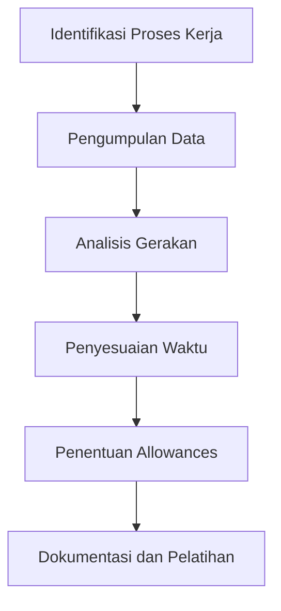

# 998 — Sistem Pengukuran Waktu dan Metode Kerja dalam Teknik Industri

**Domain:** Teknik Industri & Rekayasa Sistem Industri  
**Topik Spesialis:** Methods Engineering & Work Measurement (Niebel-Freivalds & Barnes): Predetermined Motion Time Systems (MTM-1, MTM-2, MOST), Performance Rating Factor (Westinghouse), and Allowances Sizing  
**Standar & Referensi Utama:** Niebel & Freivalds (Methods, Standards, and Work Design, 13th Ed., McGraw-Hill); Barnes (Motion and Time Study: Design and Measurement of Work, 7th Ed., Wiley); Zandin (MOST Work Measurement Systems)

---

## 1. Pendahuluan dan Konteks Industri

Dalam konteks industri modern, efisiensi operasional menjadi salah satu kunci utama untuk mempertahankan daya saing di pasar global. Dengan meningkatnya kompleksitas proses manufaktur dan rantai pasok, perusahaan dituntut untuk mengoptimalkan setiap aspek dari operasi mereka. Tantangan yang dihadapi mencakup pengurangan waktu siklus produksi, peningkatan kualitas produk, dan pengurangan biaya operasional. Menurut laporan dari McKinsey & Company (2022), perusahaan yang menerapkan metode pengukuran waktu dan teknik kerja yang efektif dapat meningkatkan produktivitas hingga 30%.

Sistem pengukuran waktu yang telah ditetapkan, seperti Predetermined Motion Time Systems (PMTS), termasuk MTM (Methods-Time Measurement) dan MOST (Maynard Operation Sequence Technique), memberikan kerangka kerja yang sistematis untuk menganalisis dan merancang proses kerja. Metode ini tidak hanya membantu dalam perencanaan dan pengendalian produksi, tetapi juga dalam pengembangan standar kerja yang dapat diandalkan. Dalam industri yang sangat kompetitif, seperti otomotif dan elektronik, penerapan metode ini menjadi semakin penting untuk mengurangi pemborosan dan meningkatkan efisiensi.

Namun, tantangan dalam implementasi metode ini sering kali mencakup ketidakpahaman terhadap sistem yang kompleks dan resistensi terhadap perubahan dari tenaga kerja. Oleh karena itu, penting untuk memberikan pelatihan yang memadai dan membangun budaya kerja yang mendukung penerapan teknik pengukuran waktu dan metode kerja yang efektif.

## 2. Landasan Teori & Formulasi Matematis

### 2.1. Predetermined Motion Time Systems (PMTS)

PMTS adalah sistem yang menggunakan analisis gerakan untuk menentukan waktu yang diperlukan untuk menyelesaikan tugas tertentu. Dua sistem utama yang sering digunakan adalah MTM dan MOST.

#### 2.1.1. MTM

MTM terdiri dari beberapa level, di antaranya MTM-1 dan MTM-2. MTM-1 digunakan untuk pekerjaan yang lebih sederhana, sedangkan MTM-2 lebih kompleks dan mencakup lebih banyak gerakan.

Rumus dasar untuk menghitung waktu dalam MTM adalah:

$$
T = \sum_{i=1}^{n} t_i
$$

di mana:
- \( T \) = total waktu
- \( t_i \) = waktu untuk setiap gerakan \( i \)
- \( n \) = jumlah gerakan

#### 2.1.2. MOST

MOST adalah sistem yang lebih baru yang mengelompokkan gerakan menjadi beberapa kategori dan memberikan waktu yang telah ditentukan untuk setiap kategori.

Waktu total dalam MOST dapat dihitung dengan rumus:

$$
T = T_{A} + T_{B} + T_{C}
$$

di mana:
- \( T_{A} \), \( T_{B} \), dan \( T_{C} \) adalah waktu untuk kategori gerakan A, B, dan C.

### 2.2. Performance Rating Factor

Performance Rating Factor (PRF) digunakan untuk menyesuaikan waktu yang dihitung dengan mempertimbangkan efisiensi kerja individu. Rumus PRF adalah:

$$
PRF = \frac{Waktu\ Aktual}{Waktu\ Standar} \times 100\%
$$

### 2.3. Allowances Sizing

Allowances adalah waktu tambahan yang diberikan untuk mengakomodasi faktor-faktor yang tidak terduga dalam proses kerja. Allowances dapat dihitung dengan rumus:

$$
A = P + F + S
$$

di mana:
- \( A \) = total allowances
- \( P \) = allowance untuk istirahat
- \( F \) = allowance untuk faktor-faktor tidak terduga
- \( S \) = allowance untuk situasi khusus

## 3. Metodologi Rekayasa & Standar Prosedur Operasional (SOP)

### 3.1. Langkah-langkah Implementasi

1. **Identifikasi Proses Kerja**: Tentukan proses yang akan dianalisis.
2. **Pengumpulan Data**: Kumpulkan data tentang gerakan dan waktu yang diperlukan untuk menyelesaikan tugas.
3. **Analisis Gerakan**: Gunakan PMTS untuk menganalisis gerakan dan menghitung waktu standar.
4. **Penyesuaian Waktu**: Terapkan PRF untuk menyesuaikan waktu yang dihitung.
5. **Penentuan Allowances**: Hitung allowances yang diperlukan.
6. **Dokumentasi dan Pelatihan**: Dokumentasikan hasil dan berikan pelatihan kepada tenaga kerja.

### 3.2. Diagram Alir Proses

## 4. Studi Kasus Kuantitatif Industri & Perhitungan Numerik

### 4.1. Contoh Kasus

Misalkan sebuah perusahaan manufaktur elektronik ingin menghitung waktu standar untuk proses perakitan komponen.

#### 4.1.1. Data Input

- Gerakan A: 10 detik
- Gerakan B: 15 detik
- Gerakan C: 5 detik
- PRF: 90%
- Allowances: 15%

#### 4.1.2. Perhitungan

1. Hitung total waktu menggunakan MTM:

$$
T = T_{A} + T_{B} + T_{C} = 10 + 15 + 5 = 30 \text{ detik}
$$

2. Terapkan PRF:

$$
Waktu\ Standar = T \times \frac{PRF}{100} = 30 \times \frac{90}{100} = 27 \text{ detik}
$$

3. Hitung allowances:

$$
A = 15\% \times 27 = 0.15 \times 27 = 4.05 \text{ detik}
$$

4. Total waktu dengan allowances:

$$
T_{total} = Waktu\ Standar + A = 27 + 4.05 = 31.05 \text{ detik}
$$

### 4.2. Interpretasi Hasil

Hasil perhitungan menunjukkan bahwa waktu standar untuk proses perakitan komponen adalah 31.05 detik, termasuk allowances. Ini memberikan dasar yang kuat untuk perencanaan produksi dan pengendalian biaya.

## 5. Evaluasi Kritis, Aplikasi Lintas Sektor & Standar Masa Depan

Metode pengukuran waktu dan teknik kerja memiliki aplikasi yang luas tidak hanya dalam industri manufaktur, tetapi juga dalam sektor lain seperti layanan kesehatan, logistik, dan teknologi informasi. Dalam konteks rantai pasok, pemahaman yang mendalam tentang waktu dan metode kerja dapat membantu dalam pengelolaan inventaris dan pengurangan waktu tunggu.

Namun, batasan metodologi ini termasuk ketergantungan pada data historis yang mungkin tidak selalu akurat dan variabilitas dalam kinerja individu. Oleh karena itu, penelitian masa depan harus fokus pada integrasi teknologi seperti analitik data dan kecerdasan buatan untuk meningkatkan akurasi dalam pengukuran waktu dan perencanaan kerja.

Dengan demikian, penerapan sistem pengukuran waktu dan metode kerja yang efektif tidak hanya mendukung efisiensi operasional, tetapi juga berkontribusi pada keberlanjutan dan inovasi dalam industri.

## 5. Ringkasan & Catatan Praktis Implementasi
Implementasi metode ini memerlukan standarisasi prosedur operasi (SOP), kalibrasi instrumen berkala, serta integrasi pemantauan real-time untuk memastikan konsistensi performa dan efisiensi sistem secara berkelanjutan.
